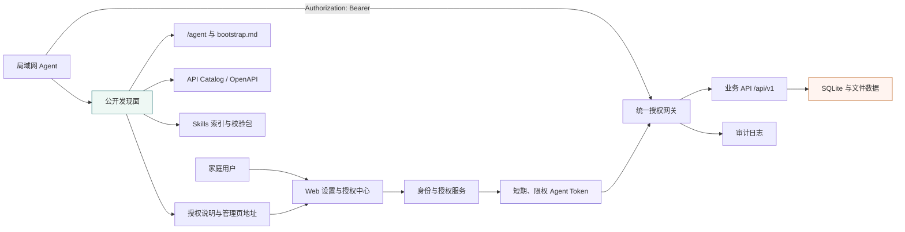

# 家庭图书管理系统 Agent 引导入口与能力授权体系规划

> 状态：WBS-0~9 已实施完成，WBS-10 可选二期  
> 日期：2026-08-11（初版），2026-08-12（WBS-0~9 完成）  
> 方案：B——轻量级 Agent Bootstrap Gateway  
> 适用范围：家庭局域网、自托管 FastAPI + Vue 3 + CLI + Agent Skills 架构  
> 实施要求：执行本文 WBS 时使用 `executing-plans`，按任务逐项测试、评审和交付。

## 0. 结论摘要

本项目应增加一个统一、可复制的 **Agent 初始访问地址**，建议稳定为：

```text
http://<家庭服务器地址>:<端口>/agent
```

这个地址是“系统使用说明与授权入口”，不是“家庭书架数据入口”。它向局域网内的 Agent 公开以下内容：

- 系统是什么、适合完成哪些任务；
- Web、API、OpenAPI、CLI、Skills 和授权入口在哪里；
- 每项能力需要什么权限、是否会读取或修改数据；
- 如何下载、校验、审阅和安装 Skills；
- 如何向用户发起访问授权请求；
- 未授权时允许做什么、禁止做什么。

它 **绝不公开** 以下内容：

- 书籍、ISBN、作者、封面、附件、读书笔记、购买记录和阅读进度；
- 成员姓名、成员 ID、渠道绑定、家庭统计、数据库状态和文件路径；
- API Key、管理口令、渠道签名密钥、访问令牌或其他凭证；
- 可以通过数量、时间、错误细节间接推断出的家庭业务信息。

核心安全模型是：

> **能力可发现，数据默认不可访问；Agent 可以了解“系统会什么”，但只有用户明确授权后，才能按获批 Scope 访问“这个家庭的数据”。**

公开发现面与受保护业务面必须在路由、数据模型、响应模型、缓存策略和测试上分离。只在页面上写一句“需要授权”不构成安全边界。

## 1. 背景与功能描述扩充

### 1.1 原始需求的完整化

当前需求可扩充为六个相互关联的能力：

1. **地址展示与复制**：Web 页面展示前端地址、API 地址和唯一的 Agent 初始地址，支持一键复制、二维码和连通性提示。
2. **Agent 能力发现**：Agent 从一个入口获得结构化能力目录、风险等级、所需权限、调用方式和文档链接。
3. **Skills 安全分发**：Agent 可以下载本系统提供的 Skills，但安装前必须校验来源、版本和摘要，并由用户确认。
4. **访问授权**：Agent 第一次真正读取或修改业务数据前，必须发起授权；用户决定成员身份、权限范围、有效期并可随时撤销。
5. **可审计调用**：所有持凭证访问都有 Agent 身份、成员身份、Scope、时间、结果和关联 ID，可追踪和撤销。
6. **渐进式协议兼容**：首期复用 REST、OpenAPI、CLI 和 Skills；后续按价值增加 MCP；只有系统成为可委派任务的自主 Agent 时才采用 A2A。

### 1.2 用户故事

#### 家庭成员

- 我能在设置页看到一个稳定的 Agent 入口，并一键复制给 Agent。
- 我能在授权前确认 Agent 要访问哪些数据、执行哪些动作、代表哪位成员。
- 我能只允许查询书籍而不允许入库、删除、查看购买记录或笔记。
- 我能设置授权有效期，查看最近调用，并立即撤销某个 Agent。

#### 未授权 Agent

- 我能从入口了解系统用途、接口和 Skills，不需要先获得家庭数据访问权。
- 我能下载并审阅初始化 Skill，运行不读取业务数据的环境检查。
- 我调用受保护端点时得到明确的 `401 Unauthorized` 或 `403 Forbidden`，而不是空数据或默认成员数据。
- 我能向用户说明建议申请的 Scope，并引导用户打开授权中心；首期不能自行创建或批准授权。

#### 已授权 Agent

- 我只拿到用户批准的 Scope，并以绑定的家庭成员身份调用。
- 我能知道令牌何时到期、如何刷新或重新申请。
- 当权限不足时，系统明确指出需要哪个 Scope，但不泄露目标资源是否存在。

### 1.3 成功指标

- 新 Agent 从复制入口到发起授权请求不超过 5 分钟。
- 未授权请求无法读取任何业务记录，自动化越权测试覆盖率 100%。
- Skills 包可以被确定性构建；版本、文件清单和 SHA-256 可复验。
- 每个受保护端点都声明并强制对应 Scope。
- 用户可以在一个页面查看、批准、拒绝、限权和撤销 Agent。
- 撤销后旧令牌立即失效，不依赖等待进程重启。

## 2. 现有基础与关键差距

### 2.1 可复用基础

| 现有能力 | 位置 | 可复用方式 |
| --- | --- | --- |
| FastAPI 与 OpenAPI | `backend/app/main.py` | 完整 `/openapi.json` 改为 owner 可见；增加公开的 Agent allowlist 规范 |
| Vue 3 SPA | `frontend/src/` | 增加 Agent 连接卡片、引导页和授权管理页 |
| CLI | `cli/bookshelf/` | 增加 bootstrap、auth、skills 安装/检查命令 |
| 7 个 Skills | `skills/*/SKILL.md` | 按 Agent Skills 结构打包、版本化和分发 |
| 初始化诊断 | `bookshelf doctor` | 拆分为公开环境检查与授权后业务检查 |
| 渠道成员映射 | `backend/app/auth.py` | 保留 IM 渠道身份，但不作为通用 Agent Token 的替代品 |
| 单一生产入口 | 后端静态托管 SPA | 生产环境优先用同源地址，减少端口与 CORS 配置 |

### 2.2 必须解决的差距

当前信任模型是“一期可信局域网”：部分无渠道头请求会回退到默认成员，Web UI 通过 `X-UI-Client: web` 声明绕过渠道鉴权。任意局域网客户端都可以伪造普通 HTTP 头，因此这个机制不能证明调用者就是内置 UI，也不满足本方案的“先授权、后访问业务数据”。

实施本方案时必须完成以下收口：

- 禁止未授权 Agent 回退到默认成员；
- `X-UI-Client: web` 不再作为授权凭据；
- Web UI 也应使用真实用户会话或受控的本地所有者会话；
- 读端点与写端点都纳入授权，而不只是现有写端点；
- 公共健康检查不得返回数据库连接、第三方 Key 配置、条码依赖等内部细节；
- 渠道身份、Web 会话和 Agent Token 最终统一进入同一个授权上下文，再由 Scope 决定能做什么。

## 3. 外部最佳实践与适用性调研

### 3.1 调研结论

GitHub 上没有一个成熟项目可以原样解决“复制一个家庭局域网地址，让任意 Agent 安全完成发现、Skills 安装和数据授权”的全部需求。成熟做法是组合多个窄标准，各自负责一层，而不是再发明一个万能 Agent 协议。

| 实践 | 成熟度 | 本项目用途 | 决策 |
| --- | --- | --- | --- |
| OpenAPI | 成熟标准，FastAPI 原生支持 | 描述 REST 契约 | 直接复用 |
| Agent Skills / `SKILL.md` | 已有开放规范及多客户端采用 | 打包 Agent 使用方法 | 直接采用 |
| GitHub CLI `gh skill` | 已支持 GitHub 仓库和本地目录安装 | GitHub 发布或下载后本地安装 | 作为推荐安装器之一 |
| MCP Streamable HTTP | 跨 Agent 工具协议，鉴权和客户端支持持续成熟 | 后续将核心动作暴露为工具 | 第二阶段可选 |
| `llms.txt` | 采用面扩大，但仍是提案 | 提供简洁 Markdown 导航 | 作为兼容入口，不作为唯一契约 |
| `/.well-known/api-catalog` | IETF RFC 9727 | 标准化发现 API 描述链接 | 应采用 |
| A2A Agent Card | 适合 Agent 对 Agent 委派 | 本项目当前不是自主 Agent | 暂不实现，只预留扩展位置 |
| OAuth Device Flow | IETF RFC 8628 | 无浏览器或异设备 Agent 请求用户授权 | 第二阶段目标；首期可先做人工生成的短期 Token |

### 3.2 与本项目最相关的最佳实践

1. Agent Skills 以包含 `SKILL.md` 的目录为最小单元，按名称/描述发现，需要时再加载完整说明；项目现有 Skills 结构已接近该模式。
2. OpenAI Docs 显示 Codex 可通过地址连接 Streamable HTTP MCP，并支持 Bearer Token、OAuth、工具白名单和按工具审批。MCP 适合未来的“工具执行层”，不应替代当前这份“发现与授权入口”。
3. RFC 9727 已定义 `/.well-known/api-catalog`，要求支持 `application/linkset+json`，并明确建议在发布前做隐私审查、对目录使用只读权限、优先 HTTPS。因此不建议创造一个占用未注册名字的通用 `/.well-known/agent.json` 来冒充行业标准。
4. A2A 的 `/.well-known/agent-card.json` 是给真正的 A2A Agent 使用的。家庭书架当前是数据与工具服务，若仅为“看起来标准”而发布 Agent Card，会让客户端误以为它支持 A2A 消息与任务协议。
5. `llms.txt` 适合为 Agent 提供紧凑导航，但它仍是提案，而且内容没有强类型校验，所以机器契约仍应以 JSON Schema、OpenAPI 和 API Catalog 为准。
6. Skills 属于供应链输入。禁止 `curl URL | sh`；必须先下载到临时目录、显示来源与权限、验证摘要、供用户审阅，然后执行本地安装。

### 3.3 推荐的标准组合

```text
人类入口            /agent
Agent 文本入口      /agent/bootstrap.md + /llms.txt
API 标准发现        /.well-known/api-catalog
项目机器清单        /agent/manifest.json
Agent REST 契约      /agent/openapi.json（公开字段 allowlist）
Skills 索引          /agent/skills/index.json
Skills 不可变包      /agent/skills/download/{bundle_version}.zip
业务执行             /api/v1/*（始终鉴权）
未来 MCP             /mcp（可选、始终鉴权）
未来 A2A             仅在真正实现 A2A 服务后发布 Agent Card
```

## 4. 总体架构



架构分为三条边界：

- **发现平面**：允许局域网匿名 `GET/HEAD`，只返回静态或从安全配置生成的非业务元数据。
- **授权平面**：只有已认证的 owner 可以创建、限权、设置期限、重新签发和撤销 Agent Grant；首期没有匿名申请入口。
- **业务平面**：所有读写都需要可验证身份；授权上下文绑定 `agent_id + member_id + scopes + expires_at`。

## 5. 页面与复制交互设计

### 5.1 页面位置

建议在 Web 顶栏或设置页增加“连接 Agent”入口，页面路由为 `/agent`。首页只放一个简洁卡片，避免把安装与安全说明塞进业务书架页面。

### 5.2 页面信息层级

#### 第一屏：复制入口

- 标题：连接你的 Agent
- 主地址：`http(s)://<configured-base>/agent`
- 操作：复制地址、显示二维码、打开使用说明
- 状态：服务可发现 / 当前仅 HTTP / 尚未配置稳定主机名
- 明示：**此地址不会向 Agent 提供家庭书架数据**

#### 第二屏：Agent 将了解什么

- 功能目录：查书、入库、阅读进度、购买、笔记、统计等；
- 每项能力的风险等级与所需 Scope；
- CLI、OpenAPI、Skills 和授权方式；
- 公开信息清单和永不公开信息清单。

这里可以展示能力名称，但不得展示实际书籍数量、成员数量或“是否存在某本书”等业务结果。

#### 第三屏：安装 Skills

- Bundle 版本、发布日期、包含的 Skill、文件数、体积；
- SHA-256、Ed25519 签名、签名 Key ID 和验证结果；
- “下载安装包”“复制安全安装命令”“查看文件清单”；
- 安全提示：安装前需审阅，不自动执行脚本，不在聊天中粘贴密钥。

#### 第四屏：请求访问

- 显示“当前无权访问家庭数据”；
- Agent 可创建一次性授权请求，用户在授权中心查看；
- 用户选择成员、Scope 和有效期；
- 令牌只显示一次，不通过 URL、二维码查询参数或页面日志传递。

### 5.3 地址生成规则

生产环境建议前端、后端和 Agent 入口同源：

```text
Web:       https://bookshelf.home/
API:       https://bookshelf.home/api/v1
Agent:     https://bookshelf.home/agent
OpenAPI:   https://bookshelf.home/agent/openapi.json
```

开发环境允许分端口展示，但 Agent 入口仍只选一个规范地址：

```text
Web Dev:   http://192.168.1.20:5173
API:       http://192.168.1.20:8000/api/v1
Agent:     http://192.168.1.20:8000/agent
```

后端新增显式配置 `PUBLIC_BASE_URL`；不得无条件相信请求的 `Host` 或 `X-Forwarded-Host` 生成复制地址。反向代理场景只信任配置过的代理，并验证 Host allowlist。相对链接优先用于机器清单，绝对地址由已验证的 `PUBLIC_BASE_URL` 组合。

## 6. 公开发现接口契约

### 6.1 路由清单

| 方法与路径 | 内容 | 是否匿名 | 是否包含业务数据 |
| --- | --- | --- | --- |
| `GET /agent` | 人类可读引导页/SPA 路由 | 是，局域网 | 否 |
| `GET /agent/bootstrap.md` | Agent 可读初始化说明 | 是，局域网 | 否 |
| `GET /agent/manifest.json` | 项目机器清单 | 是，局域网 | 否 |
| `GET /.well-known/api-catalog` | RFC 9727 Linkset | 是，局域网 | 否 |
| `GET /llms.txt` | 精简文档导航 | 是，局域网 | 否 |
| `GET /agent/skills/index.json` | Skill 版本、权限、摘要 | 是，局域网 | 否 |
| `GET /agent/skills/download/{version}.zip` | 不可变 Skills 包 | 是，局域网 | 否 |
| `GET /api/v1/public-health` | 最小可用性 | 是，局域网 | 否 |
| `GET /agent/openapi.json` | 经 allowlist 过滤的 Agent API 结构 | 是，局域网 | 否；不得包含管理接口、内部模型或真实示例 |

公开响应统一要求：

- 公开发现面只允许 `GET/HEAD/OPTIONS`；
- `Cache-Control` 明确区分静态包与动态授权元数据；
- 配置 `ETag`，Skills 包使用不可变版本路径；
- 不回显请求头、内网接口列表、文件绝对路径或异常堆栈；
- 对包下载做每 IP 限流；
- 响应有独立 Pydantic Schema 和快照测试，禁止直接序列化 ORM 对象。

FastAPI 默认 `/openapi.json` 和 `/docs` 只允许 owner 会话访问，生产环境也可以完全关闭。公开的 `/agent/openapi.json` 从独立 allowlist 生成，只描述允许 Agent 调用的业务动作、Bearer 安全方案、Scope 和安全错误，不包含 owner 管理端点、数据库模型、内部字段、真实 example/default。隐私测试同时验证路径 allowlist和 Schema 字段 allowlist，不能只做敏感词搜索。

### 6.2 `manifest.json` 示例

以下示例只说明契约，不是最终字段冻结版本：

```json
{
  "schema_version": "1.0",
  "service": {
    "id": "home-bookshelf",
    "name": "家庭图书管理系统",
    "version": "0.3.6",
    "description": "自托管家庭藏书、阅读与笔记管理服务"
  },
  "links": {
    "human_entry": "/agent",
    "agent_guide": "/agent/bootstrap.md",
    "api_catalog": "/.well-known/api-catalog",
    "openapi": "/agent/openapi.json",
    "skills_index": "/agent/skills/index.json",
    "authorization_manage": "/settings/agent-access"
  },
  "data_policy": {
    "discovery_contains_business_data": false,
    "business_access_requires_user_authorization": true,
    "credentials_in_urls": false
  },
  "capabilities": [
    {
      "id": "books.search",
      "description": "搜索用户获权范围内的藏书",
      "authorization_required": true,
      "required_scopes": ["books:read"],
      "risk": "read"
    },
    {
      "id": "books.intake",
      "description": "向用户获权的家庭书架新增图书",
      "authorization_required": true,
      "required_scopes": ["books:write"],
      "risk": "write"
    }
  ],
  "skills": {
    "bundle_version": "0.2.5",
    "index": "/agent/skills/index.json"
  }
}
```

禁止在清单中添加 `book_count`、`member_count`、`bound_channels`、数据库厂商、数据目录、真实资源 ID 或用户专属 URL。

### 6.3 `api-catalog` 示例

响应类型使用 `application/linkset+json`，只列接口描述资源，不列业务实例：

```json
{
  "linkset": [
    {
      "anchor": "https://bookshelf.home/",
      "service-desc": [
        {
          "href": "https://bookshelf.home/agent/openapi.json",
          "type": "application/vnd.oai.openapi+json"
        }
      ],
      "describedby": [
        {
          "href": "https://bookshelf.home/agent/bootstrap.md",
          "type": "text/markdown"
        }
      ]
    }
  ]
}
```

### 6.4 公开健康检查

现有 `/api/v1/health` 会公开数据库连接、Google Books Key 配置和条码依赖状态。该端点应改为受保护诊断，另设公共端点只返回：

```json
{
  "ok": true,
  "data": {
    "status": "available",
    "service": "home-bookshelf",
    "authorization_required": true
  },
  "error": null
}
```

公共健康检查不得成为探测家庭服务器软件栈和配置的指纹接口。

## 7. 业务数据授权模型

### 7.1 原则

- 默认拒绝：无有效凭证时所有业务读写返回 `401`。
- 最小权限：用户逐项批准 Scope，服务端不能把请求的全集直接当作批准结果。
- 身份绑定：每个授权绑定一个 `agent_id` 和一个 `member_id`。
- 有限时效：访问令牌短期有效；长期授权通过可撤销 Grant 表达。
- 服务端强制：Skill、CLI 或页面提示都不是安全控制，权限必须在 API 依赖层验证。
- 不泄露存在性：无权访问时不通过 `404/403` 差异暴露资源是否存在。

### 7.2 推荐 Scope

| Scope | 能力 | 默认建议 |
| --- | --- | --- |
| `books:read` | 查询书目与副本 | 可单独授予 |
| `books:write` | 入库、编辑书目、封面 | 需明确确认 |
| `books:delete` | 删除或合并书籍 | 高风险，默认不授予 |
| `reading:read` | 查看阅读进度和日志 | 可单独授予 |
| `reading:write` | 更新进度和日志 | 需明确确认 |
| `notes:read` | 查看笔记与附件 | 敏感，默认不授予 |
| `notes:write` | 新建或修改笔记 | 敏感，需明确确认 |
| `purchases:read` | 查看价格、渠道、订单信息 | 财务敏感，默认不授予 |
| `purchases:write` | 记录购买 | 需明确确认 |
| `stats:read` | 查看授权成员统计 | 可单独授予，但仍是业务数据 |
| `files:read` | 下载授权范围附件 | 敏感，短期 URL 或流式鉴权 |
| `members:read` | 查看家庭成员 | 默认不授予普通 Agent |
| `stats:household` | 查看跨成员家庭统计 | 仅 owner 可明确授予，默认不授予 |

Agent Grant 不支持 `*` 或 `admin:*` 通配符；授权管理和系统配置永远只属于 owner 会话。Scope 是权限上限，资源归属校验仍必须执行：

- `books`、`book_copies` 是家庭共享资源，获 `books:read` 的成员可按家庭规则查询；
- 阅读进度、阅读日志、笔记和购买记录默认绑定 `member_id`，Agent 只能访问 Grant 绑定成员的数据；
- 附件继承父资源权限，不允许仅凭附件 ID 越权下载；
- `stats:read` 只返回 Grant 绑定成员的统计，跨成员聚合必须另获 `stats:household`；
- owner 可以为任一成员创建 Grant，但 Grant 建立后不能在请求体中切换成员；
- WBS-0 必须产出完整的“端点 × 方法 × Scope × 主体 × 资源范围”矩阵，WBS-6 的参数化测试以该矩阵为唯一输入。

### 7.3 首期 owner 身份与初始化

owner 会话是 Agent 授权的根信任，首期冻结为“本机命令初始化 + 密码登录 + 服务端会话”，不允许网页自助认领 owner：

1. 部署者在家庭服务器本机运行管理命令，例如 `python -m app.admin owner-init --member-id <id>`；命令在 TTY 中读取密码并保存 Argon2id 哈希。
2. 未初始化 owner 凭据时，公开发现面仍可用，但授权中心、Token 签发和全部家庭业务访问保持锁定；页面只提示到服务器本机完成初始化。
3. owner 通过 HTTPS 登录，服务端创建可撤销会话；Cookie 使用 `HttpOnly`、`Secure`、`SameSite=Strict`，状态变更请求同时验证 CSRF Token 和 Origin。
4. 登录、重置和授权操作限流并写审计日志；登录响应不区分“用户不存在”和“密码错误”。
5. 忘记密码只能在服务器本机运行 `owner-reset-password`；重置会让全部 owner 会话立即失效，但不自动恢复匿名访问。
6. owner 成员删除、降级或凭据缺失时进入安全锁定状态，不能把第一个网页访问者提升为 owner。

### 7.4 首期唯一授权流程：用户主动生成限权 Token

1. Agent 读取 Bootstrap，发现访问需要授权，并向用户说明建议的 Scope 和理由。
2. 用户自行打开 Web“Agent 授权中心”；首期 Agent 不调用匿名申请接口。
3. 用户创建授权：填写纯文本 Agent 名称，选择成员、Scope 和有效期。
4. 页面生成高熵 Token，只显示一次；数据库只保存哈希、前缀和元数据。
5. 用户把 Token 写入 Agent 的密钥存储或环境变量，不粘贴到公共对话、URL 或日志。
6. Agent 使用 `Authorization: Bearer <token>` 调用业务 API。
7. 用户随时撤销 Grant；下一次请求立即失败。

推荐默认有效期：7 天；允许 1 小时、1 天、7 天和 30 天，首期不签发永久 Token。Agent 名称限制为 1–80 个 Unicode 字符并按纯文本转义展示；不接受 HTML、Markdown、外链、头像 URL 或任意扩展 JSON，避免把 Agent 自述变成存储型 XSS/钓鱼入口。

### 7.5 第二阶段：设备授权流程

为了减少复制 Token，可按 OAuth 2.0 Device Authorization Grant 的交互模式实现：

1. Agent 在用户明确要求连接时调用设备授权端点；
2. 服务端返回短期 `device_code`、人类可读 `user_code` 和验证地址；
3. 用户在已认证 Web 会话中输入或确认代码；
4. 用户缩减 Scope、选择成员、批准或拒绝；
5. Agent 按规定间隔轮询，获批后得到短期访问令牌；
6. 用户可在授权中心撤销。

设备码必须短时有效、限速、防暴力猜测；Agent 不得在启动时自动创建授权请求。未部署 HTTPS 前不启用跨设备 Bearer Token 流程。

设备授权阶段新增的 Agent 自述必须使用字段 allowlist、长度限制和纯文本输出；`device_code` 与查询状态 ID 使用至少 128 bit 随机值，用户码限速防枚举，申请短时过期并自动清理。

### 7.6 Token 安全契约

- Token 使用 CSPRNG 生成 32 字节随机秘密，格式为 `hbs_at_<public_id>_<secret>`；`public_id` 只用于索引，不能授权。
- 数据库保存 `SHA-256(full_token)` 和公开前缀，不保存明文。由于秘密具备 256 bit 随机熵，数据库离线穷举不可行；首期不引入会增加轮换复杂度的全局 pepper。
- 服务端先按 `public_id` 定位候选，再对完整摘要做恒定时间比较；不能只比较前缀。
- Token 创建响应使用 `Cache-Control: no-store`、`Pragma: no-cache`、严格 CSP 和 `Referrer-Policy: no-referrer`，明文离开页面后不可恢复。
- 日志、异常、追踪和审计统一对 `Authorization`、Token 格式和 CLI 环境变量脱敏。
- 优先写入目标 Agent 的系统密钥库；`BOOKSHELF_ACCESS_TOKEN` 环境变量仅作跨客户端兼容方案，不得写入仓库 `.env`。

### 7.7 统一授权上下文

后端新增统一结构：

```text
AuthContext
├── principal_type: web_user | channel | agent
├── principal_id
├── member_id
├── scopes
├── grant_id
├── expires_at
└── request_id
```

REST 服务只依赖 `AuthContext`，不再让各路由分别猜测渠道头、UI 头和默认成员。IM 渠道签名验证、Web 登录和 Agent Bearer Token 只是生成授权上下文的三种认证方式。

### 7.8 状态码约定

| 场景 | 状态码 | 说明 |
| --- | --- | --- |
| 未提供凭证 | `401` | 带 `WWW-Authenticate: Bearer` |
| Token 无效、过期或撤销 | `401` | 不透露目标资源信息 |
| 已认证但缺 Scope | `403` | 返回缺少的 Scope，不返回资源内容 |
| 已有 Scope 但具体资源不在授权范围 | `404` | 与资源不存在使用同一响应，避免存在性侧信道 |

首期不出现授权申请 `pending` 状态；`202 pending`、用户码和轮询错误只属于第二阶段 Device Flow。

### 7.9 HTTPS 与立即撤销硬约束

- 正式家庭数据环境中，owner 登录、Token 签发和 Agent Bearer 调用必须使用 HTTPS；唯一例外是同机进程访问 `127.0.0.1`/`::1`。
- HTTP 局域网部署只能开放发现文档和签名 Skills 下载，授权中心显示阻断页，后端拒绝签发和接受 Agent Token；首期不提供“我了解风险仍继续”的开关。
- 首期每个 Agent 请求都查询 Token 与 Grant 的当前状态和到期时间，不使用正向授权缓存。因此撤销、owner 重置和 Agent 整体禁用必须在下一请求生效。
- 后续若为性能增加缓存，必须先实现可靠的主动失效和并发撤销测试，否则不得改变“下一请求失效”的承诺。

## 8. Skills 分发与安装体系

### 8.1 包结构

```text
home-bookshelf-skills-0.2.5.zip
├── manifest.json
├── LICENSE
├── SHA256SUMS
└── skills/
    ├── bookshelf-setup/SKILL.md
    ├── book-intake/SKILL.md
    ├── book-query/SKILL.md
    ├── reading-tracker/SKILL.md
    ├── purchase-logger/SKILL.md
    ├── note-taker/SKILL.md
    └── shelf-report/SKILL.md
```

构建必须确定性：固定文件顺序、统一时间戳策略、无 `.env`、数据库、测试缓存、Git 元数据和绝对路径。发布后同一版本的字节内容不可改变；如需修改必须升版本。

正式发布包使用 Ed25519 离线发布密钥签名。验证公钥固定在项目仓库和官方 CLI 中，安装器不能信任与 ZIP 同时从未知地址下载的临时公钥。自定义本地构建无法使用官方私钥时必须标记 `unsigned-local-build`，由用户显式确认来源；SHA-256 只证明下载内容与索引一致，不能单独证明发布者身份。

### 8.2 Skills 索引字段

每个 Skill 至少包含：

- `name`、`version`、`description`；
- `archive_url`、`sha256`、`size_bytes`；
- `signature_url`、`signature_algorithm: "Ed25519"`、`signing_key_id`；
- `required_cli_version`、`required_api_version`；
- `required_binaries` 和必要环境变量名称，但不包含值；
- `requested_scopes`；
- `has_scripts`、`has_network_access`、`writes_data`；
- 源代码地址、许可证、发布日期和变更日志。

CLI 自带版本化的 `trusted_keys.json`，Key 状态只能由 CLI 升级改变，服务端索引不能把任意新公钥声明为可信。`active` Key 可签新包，`retired` Key 只验证历史包，`revoked` Key 对新旧包都拒绝；密钥轮换先发布包含新公钥的 CLI，再切换签名 Key。索引中的 `signing_key_id` 必须命中 CLI 信任库，否则停止安装并提示升级 CLI。

### 8.3 安装流程

局域网下载推荐流程：

```text
下载 ZIP 到临时目录
→ 用 CLI 内置公钥验证 Ed25519 签名，再验证 SHA-256
→ 列出文件和权限声明
→ 用户确认
→ 安全解压
→ gh skill install <解压目录> --from-local --agent <目标Agent>
  或复制到目标 Agent 的项目级 skills 目录
→ 运行 skills doctor
```

不得提供以下形式：

```bash
curl http://bookshelf.home/install.sh | sh
```

页面可以提供分步命令，但任何写入 Agent 配置、全局目录或执行脚本的操作必须由用户确认。首选项目级安装；用户明确需要多个项目共享时才建议用户级安装。

安全解压必须在客户端执行以下检查，不能只依赖服务端构建测试：拒绝 `../`、绝对路径、驱动器路径、符号链接和硬链接；限制压缩包总大小、单文件大小、文件数与压缩比；忽略归档中的可执行权限并以普通文件写入；目标路径逐项解析后必须仍在临时目录内。安装器在用户确认前不得执行包内脚本。

### 8.4 Bootstrap Skill

建议新增一个最小 `bookshelf-bootstrap` Skill，职责仅限：

- 读取并解释 Manifest；
- 检查 API 和 CLI 版本兼容性；
- 显示所需 Scope；
- 引导用户授权；
- 验证授权后再启用业务 Skills。

它不能读取业务数据，不能创建默认成员，不能自动绑定渠道，不能把 Token 写入仓库文件。

## 9. 安全与隐私设计

### 9.1 数据分类

| 分类 | 示例 | Bootstrap 是否可返回 |
| --- | --- | --- |
| L0 公开使用元数据 | 服务名称、功能说明、版本、文档、Scope 名称 | 可以 |
| L1 运维元数据 | DB 状态、插件配置、内部路径、成员数量 | 不可以 |
| L2 家庭业务数据 | 书目、进度、统计、购买、笔记、附件 | 不可以 |
| L3 身份与凭证 | 成员绑定、Token、Key、签名密钥 | 绝不可以 |

### 9.2 威胁与控制

| 威胁 | 控制措施 |
| --- | --- |
| 局域网恶意 Agent 枚举数据 | 所有业务端点默认鉴权；一致错误语义；限流 |
| 伪造 `X-UI-Client` | 删除其授权含义；Web 使用真实会话 |
| Token 从 URL/日志泄露 | 只用 Authorization Header；日志脱敏；Token 只显示一次 |
| Skills 供应链污染 | 不可变版本、SHA-256、签名、文件清单、人工审阅、禁止管道执行 |
| Host Header 注入错误复制地址 | 显式 `PUBLIC_BASE_URL`、Trusted Host、可信代理列表 |
| Manifest 泄露内部状态 | 独立 DTO、字段 allowlist、快照测试和发布前隐私审查 |
| owner 登录暴力尝试 | HTTPS、登录限流、统一错误、审计与会话撤销 |
| 权限膨胀 | 默认最小 Scope、逐项批准、服务器端资源范围校验 |
| 被撤销 Token 继续使用 | 首期每次请求查询 Grant，不使用正向授权缓存 |
| HTTP 窃听 | 正式业务授权强制 HTTPS；HTTP 只提供发现面，拒绝签发和接受 Token |
| 错误信息侧信道 | 未授权时不区分资源存在与否，不返回内部异常 |

### 9.3 审计日志

审计记录至少包括：

- `request_id`、时间、Agent/渠道/Web 主体类型；
- `grant_id`、`member_id`、使用的 Scope；
- 操作名、资源类型、资源 ID 的内部引用；
- 结果、状态码、耗时和拒绝原因代码；
- 不记录明文 Token、请求正文中的笔记全文、附件内容和第三方 Key。

用户能按 Agent 查看最近活动并一键撤销。审计保留期应可配置，默认 90 天。

审计日志本身属于敏感业务元数据：只有 owner 会话可查询和导出；普通 Agent 无审计读取 Scope。日志表采用追加写权限，应用层不提供修改接口；到期清理由专用维护任务执行并记录删除批次。导出文件需再次确认、使用短期下载并避免进入公共附件目录。

## 10. 建议数据模型

### 10.1 `agent_clients`

| 字段 | 说明 |
| --- | --- |
| `id` | 内部主键 |
| `public_id` | 可公开的随机 ID |
| `display_name` | 用户确认的 Agent 名称 |
| `client_type` | codex/openclaw/hermes/custom 等自述类型 |
| `created_at`、`last_seen_at` | 生命周期时间 |
| `revoked_at` | Agent 整体撤销时间 |
| `metadata_json` | 经 allowlist 的非敏感客户端元数据 |

### 10.2 `agent_grants`

| 字段 | 说明 |
| --- | --- |
| `id` | Grant 主键 |
| `agent_client_id` | Agent |
| `member_id` | 代表的家庭成员 |
| `scopes_json` | 获批 Scope，不保存仅申请但未批准的 Scope |
| `status` | active/revoked/expired；pending/denied 只属于二期申请表 |
| `expires_at` | 到期时间 |
| `approved_by_member_id` | 批准者，必须具有 owner 权限 |
| `created_at`、`approved_at`、`revoked_at` | 生命周期时间 |

### 10.3 `agent_tokens`

| 字段 | 说明 |
| --- | --- |
| `id` | Token 记录 |
| `grant_id` | 对应授权 |
| `token_prefix` | UI 识别用前缀 |
| `token_hash` | 使用抗时序比较；不保存明文 |
| `issued_at`、`expires_at`、`last_used_at` | 生命周期 |
| `revoked_at` | 单 Token 撤销 |

### 10.4 `owner_credentials` 与 `web_sessions`

`owner_credentials` 保存 owner 成员引用、Argon2id 密码哈希、更新时间和强制退出版本；`web_sessions` 只保存高熵会话 ID 的哈希、CSRF 秘密哈希、创建/到期/撤销时间和最小设备说明。密码重置提升强制退出版本并撤销全部旧会话。

### 10.5 二期 `agent_authorization_requests`

该表不属于首期迁移，只在实现 Device Flow 时新增，用于保存短期申请、请求 Scope、经 allowlist 的 Agent 自述、用户码哈希、过期时间和轮询状态。过期记录自动清理，不存业务数据。

## 11. 版本与兼容策略

- Manifest 使用独立 `schema_version`；向后兼容新增字段，破坏性变更升主版本。
- API 继续使用 `/api/v1`；授权语义变化要在发行说明中标为破坏性安全变更。
- Skills Bundle 有独立版本，并声明兼容的 CLI/API 最低版本。
- `/agent/skills/download/{version}.zip` 不可覆盖；索引的 `latest` 只是指针。
- Bootstrap 文档必须同时说明系统版本、Manifest 版本、API 版本和 Skills Bundle 版本，避免把它们混成一个编号。
- Agent 遇到未知字段应忽略；遇到不支持的主版本应停止并提示用户升级，不得猜测调用。

## 12. MCP 与 A2A 演进路线

### 12.1 何时增加 MCP

满足以下条件后再进入 MCP：

- REST + Token 授权模型稳定；
- Scope 与审计已覆盖全部业务端点；
- 至少两个目标 Agent 客户端需要免 CLI 的工具调用；
- 能为每个 MCP Tool 声明只读、写入、幂等与高风险属性；
- Streamable HTTP 端点可以复用同一授权上下文。

MCP 只暴露经过人工挑选的高层工具，如 `search_books`、`add_book`、`update_progress`，不自动把整份 OpenAPI 一比一转为工具，以免形成超大、难审计的工具面。

### 12.2 何时增加 A2A

只有当家庭书架服务本身具备自主任务处理能力，例如接受“整理过去一年阅读报告”并异步执行、返回任务状态时，才实现 A2A 服务和 `/.well-known/agent-card.json`。仅有 REST API、Skills 或 MCP Tools 不足以宣称支持 A2A。

## 13. WBS（工作分解结构）

估算以熟悉现有代码库的一名工程师为基准，不含等待用户验收时间。必须按依赖顺序实施；每个实现任务遵循“先失败测试、最小实现、通过测试、独立提交”。

### WBS 总览

| WBS | 工作包 | 依赖 | 估算 | 交付结果 | 状态 |
| --- | --- | --- | --- | --- | --- |
| WBS-0 | 契约冻结与威胁建模 | 无 | 1–2 人日 | Manifest/Scope/数据分类冻结 | ✅ 完成 |
| WBS-1 | 公共地址与网络配置 | WBS-0 | 1–2 人日 | 稳定安全的复制地址 | ✅ 完成 |
| WBS-2 | Bootstrap 公开发现后端 | WBS-1 | 3–4 人日 | Manifest、Markdown、API Catalog、公共健康 | ✅ 完成 |
| WBS-3 | Agent 页面与复制体验 | WBS-2 | 2–3 人日 | `/agent` 页面、复制、二维码、状态提示 | ✅ 完成 |
| WBS-4 | Skills 构建与安全分发 | WBS-0 | 3–4 人日 | 确定性 Bundle、索引、校验与安装指引 | ✅ 完成 |
| WBS-5 | Agent 身份、Grant 与 Token | WBS-0 | 4–6 人日 | 数据模型、Token、Scope、撤销 | ✅ 完成 |
| WBS-6 | 统一授权上下文与 API 收口 | WBS-5 | 5–8 人日 | 业务读写默认鉴权，移除 UI 头旁路 | ✅ 完成 |
| WBS-7 | Web 授权中心 | WBS-5、WBS-6 | 3–5 人日 | 创建、限权、查看、撤销授权 | ✅ 完成 |
| WBS-8 | CLI 与 Bootstrap Skill | WBS-2、WBS-4、WBS-5 | 2–4 人日 | Agent 初始化、授权检测、安装检查 | ✅ 完成 |
| WBS-9 | 安全、兼容和端到端验收 | WBS-1~8 | 3–5 人日 | 越权测试、隐私快照、发布文档 | ✅ 完成 |
| WBS-10 | MCP 试点（可选二期） | WBS-9 | 5–8 人日 | 只读/低风险工具试点 | ⏸ 待定 |

核心一期（WBS-0~9）合计约 **24–39 人日**，已于 2026-08-12 完成实施。

> **发布门禁：** WBS-0~4 的预览版只能使用空库/合成数据、仅绑定 localhost，或部署在隔离的开发环境。由于当前系统仍存在匿名读路径和 `X-UI-Client` 旁路，在 WBS-5~9 完成前，不得把“符合本方案安全边界”的 Bootstrap 入口发布到真实家庭数据所在的局域网服务上。

### WBS-0：契约冻结与威胁建模

**文件：**

- 修改：`design/plans/Agent引导入口与能力授权体系规划-20260812.md`
- 新增：`design/schemas/agent-manifest-v1.schema.json`
- 新增：`design/plans/agent-authorization-matrix.md`
- 新增：`backend/tests/test_agent_discovery_contract.py`

**任务：**

1. 冻结 Manifest 1.0 字段、JSON Schema 和错误格式。
2. 建立公开字段 allowlist 与敏感字段 denylist。
3. 将全部 API 映射到 Scope、主体、风险等级和资源归属规则；Agent Grant 禁止通配 Scope。
4. 明确 Web、Channel、Agent 三类主体的迁移策略。
5. 写契约测试，断言发现响应不出现敏感键名与业务样例。

**验收：** 架构评审确认“能力目录不等于数据授权”，所有现有路由都有公开/受保护分类。

### WBS-1：公共地址与网络配置

**文件：**

- 修改：`backend/app/config.py`
- 修改：`backend/app/main.py`
- 修改：`backend/.env.example`
- 修改：`deploy/.env.example`
- 修改：`deploy/docker-compose.yml`
- 新增测试：`backend/tests/test_public_base_url.py`

**任务：**

1. 先写 `PUBLIC_BASE_URL`、路径前缀、Host allowlist 的失败测试。
2. 新增规范化配置，不接受带凭证、查询串或 fragment 的 Base URL。
3. 仅在显式配置可信代理时读取 Forwarded Header。
4. 验证路径别名部署和端口部署生成的链接。
5. 给 HTTP 页面增加“令牌传输不安全”告警。

**验收：** Host Header 攻击不能改变复制地址；同源与路径别名用例通过。

### WBS-2：Bootstrap 公开发现后端

**文件：**

- 新增：`backend/app/api/v1/agent_discovery.py`
- 新增：`backend/app/services/agent_discovery.py`
- 新增：`backend/app/schemas/agent_discovery.py`
- 修改：`backend/app/api/v1/__init__.py`
- 修改：`backend/app/main.py`
- 修改：`backend/app/api/v1/health.py`
- 新增测试：`backend/tests/test_agent_discovery.py`

**任务：**

1. 为每个公开路由写响应、Content-Type、缓存和隐私失败测试。
2. 实现 `/agent/manifest.json`、`/agent/bootstrap.md` 和 allowlist 生成的 `/agent/openapi.json`。
3. 实现 RFC 9727 `/.well-known/api-catalog` Linkset。
4. 实现 `/llms.txt` 兼容导航。
5. 拆分公共健康与受保护诊断。
6. 对 Skills 下载路由加入限流接口；首期可用进程内限流，但要记录多实例限制。

生产路由所有权固定为：`/agent` HTML 由 Vue Router 渲染并通过现有 SPA fallback 返回 `index.html`；`/agent/*.json`、`/agent/*.md`、Skills 下载和 `/.well-known/*` 在 FastAPI 中显式注册，注册顺序早于 SPA fallback，不能由前端伪造机器契约。

**验收：** 在空库和有真实测试数据的数据库上，所有公开响应字节级对比仅允许版本等预期字段变化。

### WBS-3：Agent 页面与复制体验

**文件：**

- 新增：`frontend/src/views/AgentConnectView.vue`
- 新增：`frontend/src/components/CopyAddressCard.vue`
- 新增：`frontend/src/components/CapabilityCatalog.vue`
- 修改：`frontend/src/router/index.ts`
- 修改：`frontend/src/App.vue`
- 修改：`frontend/src/assets/main.css`
- 修改：`frontend/package.json`
- 新增：`frontend/vitest.config.ts`
- 新增：`frontend/src/test/setup.ts`
- 新增测试：`frontend/src/views/__tests__/AgentConnectView.spec.ts`

**任务：**

1. 增加 Vitest、Vue Test Utils 和 jsdom 测试入口，先验证空白用例可执行。
2. 写复制成功、复制失败、键盘操作和离线状态测试。
3. 从 Manifest 渲染地址与能力，不在前端硬编码端口。
4. 增加复制、二维码和纯文本备用选择。
5. 展示“公开内容/不会公开内容”和授权状态说明。
6. 做窄屏、暗色、缩放 200%、无剪贴板权限和屏幕阅读器检查。

**验收：** 用户两次点击内复制 Agent 入口；页面清晰区分“了解功能”和“获得数据访问权”。

### WBS-4：Skills 构建与安全分发

**文件：**

- 新增：`scripts/build_skills_bundle.py`
- 新增：`backend/app/api/v1/agent_skills.py`
- 新增：`backend/app/services/skill_catalog.py`
- 新增：`cli/bookshelf/skills.py`
- 新增：`cli/bookshelf/trusted_keys.json`
- 修改：`skills/README.md`
- 新增：`skills/bookshelf-bootstrap/SKILL.md`
- 新增测试：`backend/tests/test_skills_distribution.py`
- 新增测试：`cli/tests/test_skill_bundle.py`

**任务：**

1. 写禁止敏感文件、符号链接越界和非确定性构建测试。
2. 实现固定顺序的 ZIP 构建和 `SHA256SUMS`。
3. 实现 Ed25519 离线签名、Key ID、CLI 版本化信任库和 active/retired/revoked 轮换规则。
4. 生成 Skills 索引、权限声明和兼容版本。
5. 实现不可变下载与缓存头。
6. 在 CLI 实现安全解包器及路径穿越、绝对路径、符号/硬链接、压缩炸弹、文件数/大小和权限位测试。
7. 编写基于临时目录和 `gh skill install --from-local` 的安全安装说明。
8. 在 CI 中重复构建两次并比较哈希。

**验收：** 同一 Git 提交重复构建哈希一致；包内不存在 `.env`、数据库、绝对路径或未声明脚本；签名缺失、Key 未知/撤销、摘要错误或恶意 ZIP 时 CLI 必须在写入目标 Skills 目录前失败。

### WBS-5：Agent 身份、Grant 与 Token

**文件：**

- 新增：`backend/app/models/agent_access.py`
- 新增：`backend/app/models/web_auth.py`
- 修改：`backend/app/models/__init__.py`
- 新增：`backend/app/schemas/agent_access.py`
- 新增：`backend/app/services/agent_access.py`
- 新增：`backend/app/api/v1/agent_access.py`
- 新增：`backend/app/api/v1/web_auth.py`
- 新增：`backend/app/admin.py`
- 修改：`backend/requirements.txt`
- 修改：`backend/requirements-dev.txt`
- 新增：`backend/alembic/versions/<revision>_agent_access.py`
- 新增测试：`backend/tests/test_agent_access_tokens.py`
- 新增测试：`backend/tests/test_owner_sessions.py`

**任务：**

1. 写迁移升级/降级、唯一性、过期和撤销失败测试。
2. 建立 owner 凭据、Web 会话、Agent、Grant、Token 数据模型；首期不建立匿名授权申请表。
3. 实现仅服务器本机可执行的 owner 初始化/重置命令及安全锁定状态。
4. 实现 owner 登录、登出、会话撤销、登录限流、CSRF 与 Origin 检查。
5. 生成符合第 7.6 节的高熵 Token，只返回一次，数据库保存完整 Token 摘要。
6. 实现 `Authorization: Bearer` 解析、Scope 匹配和恒定时间摘要比较。
7. 实现每请求 Grant 状态检查、撤销、到期清理和最近使用时间的低写放大更新。
8. 日志统一脱敏 Token、密码、会话 Cookie 与 Authorization Header。

**验收：** 无 owner 凭据时系统安全锁定；明文 Token 不落库、不落日志；密码重置使旧会话失效；撤销后下一请求立即 `401`。

### WBS-6：统一授权上下文与 API 收口

**文件：**

- 重构：`backend/app/auth.py`
- 修改：`backend/app/config.py`
- 修改：`backend/app/main.py`
- 修改：`backend/app/api/v1/*.py`
- 修改：`frontend/src/stores/api.ts`
- 修改：`cli/bookshelf/client.py`
- 新增测试：`backend/tests/test_authorization_matrix.py`

**任务：**

1. 建立包含全部端点、主体类型、Scope 和预期状态码的参数化失败测试矩阵。
2. 实现统一 `AuthContext` 依赖。
3. 将业务读写端点逐一迁移到 Scope 强制验证。
4. 移除 `X-UI-Client: web` 的授权含义和匿名默认成员回退。
5. 为 Web 增加真实会话，为渠道身份保留签名验证并映射 Scope。
6. 把 CORS 从 `*` 收紧为配置的 Web Origin；生产同源部署默认不需要跨域。
7. Web 会话 Cookie 始终使用 `HttpOnly`、`Secure`、`SameSite=Strict`，并为状态变更请求增加 CSRF 与 Origin 校验；非 HTTPS、非 loopback 请求不创建会话。
8. 对附件下载、统计、成员列表和 OpenAPI 示例进行专项隐私测试。

**验收：** 无凭证访问任意业务端点均不得得到业务数据；伪造 UI 头不能改变结果。

### WBS-7：Web 授权中心

**文件：**

- 修改：`backend/app/api/v1/agent_access.py`
- 修改：`backend/app/services/agent_access.py`
- 新增测试：`backend/tests/test_agent_access_management.py`
- 新增：`frontend/src/views/AgentAuthorizationView.vue`
- 新增：`frontend/src/views/AgentAccessListView.vue`
- 新增：`frontend/src/components/ScopeSelector.vue`
- 修改：`frontend/src/router/index.ts`
- 新增前端测试：`frontend/src/views/__tests__/AgentAuthorizationView.spec.ts`

**任务：**

1. 写只有 owner 可创建 Grant、高风险 Scope 二次确认、Token 只显示一次的后端与前端测试。
2. 实现 owner 专用 Agent/Grant 创建、列表、详情、撤销和重新签发接口。
3. 实现纯文本 Agent 名称、Scope、成员绑定和有效期选择，不接收富文本或任意元数据。
4. 实现授权列表、最近调用、撤销和到期状态。
5. 对删除、跨成员统计、购买和笔记权限增加明显风险提示；Agent Grant 不显示或接受任何管理通配 Scope。

**验收：** 非 owner 无法批准；用户能在 30 秒内找到并撤销指定 Agent。

### WBS-8：CLI 与 Bootstrap Skill

**文件：**

- 修改：`cli/bookshelf/main.py`
- 修改：`cli/bookshelf/client.py`
- 修改：`cli/bookshelf/doctor.py`
- 新增：`cli/bookshelf/bootstrap.py`
- 修改：`skills/bookshelf-bootstrap/SKILL.md`
- 修改：其他 `skills/*/SKILL.md`
- 新增测试：`cli/tests/test_bootstrap.py`

**任务：**

1. 增加 `bookshelf bootstrap <url>`，只读取发现信息。
2. 增加 `bookshelf auth status` 和安全的 Token 环境变量读取。
3. 将 `doctor` 分为未授权公开检查与授权后业务检查。
4. 更新 7 个业务 Skill，声明 Scope，未授权时停止并引导申请。
5. 确保 CLI 错误和调试输出不打印 Token。

**验收：** 新 Agent 可在无业务权限时完成发现与兼容性检查；业务命令在无授权时明确失败。

### WBS-9：安全、兼容和端到端验收

**文件：**

- 新增：`backend/tests/test_agent_access_e2e.py`
- 新增：`backend/tests/test_agent_discovery_privacy.py`
- 修改：`docs/agent-setup.md`
- 修改：`docs/deployment.md`
- 修改：`docs/faq.md`
- 修改：`README.md`
- 修改：`task-list.md`

**任务：**

1. 测试未授权、过期、撤销、缺 Scope、错成员、伪造 UI 头和并发撤销。
2. 用装有测试业务数据的数据库抓取所有公开响应，运行敏感词和 JSON Path 检查。
3. 测试 HTTP/HTTPS、IP、主机名、反向代理、路径别名和端口部署。
4. 在 Codex、OpenClaw、Hermes 至少各做一次 Skills 安装或兼容性记录；无法获得某客户端环境时，只能记录规范静态检查并标注“未实机验证”，不能宣称该客户端兼容，但不阻塞其他已验证客户端的发布。
5. 执行后端全量 pytest、前端构建、CLI 测试、Alembic 空库升级与 `task-list` 校验。
6. 发布迁移说明：安全模型变化可能让旧的匿名 Web/CLI 调用返回 `401`。

**验收：** 满足第 14 节全部标准，且没有 P0/P1 安全缺陷。

### 13.1 安全迁移与回滚顺序

安全模型不能通过一次开关直接切换，推荐发布顺序为：

1. 先在隔离环境或合成数据副本中部署 owner 凭据、Web 会话、Agent Grant/Token 和新版客户端；兼容性 `audit` 模式只允许在这里使用，并设置不超过 48 小时的自动失效时间。
2. 真实家庭数据服务进入维护窗口并临时只绑定 loopback，不再向局域网提供旧匿名业务访问。
3. 部署者在服务器本机初始化 owner，验证登录、重置和会话撤销。
4. Web UI 改用 owner 会话；CLI/渠道调用迁移到新授权上下文并完成回归。
5. 直接以 `enforce` 模式启动真实服务，确认默认成员回退与 UI Header 旁路已关闭；真实数据环境禁止以允许匿名读取的 `audit` 模式绑定局域网地址。
6. 最后恢复局域网监听、开放 Bootstrap 页面并完成匿名隐私抓取验收。

若上线后必须回滚，允许回滚页面或业务版本，但不得把匿名旁路重新开启到真实数据上。安全回滚方式是将业务 API 暂时设为维护/只拒绝模式、只绑定 loopback，或恢复到已具备认证的上一版本；数据迁移降级前先备份，不能通过恢复默认成员回退来换取可用性。

### WBS-10：MCP 只读试点（可选二期）

**文件：** 待 WBS-9 后根据所选 MCP SDK 冻结，避免当前过早绑定实现。

**任务：**

1. 先只提供 `search_books`、`get_book`、`get_reading_stats` 三个只读工具。
2. 复用 Agent Bearer Token 与 Scope，不创建第二套权限系统。
3. 为工具添加只读/写入/幂等/破坏性标注和审批建议。
4. 使用 MCP Inspector 与至少两个客户端验证。
5. 通过审计后再考虑写工具。

**验收：** MCP 未授权时不能完成初始化；工具调用与 REST 产生同等审计记录。

## 14. 验收标准

### 14.1 功能验收

- 页面显示 Web、API、Agent 三类地址，并能复制 Agent 规范入口。
- `/agent`、Manifest、Bootstrap Markdown、API Catalog、`llms.txt` 和 Skills 索引互相可导航。
- Agent 能在不接触业务数据的情况下理解所有公开能力和所需 Scope。
- Skills 包可下载、校验、审阅并安装。
- 用户可创建、限权、到期和撤销 Agent 授权。

### 14.2 隐私验收

- 在有书籍、成员、购买、笔记、附件和阅读日志的测试库中，匿名抓取全部公开端点。
- 响应中不得出现业务记录值、真实资源 ID、数量统计、成员信息、文件路径和凭证状态。
- 未授权业务请求不得返回空列表伪装成功，因为空列表会泄露“此身份被当作某成员处理”；必须返回 `401/403`。
- OpenAPI 的 example/default 不得使用真实家庭数据。

### 14.3 安全验收

- 伪造 `X-UI-Client: web`、`X-Channel` 或客户端名称不能获得权限。
- Token 不出现在 URL、浏览历史、访问日志、异常和数据库明文中。
- Scope 缺失、成员不匹配、过期和撤销均有自动化测试。
- Host Header 不能改变 Manifest 和复制地址。
- Skills 下载包不能包含符号链接越界、环境文件和未声明可执行内容。
- 正式家庭数据环境的 owner 登录、Token 签发和 Bearer 调用必须通过 HTTPS；HTTP 只能访问发现面，业务鉴权端点必须拒绝。

### 14.4 可用性验收

- 人类无需理解 OpenAPI/MCP 即可完成复制与授权。
- Agent 只读 Bootstrap 即能回答“系统能做什么、如何安装、如何申请权限、未经授权不能做什么”。
- 授权页面对 Scope 使用业务语言解释，不只显示技术标识。
- 授权失败提供下一步，但不鼓励 Agent 绕过或自动扩大权限。

## 15. 明确不做的事情

- 不在 Bootstrap 中发送任何家庭书架数据或个性化摘要。
- 不因处于局域网就默认信任任意 Agent、IP、User-Agent 或自定义 Header。
- 不让 Agent 自行批准授权、创建 owner、绑定默认成员或获取管理 Scope。
- 不提供包含 Token 的“一键复制完整访问 URL”。
- 不在首期实现完整 OAuth Provider、MCP 写工具或 A2A 任务服务。
- 不自动把 OpenAPI 所有端点转换成 Agent 工具。
- 不通过隐藏接口实现安全；接口可以被发现，但数据访问必须靠认证和授权控制。

## 16. 已冻结的首期关键决策

1. 授权流程：用户在 owner 授权中心主动生成限权 Token；匿名设备申请放到二期。
2. owner 身份：服务器本机命令初始化，Argon2id 密码，HTTPS 安全 Cookie 会话；禁止网页自助认领。
3. 传输安全：正式家庭数据环境的 owner 登录、Token 签发和 Bearer 调用强制 HTTPS；HTTP 仅开放发现面。
4. Token 生命周期：默认 7 天，最长 30 天，首期无永久 Token；每请求检查 Grant，撤销下一请求生效。
5. 成员绑定：一个 Grant 只绑定一个 Agent 和一个成员，请求不能切换成员。
6. 越权语义：缺 Scope 返回 `403`；具体资源不属于授权范围时与不存在统一返回 `404`。
7. API 发现：公开 `/agent/openapi.json` 使用路径与字段 allowlist；FastAPI 完整 OpenAPI/Docs 仅 owner 可见或关闭。
8. Skills 信任：官方包使用固定 Ed25519 公钥验签；SHA-256 仅作完整性校验；安装端必须安全解包。

## 17. 参考资料

- [Agent Skills 开放规范与示例仓库](https://github.com/agentskills/agentskills)
- [OpenAI Docs：Build skills](https://learn.chatgpt.com/docs/build-skills)
- [OpenAI Docs：Model Context Protocol](https://learn.chatgpt.com/docs/extend/mcp?surface=cli)
- [GitHub CLI：`gh skill install`](https://cli.github.com/manual/gh_skill_install)
- [GitHub Docs：About agent skills](https://docs.github.com/en/copilot/concepts/agents/about-agent-skills)
- [Model Context Protocol：Security Best Practices](https://modelcontextprotocol.io/docs/2025-11-25/tutorials/security/security_best_practices)
- [RFC 8615：Well-Known Uniform Resource Identifiers](https://www.rfc-editor.org/info/rfc8615)
- [RFC 9727：API Catalog](https://www.rfc-editor.org/info/rfc9727)
- [RFC 6750：Bearer Token Usage](https://www.rfc-editor.org/info/rfc6750)
- [RFC 8628：OAuth 2.0 Device Authorization Grant](https://www.rfc-editor.org/info/rfc8628)
- [A2A Protocol Specification](https://github.com/a2aproject/A2A/blob/main/docs/specification.md)
- [`llms.txt` 提案](https://llmstxt.org/)

---

本文的优先级顺序是：**先建立真正的数据授权边界，再把 Agent 接入做得方便；发现信息可以开放，家庭业务数据永远按用户授权开放。**
