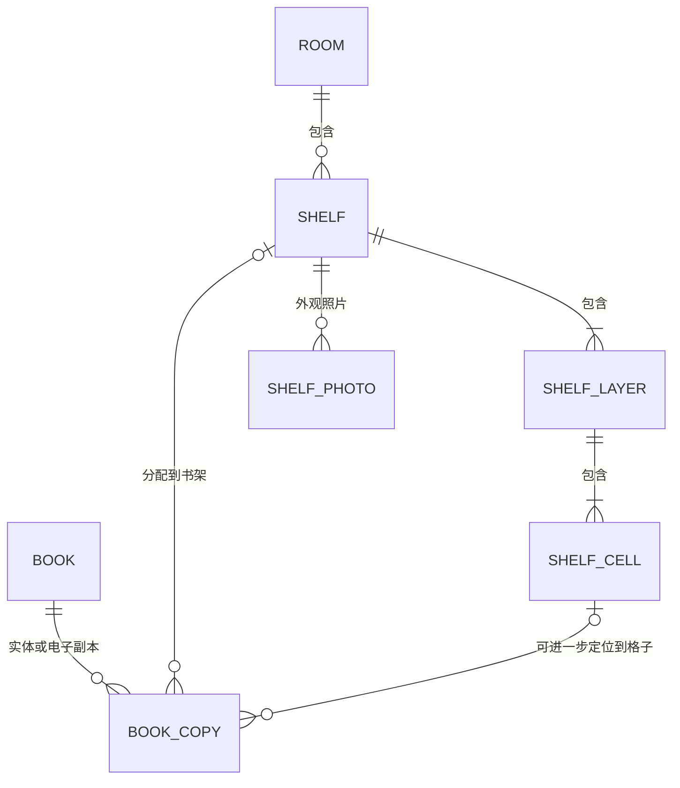

# 实体书架与图书位置管理：功能分析和设计

日期：2026-10-05  
更新：2026-10-06（核对当前实现，补充详细 WBS、依赖与阶段门禁）  
代码基线：`3bfadb6`，应用版本 0.4.0（编写时基线；实施进度见 13.3 状态表）  
状态：实施中（2026-10-06 Owner 指示启动，M0 契约已冻结，见 design/checkpoints/实体书架位置管理-M0契约冻结-20261006.md；第 14 节推荐默认值全部采纳为冻结契约）。  
范围：家庭内实体书架建档、照片、层与格子配置、图书副本定位及查找。

## 1. 要解决的问题

用户已经能查询“家里有没有关于专利的书”，但仍无法回答“它在哪个房间、哪个书架、哪一层、哪个格子”。本功能把书目检索延伸为可操作的找书指引：书目 → 实体副本 → 位置路径 → 书架照片与格子示意图。

核心需求是登记家里有几个书架、书架的名称和外观照片、所在房间与方位、每个书架的层和格子，以及书与位置的对应关系。一本书的两册可以放在不同地方，因此位置必须关联实体副本，不直接关联书目主记录。

典型结果示例：

> 《影响世界的专利》有 1 册实体副本，位于“书房／A 号书架／第 3 层／左格”，当前在架。打开位置卡片可查看书架外观照片，并在示意图中高亮目标格子。

本文中的示例是设计示例，不表示当前数据库已登记这些副本或位置。

## 2. 当前能力与缺口

下表为 2026-10-05 编写时的缺口快照，保留作为设计动机；其中「没有副本位置更新 API」「无位置编辑表单」「无房间／书架模型和页面」等缺口已由 LOC-04～15 落地，现状以 13.1／13.3 为准。

| 当前事实 | 证据 | 对设计的约束 |
| --- | --- | --- |
| 书目 `Book` 与副本 `BookCopy` 分开 | [book.py](../../backend/app/models/book.py) | 保留一书多副本，不把封面照片当副本 |
| 副本已有 `location`，是最长 200 字符的自由文本 | [copy.py](../../backend/app/schemas/copy.py) | 旧位置文字需兼容，不自动解析成格子 |
| 已有新增副本 API，当前没有副本位置更新 API | [copies.py](../../backend/app/api/v1/copies.py) | 需要新增位置变更能力，不能用反复新增副本替代移动 |
| 详情页“副本”标签展示位置、类型和状态，无位置编辑表单 | [BookDetailView.vue](../../frontend/src/views/BookDetailView.vue) | 新增位置卡片与明确的操作入口 |
| 当前无房间、实体书架、层、格子模型和页面 | [models](../../backend/app/models)、[router](../../frontend/src/router/index.ts) | 新建独立位置领域，首页封面墙继续承担藏书浏览 |
| 部分批量入库书目没有副本 | 台账 PLN-013，承接 [批量入库规划](./拍照批量入库可靠性与识书闭环开发规划及WBS-20261002.md) | 先由用户确认实体册数，不能为每个书目自动补 1 册 |
| 角色为 Owner／Member，管理操作已有 Owner Web 会话门禁 | [权限基线](./权限-数据分层与用户角色设计建议-20260820.md)、[permission_policy.py](../../backend/app/services/permission_policy.py) | 位置管理、Agent 访问和匿名展示需分别授权 |

已有“概览图”是封面拼图，不承担实体书架照片管理。本设计中的书架照片属于新的位置资源。

## 3. 目标、范围与方案取舍

### 3.1 可验证的目标

1. Owner 能建立实体书架清单，记录房间、编号、方位和外观照片。
2. Owner 能配置不同层数，以及每层不同的格子数量。
3. 家庭成员能从书目详情看到每个实体副本的位置，或明确看到位置尚未登记。
4. 能从书架／格子反向查看其中登记的书及实体册数。
5. 移动、归位、修改布局不会丢失副本、误改阅读进度或静默产生重复副本。
6. 旧 `location` 数据、现有 CLI 与入库路径继续工作；新增位置数据可备份、可核对。

### 3.2 三种可选方案

| 方案 | 收益 | 局限 | 建议 |
| --- | --- | --- | --- |
| 只规范位置文字，如“书房-A-3-左” | 开发量小，可快速补录 | 没有书架实体、照片、格子统计；改名和拼写会造成分裂 | 作为旧数据兼容入口 |
| 房间—书架—层—格子结构，附外观照片 | 能稳定定位、反向盘点和批量移动；易接入当前副本模型 | 需要维护位置结构与迁移 | 第一阶段推荐 |
| 直接在照片上绘制区域、识别书脊和自动定位 | 直观，适合异形柜体 | 照片变化、标注校准和识别准确性增加复杂度 | 后续增强 |

推荐结构化方案，先用可变层／格子示意图表示位置，照片作为外观参照。默认允许每层格子数不同；不要求先上传照片才能建书架。此默认布局已随 M0 契约冻结（见第 14 节）。

### 3.3 第一阶段与后续范围

| 第一阶段必须交付 | 后续可扩展 |
| --- | --- |
| 房间、书架清单和详情；创建、编辑、归档 | 房间平面图、书架在房间中的坐标 |
| 外观照片上传、封面照片选择、删除 | 照片区域标注，格子与标注关联 |
| 按层配置格子，允许每层不同；单层单格表示开放搁板 | 不规则多边形格子、门柜和抽屉等类型 |
| 副本位置补录、单册及批量移动、未定位清单 | 条码／二维码扫描格子后快速归位 |
| 书目定位卡片、格子内容清单、在架与归属统计 | 定期盘点、遗失核查、容量预警 |
| 旧文字位置兼容、审计、幂等和并发保护 | 识别整架书脊并给出待人工确认的摆放建议 |

第一阶段不做自动识别整架藏书、不承诺精确尺寸容量、不自动推定“书目 = 家中存在 1 册”，也不扩展为完整借还管理系统。

## 4. 用户场景与权限

### 4.1 Owner

- 给书房和客厅建档，登记两个外观相似的柜子，以照片区分。
- 配置 A 号书架：第 1 层两个格子、第 2 层三个格子、第 3 层一个开放格。
- 在“未定位”清单中确认已有副本的格子；对只有书目、没有实体副本的书，先确认实际册数。
- 一次选择若干副本移至另一格；检查确认清单后保存。
- 更换书架布局时，把旧格子的副本逐一迁移或明确取消定位，再归档旧格子。

### 4.2 普通家庭成员

- 搜索书名或主题，打开详情，查看位置路径、状态和书架照片。
- 点击“查看位置”，进入示意图高亮的格子，或查看同一格里的其他书。
- 看到“外借／遗失”等状态时，不把保留的归属格子理解为书目前仍在那里。

第一阶段推荐 Member 只读位置，Owner 负责建档和变更。是否允许成员移动自己拥有的副本，列为待确认项，不预先开放。

### 4.3 权限矩阵（已实施，LOC-05）

| 能力 | Owner Web | Member Web | Agent／CLI Token | 匿名共享目录／当前 MCP 目录工具 |
| --- | --- | --- | --- | --- |
| 读取房间、书架、格子与副本位置 | 允许 | 允许 | 须显式授予 `locations:read` | 不提供精确位置 |
| 查看书架外观照片 | 允许 | 允许 | 须同时有 `locations:read` 与 `files:read` | 不提供 |
| 建档、编辑布局、上传照片、归档 | 允许 | 拒绝 | 拒绝 | 拒绝 |
| 分配、移动或清除结构化位置 | 允许 | 第一阶段拒绝 | 第一阶段拒绝 | 拒绝 |
| 新增旧格式文字位置的副本 | 延续当前鉴权 | 延续当前鉴权 | 延续当前授权 | 拒绝 |

`locations:read` 已实施为现有 Scope（LOC-05，2026-10-06）：服务器角色能力表、可授予集合、发现契约与授权矩阵文档均已同步；不向已有 Token 自动追加。管理端点仍要求 Owner Web 会话及现有 CSRF 校验，不能仅凭 `books:write` 修改结构化位置。

精确位置和家居照片属于家庭内部数据。匿名目录继续只展示脱敏库存状态；现有 MCP 目录接口也不因新增功能而增加房间名、位置或照片字段。若后续新增定位 Tool，需单独评审契约、Scope 和版本。

## 5. 信息结构与页面设计

新增顶栏“实体书架”入口：登录成员可读，Owner 显示管理按钮。拟新增路由 `/storage` 与 `/storage/shelves/:id`，避免与现有首页“书架”封面墙混淆。

### 5.1 清单页

- 按房间分组显示书架卡片：外观照片、编号、名称、方位、层数／格数。
- 显示“在架册数”“已分配位置册数”和“涉及书目数”，不把册数和书目数混算。
- 筛选房间、名称和归档状态；Owner 可建房间、建书架。
- “未定位”入口分为：有实体副本但位置未登记／仅有旧位置文字／书目尚无实体副本，三类分别处理。
- 暂无书架时引导 Owner 建档；Member 显示“尚未配置实体书架”。

### 5.2 书架详情页

外观照片和方位说明在上方，层／格子示意图在下方；照片缺失时展示占位图，定位仍可使用。编号约定：面向书架正面，层从上到下、格子从左到右；界面始终显示这条约定。

```text
书房 · A 号书架 · 靠窗右侧
[书架外观照片]

第 1 层  [左格：8 册]       [右格：6 册]
第 2 层  [左格：5 册] [中格：9 册] [右格：4 册]
第 3 层  [开放格：12 册]
```

点击格子显示书目及副本清单。Owner 可“分配已有副本”“批量移动”；移动前后均展示完整位置路径。手机采用逐层纵向布局，格子可通过按钮和列表访问，不依赖拖拽、颜色或照片标注才能操作。

### 5.3 书籍详情与查找

“副本”标签为每册展示：副本编号、状态、归属成员、位置路径、照片缩略图和“查看位置”。同书两册分开列出；位置仅到书架时显示“格子待登记”；旧文字位置注明“文字位置，未关联实体书架”；无副本则显示“尚未登记实体副本”。

Owner 可新增实体副本并选择位置，或编辑已有副本位置。副本增量数据进入书目详情返回，普通阅读页继续正常工作。Owner／Member Web 可读结构化位置；原 Agent 书目详情若无 `locations:read`，只保留原有旧文字字段，不新增精确位置或照片地址。

第一阶段在实体书架页提供房间／书架／格子过滤；首页可加“有已登记在架副本”过滤，但不得改变现有阅读状态筛选的含义。

## 6. 数据模型



### 6.1 位置实体（已建表，LOC-04）

| 实体 | 核心字段 | 约束 |
| --- | --- | --- |
| `storage_rooms` | id、code、name、description、sort_order、version、archived_at | code 家庭内唯一且归档后保留；name 可修改 |
| `storage_shelves` | id、room_id、code、name、position_note、version、archived_at | code 家庭内唯一，如 A01；room 必须有效；照片按独立表关联 |
| `shelf_layers` | id、shelf_id、label、sort_order、version、archived_at | label 用于“第 3 层”等展示，排序与稳定 ID 分离 |
| `shelf_cells` | id、shelf_id、layer_id、code、label、sort_order、version、archived_at | shelf 内 code 唯一且不复用；layer 必须属于同一 shelf |
| `shelf_photos` | id、shelf_id、relative_path、mime_type、width、height、caption、is_primary、version、created_at | 第一阶段每架最多 5 张；最多一张主图；逻辑 ID 访问文件 |
| `location_operations` | id、operator_member_id、idempotency_key、payload_digest、result_json、created_at | 写操作幂等记录；同操作者与 key 唯一；与业务修改同事务 |
| `location_file_gc_jobs` | id、relative_path、reason、status、attempts、next_retry_at、lease_until、last_error、created_at | 照片删除／替换时同事务登记；失败可恢复，不以进程内队列代替 |

所有结构实体记录创建、更新时间。数量、尺寸和上限已随 M0 冻结为默认值（见第 14 节）。实体引用依赖 ID，编号和名称只是可读标签，不作为数据库关联键。

### 6.2 对 BookCopy 的增量

- 增加 `placement_shelf_id`、`placement_cell_id`、`placement_version`。
- 仅实体副本 `copy_type=physical` 可设置这些字段；电子副本不进入实体占用统计。
- 两个 ID 均为空表示未结构化定位；仅 shelf_id 表示知道书架但不知道格子；cell_id 非空必须同时有对应 shelf_id。
- cell 与 shelf 的关系使用数据库复合外键或同等约束保证；layer 与 shelf 也须保证一致。SQLite 启用外键校验，不能只依赖前端下拉框。
- 位置字段表达“登记的存放／归属位置”。当前实际是否在该位置，结合副本状态判断。
- 保留旧 `location` 原文。结构化路径通过关联实时生成 `location_display`，不把生成文本回写为唯一事实。
- 有 `locations:read` 的副本响应增加 `placement` 对象、独立的 `placement_version` 与 `location_display`；没有结构化定位时 `placement=null`，但仍返回真实版本，display 回退旧 location。清除位置不会将版本重置为 1；再次设置须使用刷新后的版本。未授权响应不包含这三个字段，旧客户端仍可读原字段。（2026-10-07，BUG-298 修订）

旧文字与结构化位置不一致时，界面以结构化位置为当前登记位置，并允许查看旧文字。用户清除结构化位置时须明确选择“保留旧文字”或“一并清空”，防止无意显示过期位置。旧客户端向已结构化定位副本更新 location 时，返回 409 并引导使用位置接口，避免形成两套相互矛盾的当前位置。

### 6.3 数量和状态口径

| 数值／状态 | 定义 |
| --- | --- |
| 已分配位置册数 | 有效位置引用的实体副本数，包含暂时外借等非在架副本 |
| 在位册数 | 已分配到该位置、状态为 `in_shelf` 或 `storage` 的实体副本数 |
| 在架册数 | 上述副本中状态为 `in_shelf` 的数量 |
| 涉及书目数 | 分配副本对应的 distinct book_id 数 |
| `lent_out` | 保留归属位置，显示“外借，当前不在此处”，不计在位册数 |
| `lost`／`discarded` | 可保留历史归属位置，但不计在位册数 |
| `damaged` | 不能仅凭损坏推断当前所在处；显示状态，不计确定在位册数 |

第一阶段不做容量占用百分比：一本大开本与一本小册子的空间不等价。“0 册”只表示系统未登记，不等于现场一定为空。

## 7. 核心流程与业务规则

### 7.1 建档与配置

Owner 创建房间 → 创建书架并填方位 → 指定层数和各层格数 → 预览编号 → 保存 → 可选上传外观照片。默认每层先建 1 格，之后按现场细分。保存前展示具体结构，创建结构和幂等回执同事务提交。

已有副本后调整布局不能通过“删掉重建整个网格”实现。重命名或调整显示顺序保留层／格 ID；合并、拆分格子需明确选择旧副本的新位置。删除／归档仍被副本引用的格子，即使副本外借或已遗失，也返回 409，要求先处理引用。

层、书架、房间的归档检查全部后代和所有副本引用；不得级联删除书目或副本。第一阶段只提供归档和恢复，硬删除待后续清理设计。归档的子对象保留历史，但所有读取和写入都检查祖先是否归档；恢复子对象前需先恢复祖先。

### 7.2 副本补录与移动

1. 对已有实体副本，直接选择目标书架／格子，更新位置而不新增副本。
2. 对没有副本的书目，要求用户确认实体册数、归属成员和位置；电子书／仅收藏书目可跳过。
3. 同一本书多个副本可放在同一格，也可分散存放；不建立“一格一书”的唯一约束。
4. 批量操作先预览每个 copy_id、书名、旧位置、新位置和版本；确认后一次事务处理，第一阶段最多 100 册。
5. 任一副本版本变化、目标归档或跨书架关系不合法，则整个批次返回 409／422，零部分成功；刷新预览后重新确认。
6. 请求带 idempotency_key；同 key、同摘要重放返回原结果，同 key、不同摘要返回 409。超时后先查操作回执，不能再用新 key 盲目补建副本。写事务开始即尝试登记幂等 key，并与业务修改一起提交；并发同 key 请求等待首个事务完成后读取回执，不能各自先创建副本再登记 key。

### 7.3 并发与审计

位置变更使用副本 placement_version，结构变更使用资源 version。位置分配、归档和布局变更共用事务与固定顺序的资源写锁：先收集所有副本原位置及目标位置的完整祖先集合，再按 room → shelf → layer → cell → copy 的类型顺序、每类按 ID 升序加锁。归档及布局变更也遵循相同顺序，不能先锁目标再临时追加源位置锁。

SQLite 通过条件 UPDATE 获取写锁并重读；PostgreSQL 使用同等资源锁策略。锁定后如发现副本已换位置、父子关系已变化或目标祖先集合与预览不符，回滚并返回冲突，不能在持锁事务中继续补锁。数据库忙或死锁仅在确定整个事务已回滚时，允许从头重试完整事务最多 3 次；版本冲突不自动重试。不能把仅适用于某一数据库的 SELECT FOR UPDATE 当作跨库保证。

锁定后重验目标和祖先有效、成员与副本有效、版本一致；业务修改、幂等回执和审计在同一事务提交。位置服务不复用当前会自行 commit 的 create_copy 作为批量事务单元，应提取由调用方控制事务的领域操作，保留旧 API 的提交语义。

审计复用现有 OperationLog，以 [log_operation](../../backend/app/utils/operation_log.py) 将记录加入当前 Session，随后由位置业务事务统一 commit；不得调用会吞掉日志失败并自行提交的 log_and_commit 作为此流程的审计单元。payload 记录 operation_id、实际操作者、副本 ID、原／新位置 ID、原／新展示路径快照、版本和操作类型；审计失败则整个位置事务失败。

批量移动按副本记录成员归属；不修改 reading_progress、reading_notes 或 purchase_records。结构改名会改变实时位置路径，历史审计保留当时快照，不能只保存可能变名／归档的外键引用。

## 8. 外观照片与位置示意

第一阶段支持 JPEG、PNG、WebP，默认单张上传不超过 10 MiB、解码像素不超过 2000 万、每架最多 5 张。服务端验证真实格式与尺寸，解码后重编码、移除 EXIF，避免保留 GPS；超限拒绝。HEIC 转码和自动压缩提示留待设备兼容评审。

文件存储建议为 `data/shelf_photos/<shelf_id>/<uuid>.<ext>`，原文件名不参与路径生成。上传先写独立暂存文件，数据库失败只清理本次文件；成功后照片记录与受控路径建立关联。通过照片 ID 获取文件，读取时验证父资源及权限、路径 containment；禁止复用匿名封面入口或任意文件路径参数。

替换／删除照片时，在同一数据库事务中更新照片引用并插入 location_file_gc_jobs；commit 成功后再清理旧文件。即使进程在 commit 后、清理前退出，下一次启动或受控清理命令也可继续处理已持久化的任务。回收任务使用条件更新获取短期租约，执行前重新验证路径 containment 且文件不再被任何照片引用；删除不存在的文件视为已完成。失败增加 attempts、记录诊断并退避，达到上限后保留失败任务供人工处理，不删除其他请求的文件。

上传过程中尚未提交引用的文件不按普通回收任务立即删除。暂存和永久目录应提供只读孤儿核对清单，保守筛选超过 24 小时且无引用的候选，人工确认后再回收；受控清理不扫描 covers／attachments 等其他目录。主图切换持有书架锁，保证最多一张主图。文件缺失时显示“照片不可用”，记录诊断，书目与位置查询继续可用。

示意图独立于照片，通过当前层／格结构生成。照片没有区域标注时，高亮的是示意图格子，不能在原照片上凭猜测圈出位置。若后续增加标注，坐标采用相对图片宽高的归一化坐标，并关联照片 ID／版本；更换照片后旧标注应失效并要求重校准。

## 9. API 与契约草案

以下接口已实现（LOC-06～14，2026-10-06；实施期契约修订见 M0 checkpoint 修订记录）。沿用 `/api/v1` 与项目 ApiResponse 包装；Web 请求按部署基址拼接路径。所有变更传期望版本，非幂等创建及批量写入传 idempotency_key。

| 方法与路径 | 用途 | 门禁 |
| --- | --- | --- |
| GET `/storage/rooms`、`/storage/shelves` | 列表、房间过滤与分页 | locations:read |
| POST `/storage/rooms`、`/storage/shelves` | 创建房间／书架 | Owner Web |
| PATCH `/storage/rooms/{id}`、`/storage/shelves/{id}` | 修改、归档或恢复 | Owner Web |
| GET `/storage/shelves/{id}` | 元数据、结构、统计与受授权的照片引用 | locations:read |
| PUT `/storage/shelves/{id}/layout` | 带稳定 ID 的布局变更，校验引用与版本 | Owner Web |
| GET `/storage/cells/{id}/copies` | 格子副本清单，支持分页 | locations:read |
| POST `/storage/shelves/{id}/photos` | 上传外观照片 | Owner Web |
| GET `/storage/photos/{id}/content` | 受认证的图片读取 | locations:read + files:read |
| PATCH／DELETE `/storage/photos/{id}` | 改说明、设主图或删除 | Owner Web |
| GET `/storage/unlocated` | 三类未定位清单 | locations:read |
| PATCH `/books/{book_id}/copies/{copy_id}/placement` | 单册分配／移动／清除 | Owner Web |
| POST `/storage/placements/preview` | 预览移动，产生规范化摘要 | Owner Web |
| POST `/storage/placements` | 原子执行批量移动，重验预览版本 | Owner Web |
| POST `/storage/copies` | 显式确认数量后批量补录实体副本及位置 | Owner Web |
| GET `/storage/operations/{idempotency_key}` | 查询自己的写操作回执 | Owner Web |

已有 POST `/books/{book_id}/copies` 保留；若请求新增结构化 placement 字段则额外要求 Owner Web 并使用事务版位置领域操作。普通成员与 Agent 的旧文字副本新增保持现有规则。新接口验证 copy_id 属于路径中的 book_id，不接受通过改路径操作另一书副本。

批量移动请求内容示例（外层仍采用项目约定）：

```json
{
  "idempotency_key": "客户端生成的唯一请求标识",
  "preview_digest": "服务端预览摘要",
  "target": {"shelf_id": 2, "cell_id": 8, "shelf_version": 3, "cell_version": 1},
  "copies": [{"copy_id": 91, "placement_version": 2}]
}
```

错误建议使用稳定 code：未授权 401／403，资源不可见或不存在 404，版本变化 `PLACEMENT_CHANGED`、位置停用 `LOCATION_ARCHIVED`、仍有引用 `LOCATION_IN_USE`、幂等摘要冲突 `IDEMPOTENCY_CONFLICT` 为 409，非法层格关系为 422，图片大小超限为 413。只允许同一目标的批量移动；多目标补录使用独立条目列表与整体预览。

接口返回要区分副本数、书目数、在位数；所有清单分页。第一阶段采用同步事务，回执查询区分 completed 与 not_found：not_found 也可能是首个事务尚未提交，不能解释为“确定没有执行”。客户端可等待后再查，或以同 key、同摘要重放；不生成新 key。若后续采用异步任务，再定义独立的 pending／failed 状态与恢复规则。

## 10. 与批量入库、CLI 和 Agent 的衔接

### 10.1 现有书目先补录

提供独立“副本与位置补录”流程承接 PLN-013，允许多选书目，但每项必须确认册数和归属。先列出已存在副本，默认只给它们分配位置；用户明确确认增购／额外实体册数时才新增副本。

不能因当前数据库有 76 个书目而自动建立 76 册实体副本，不能把照片张数当实际册数。未确认项目留在未登记清单，系统仍能浏览它们。

### 10.2 拍照批量入库

第一阶段不改 intake.create_book／intake.link_photos 的执行语义。执行成功后，提供“继续登记副本与位置”入口，复用上一节流程，位置操作有独立幂等回执。

按最终 book_id 合并提示，展示该书现有副本；同一书的多个候选或照片不能默认生成多册。使用新书架默认位置只能预填选项，不能替用户确认副本数量。这样书目入库成功但位置登记失败时，只重试位置步骤，不重新建书。

后续若将两步纳入同一工作台事务，需另行扩展确认摘要和命令契约，并同时评审恢复与幂等边界。

### 10.3 CLI／Agent

保留 CLI `--location` 的文字语义，不通过分隔符猜测 shelf_id／cell_id。第一阶段可增加只读定位命令／API 适配，必须取得 locations:read；设计中的 Agent 查找示例：

> 找到 3 本相关书，其中《影响世界的专利》登记有 1 册，归属位置为书房 A 号书架第 3 层左格，状态为外借，因此当前不在架。

没有副本或位置时明确说明缺失，不推断房间或格子。结构化写入 CLI／Agent 暂不开放，后续以独立权限设计支持，不能把 Member 或普通 Token 当 Owner Web。

## 11. 迁移、部署与回退

1. Alembic 以增量迁移创建位置表，为 BookCopy 增加可空字段和版本；旧行默认未结构化定位。
2. 在现有数据库副本上演练，核对书目、副本、进度、购买和笔记数量及引用；不因迁移写入虚构房间或副本。
3. 上线新读取能力和 Owner 建档页，旧客户端继续可用；人工补录通过可预览、可撤销的业务操作完成。
4. LWA 同步前备份正在运行实例的数据库及 data 文件，而不是用本地旧库覆盖运行后的新数据。备份范围包含 shelf_photos 和幂等回执。
5. 构建前端使用当前部署别名基址，再同步后端与构建产物，执行迁移、登录及位置验收。
6. 回退应用代码时保留新增表和列，停止位置写入；旧版应用仍读旧 location，可能无法展示新定位，这一限制需明确提示。
7. 若必须回退 schema，则先导出位置关联和图片清单，停写后执行；不可直接 drop 含新位置数据的表。恢复整库备份会丢失备份之后的写入，只能在用户明确选择该回退方案后执行。

第一阶段主要读位置实时计算，不新增常驻盘点服务。结构与照片变更后刷新相关缓存，文件响应使用 private 缓存，不向匿名共享缓存发布家居照片。

## 12. 验收标准与验证矩阵

| 场景 | 验收结果 |
| --- | --- |
| 建两个房间、三个书架；其中一个每层格数不同 | 清单、编号、示意图和详情一致；数量不会按规则矩形错误计算 |
| 手机无照片、无拖拽操作 | 可通过文字路径、按钮和格子列表完成定位 |
| 同书两册，分别放两格 | 展示两个副本与两个位置；书目统计 1、实体统计 2 |
| 仅定位到书架／旧位置文字／完全未登记 | 三种情况文案清楚，不出现虚构格子 |
| 普通成员找书 | 能读内部位置与照片；管理按钮不出现，直接调用写 API 被拒绝 |
| 匿名目录、现有 MCP、无 locations:read Token | 不出现新增精确位置和书架照片；旧目录契约不漂移 |
| 带 locations:read 的 Agent | 只读位置；照片还需 files:read；没有管理写权 |
| 移动已有副本、重复点击、请求回执丢失 | 仅一次位置变更；副本数不增加，重放返回同回执 |
| 补录副本重复请求与同 key 不同参数 | 不重复创建；不同摘要返回 409 |
| 先预览后被另一会话移动 | 版本冲突，中止整体操作，重新核对后再提交 |
| 一个批量条目失效 | 整批零写入，副本、回执和审计不部分提交 |
| 移动与归档并发，在 SQLite 与 PostgreSQL 分别验证 | 不产生引用已归档位置的新增分配，冲突可解释 |
| 层／格改名、重排序、合并／拆分 | ID 不静默重建；有引用的删除被拦截，先迁移再归档 |
| 外借、遗失、损坏、电子副本 | 归属位置与当前在位区分；电子副本不能分配实体格子 |
| 恶意图片、伪扩展名、路径穿越、超限像素、上传并发失败 | 拒绝非法输入；不泄漏 EXIF；仅清理本次文件 |
| 照片删除已提交后进程退出／回收任务租约失效 | 重启能继续清理；幂等处理不存在文件，不删除仍有引用的照片 |
| 已有书目、旧位置、旧 CLI 与登录／阅读流程 | 原数据保留，旧接口不被副本补录或位置迁移破坏 |
| LWA 路径别名、刷新深链接、照片认证 | 页面资源和 API 基址正确，刷新与图片读取正常 |

性能验收建议：使用 100 个书架、2000 个格子、1 万副本的合成数据验证分页、查询计划和 N+1；返回量受分页限制，先记录家庭服务器实际耗时，再制定发布门槛，不提前承诺未经测量的响应时间。

## 13. 分阶段交付与 WBS

### 13.1 当前落实情况与状态口径

2026-10-06 对照当前工作区复核：已有 Book／BookCopy 分离、文字 `location`、新增副本 API 与详情页副本展示；尚无本文拟新增的位置表、结构化 placement 字段、`/storage` 接口与页面，也没有 `locations:read` Scope。现有副本、权限、照片处理和审计代码可作为实现基础，不能因此把新增工作包标为已完成。（本段为 2026-10-06 上午复核时点快照；同日 M1 起上述各项已陆续落地，现状以 13.3 状态表为准。）

2026-10-06 Owner 指示立即实施，M0（LOC-01～03）契约冻结完成（见上述 checkpoint），第 14 节推荐默认值全部采纳；M1 起按依赖顺序逐项实施。PLN-013 的产品决策以 M0 冻结为准（不自动补册、人工确认），真实副本数量核对及实际补录仍待 LOC-14/16/20 落地后完成，PLN-013 保持待办。

原第 13 节只有 M0～M4 阶段概览，2026-10-06 补充 LOC-01～LOC-22 的详细 WBS。本文已随 Owner 指示与 M0 契约冻结升格为实施基线：LOC-01～14 已完成（证据见 13.3），LOC-15 进行中，LOC-16～22 待办。PLN-013 的产品决策、真实副本数量核对及实际补录仍待完成，设计文档完成不能关闭该条目。

实施后按“待办 → 进行中 → 待验收 → 已完成”更新本文工作包状态，并附代码、测试及验收记录。仅单元测试通过、接口可调用或页面可打开，不足以替代迁移、权限、跨库并发和真实试点验收。开发任务另行登记根目录台账；LOC 编号是本文的工作包编号，不占用台账 ID。

### 13.2 阶段概览

| 阶段 | 工作包 | 依赖与完成标准 |
| --- | --- | --- |
| M0 契约确认 | 位置语义、权限矩阵、编号规则、迁移和照片限制 | 明确待确认项，补正式接口与数据约束 |
| M1 领域基础 | 模型、迁移、结构 CRUD、Owner 门禁、归档、事务与版本 | 后端核心约束及 SQLite／PostgreSQL 并发验收通过 |
| M2 实体书架页面 | 房间／书架清单、可变层格配置、照片与示意图 | 手机／桌面建档及 Member 只读验收通过 |
| M3 副本定位 | 详情卡片、未定位清单、单册／批量位置、补录及幂等 | 一书多册、整体失败、恢复查询等验收通过 |
| M4 流程衔接与发布 | 入库后补录入口、只读 Agent、文档、LWA 验证 | 整链路真实试点、权限回归、备份／回退演练完成 |

M2、M3 表示用户可验收的交付阶段；其后端查询、照片与位置操作可在相应依赖完成后交叉推进。具体依赖以下表为准，不要求等待全部 M2 页面完成才开始位置服务。

### 13.3 详细 WBS

| 编号 | 阶段 | 工作包与交付物 | 前置依赖 | 完成标准 | 当前状态 |
| --- | --- | --- | --- | --- | --- |
| LOC-01 | M0 | 冻结位置与实体副本产品语义：册数、归属、仅到书架／到格子、状态统计、编号、成员权限与照片默认限制；记录 PLN-013 决策 | 无 | 第 14 节各项有明确结论；确认“不按书目或照片数自动补册”；未决项有明确后续范围 | 已完成（2026-10-06，[M0 契约冻结](../checkpoints/实体书架位置管理-M0契约冻结-20261006.md)） |
| LOC-02 | M0 | 冻结 API、请求／响应 Schema、分页、错误码、权限矩阵、旧客户端字段与回执查询契约 | LOC-01 | 第 9 节形成可实施契约；声明 `locations:read`、照片双 Scope、Owner Web 写入、同 key 重放及 not_found 语义；旧 MCP 目录输出保持原契约 | 已完成（2026-10-06，同上） |
| LOC-03 | M0 | 冻结关系约束、锁顺序、幂等事务、审计、照片生命周期及部署验证方案 | LOC-01、LOC-02 | 给出 SQLite／PostgreSQL 对应约束和并发验证安排、升级及保留 schema 的回退方案；确定配置上限与文件回收入口 | 已完成（2026-10-06，同上） |
| LOC-04 | M1 | 位置实体与 Alembic 增量迁移：七张拟新增表、BookCopy placement 字段、索引与关系约束 | LOC-03 | 新库与旧库副本迁移通过；旧文字保留且不自动创建副本；物理副本、层格所属、唯一编号及主图约束可验证 | 已完成（2026-10-06，迁移 l3c4d5e6f7a8 + test_storage_locations.py 10 例，新旧库升级/回退演练通过） |
| LOC-05 | M1 | 位置鉴权与输出隔离：角色能力、可授予 Scope、发现契约、授权矩阵与序列化 | LOC-02、LOC-04 | Owner／Member／Token／匿名矩阵通过；旧 Token 不自动扩权；未授权响应无新增精确位置或照片；管理写入要求 Owner Web 与 CSRF | 已完成（2026-10-06，`locations:read` 全链路 + include_placement 输出隔离，test_storage_auth.py 7 例，后端全量 992 通过） |
| LOC-06 | M1 | 房间／书架／层格领域服务与 CRUD、布局修改、归档和恢复接口 | LOC-04、LOC-05、LOC-07 | 稳定 ID 不随改名或排序改变；有副本引用的归档被拒；祖先归档限制有效；合并／拆分先明确处理引用 | 已完成（2026-10-06，storage_locations.py + api/v1/storage.py 9 端点 + test_storage_crud.py 11 例；后端全量 1015 通过） |
| LOC-07 | M1 | 共用写事务与并发基础：资源锁、条件版本更新、幂等回执、摘要校验、审计及受控重试 | LOC-03、LOC-04、LOC-05 | 业务、回执、审计同事务；同 key 并发只提交一次；不同摘要冲突；失败零部分写入；两种数据库按固定顺序锁定并重验资源 | 已完成（2026-10-06，storage_tx.py + test_storage_tx.py 12 例；PG 分支已实现未实机验证；后端全量 1004 通过） |
| LOC-08 | M1 | 位置查询、格子副本清单、三类未定位清单、分页和数量统计 | LOC-04、LOC-05、LOC-06 | 同书多册、电子副本及非在位状态口径符合第 6.3 节；位置路径实时生成；三类未定位数据不会混算；列表无逐行查询扩张 | 已完成（2026-10-06，storage_queries.py + cells/{id}/copies 与 unlocated 端点 + location_display 实时路径，test_storage_queries.py 9 例；后端全量 1024 通过，MCP 契约零漂移） |
| LOC-09 | M2 | 书架照片领域与受控文件接口：格式／像素校验、重编码去 EXIF、主图、删除回收任务和恢复入口 | LOC-04、LOC-05、LOC-06、LOC-07 | 非法输入和越权读取被拒；每架上限及并发主图唯一有效；上传失败仅清理本次文件；删除提交后中断可恢复，不删仍有引用文件 | 已完成（2026-10-06，storage_photos.py + 5 端点 + GC 租约/启动恢复/孤儿只读核对，test_storage_photos.py 22 例；后端全量 1046 通过） |
| LOC-10 | M2 | `/storage` 路由与导航、房间／书架清单、建档编辑、归档状态及空态 | LOC-06、LOC-08 | Owner 可建档，Member 只读；手机／桌面可操作；无书架与无照片时说明清楚；与首页封面墙入口明确区分 | 已完成（2026-10-06，StorageView + 2 表单组件 + storage store，vitest 57 通过、build 通过；手机/桌面实机操作验收并入 LOC-19/20） |
| LOC-11 | M2 | 可变层格布局编辑器：预览编号、改名排序、带引用的结构调整与冲突提示 | LOC-06、LOC-10 | 各层格数不同可保存；操作保持稳定 ID；有引用时引导先处理副本，不静默删格；版本冲突刷新后再确认 | 已完成（2026-10-06，ShelfLayoutEditor + putShelfLayout，vitest 67 通过、build 通过；实机验收并入 LOC-19/20） |
| LOC-12 | M2 | 书架详情、照片管理、层格示意图、高亮定位与格子内容列表 | LOC-08、LOC-09、LOC-10、LOC-11 | 无照片仍可定位；高亮对应实际格子 ID；支持键盘和手机列表访问；照片不凭空标注区域；数量与后端口径一致 | 已完成（2026-10-06，StorageShelfView + `/storage/shelves/:id` 路由 + ?cell= 高亮，vitest 78 通过、build 通过；实机验收并入 LOC-19/20） |
| LOC-13 | M3 | 单册位置与批量移动领域/API：预览摘要、完整祖先版本、原子提交、清除位置及回执查询 | LOC-06、LOC-07、LOC-08 | 最多 100 册默认上限；任一版本或资源失效整批拒绝；移动不新增副本；清除时明确保留／清空旧文字；移动与归档并发不产生无效新引用 | 已完成（2026-10-06，storage_placement.py + PATCH copies placement 与 placements/preview·placements 端点，test_storage_placement.py 16 例含并发移动/归档；后端全量 1062 通过） |
| LOC-14 | M3 | 存量实体副本补录领域/API：先查已有副本、逐项确认新增册数与归属、批量幂等创建 | LOC-07、LOC-08、LOC-13 | 已有副本优先分配位置；新增册数来自明确确认；重复请求不重复创建；校验成员、书目及目标；不改变进度、笔记和购买记录 | 已完成（2026-10-06，storage_intake.py + POST /storage/copies，test_storage_intake.py 10 例含 4 线程并发同 key；后端全量 1072 通过） |
| LOC-15 | M3 | 书籍详情副本位置卡片及 Owner 新增／编辑入口，跳转高亮格子 | LOC-08、LOC-12、LOC-13、LOC-14 | 同书两册分开展示；仅到书架、旧文字、未定位和无副本文案可区分；外借／遗失不显示为当前在架；未授权主体不见新增字段 | 进行中（2026-10-07：详情卡片、CopyPlacementEditor、CopyProvisionForm 与「查看位置」跳转已接线，BUG-298 修复后编辑器 4 例回归、前端四文件 37 例通过、build 通过；同日 BUG-299/303 补强——补录幂等键按载荷跨实例复用、结果未确认不换键，编辑器模式切换清空隐藏目标，前端全量 100 例通过；尚缺 BookDetailView 视图级回归与浏览器实机验收，未达完成标准） |
| LOC-16 | M3 | 未定位与补录页面：分类清单、数量确认、归属选择、移动预览及未知结果恢复 | LOC-10、LOC-13、LOC-14 | 每条显示已有副本及本次新增量；超时后查询回执或同 key 重放，不盲目换 key；冲突不部分成功；未确认项目可留待后续补录 | 待办 |
| LOC-17 | M3 | 拍照批量入库执行成功后的“继续登记副本与位置”入口 | LOC-14、LOC-16 | 按最终 book_id 合并提示；多照片／多候选不默认多册；位置失败只恢复位置操作；不改既有 intake 命令、确认摘要及建书语义 | 待办 |
| LOC-18 | M4 | Agent 受授权只读定位说明及契约联调；按评审需要增加 CLI 只读适配 | LOC-02、LOC-05、LOC-08、LOC-15 | 无位置如实说明，外借显示归属而不推断在架；精确定位要求 `locations:read`，照片另需 `files:read`；原 CLI `--location` 文字语义保留；不开放结构化写入或擅自新增 MCP Tool | 待办 |
| LOC-19 | M4 | 综合自动化回归与并发／故障验收记录，覆盖第 12 节完整矩阵 | LOC-09、LOC-11、LOC-13、LOC-14、LOC-15、LOC-16、LOC-17、LOC-18 | 两种数据库的约束、移动／归档并发、幂等、审计回滚及照片中断恢复均有证据；前端、鉴权、旧 CLI／目录及原入库回归通过；跳过项不能记为验收通过 | 待办 |
| LOC-20 | M4 | 查询性能验证与真实家庭试点：合成规模测量、2 个书架和至少 10 册真实副本核对 | LOC-12、LOC-15、LOC-16、LOC-17、LOC-19 | 记录分页和查询计划及家庭服务器耗时，再确定性能门槛；现场验证同书多册、旧文字、不同层格、外借和缺照片；系统位置与现场一致 | 待办 |
| LOC-21 | M4 | 迁移、备份恢复与 LWA 部署演练：增量升级、照片／回执备份、路径别名与旧应用回退 | LOC-04、LOC-09、LOC-19 | 在运行库副本演练并核对数量与引用；备份可恢复位置、照片及回执；深链接刷新与照片鉴权正常；回退不直接删除新位置数据 | 待办 |
| LOC-22 | M4 | 使用与维护文档、验收清单、台账同步及发布取舍 | LOC-20、LOC-21 | 列明已验收范围、配置、补录步骤、回收诊断及未交付项；保存试点与回退证据；按用户发布授权执行后续操作；PLN-013 仅在决策与约定补录实际完成后收口 | 待办 |

### 13.4 依赖顺序与阶段门禁

1. M0：LOC-01～03 明确产品与技术契约后，再推进迁移和新写接口。后续取舍回写本文，不让接口、数据库与页面分别采用不同默认值。
2. M1：先完成 LOC-04、05、07，再实现结构管理与查询（LOC-06、08）。目录只读权限和 Owner 写权限先成立，再开放位置管理页。
3. M2／M3：基础契约稳定后，照片、布局页面和位置领域可按表中依赖推进。补录页面必须先具备幂等和恢复查询，不能用原新增副本 API 的重复调用代替事务版补录。
4. M4：回归、跨库并发、真实试点及部署／回退证据分别验收。开发完成不等于可正式批量补录；未完成的门禁须在 LOC-22 中如实列出。

LOC-19 的综合验收不替代各工作包自身回归。迁移、权限、并发、照片文件安全等关键约束应在所属工作包实现时就验证，避免到试点阶段才发现基础规则缺失。

第一阶段最小可用闭环为：建档房间／书架与可变层格 → 用户确认真实副本 → 分配位置 → 详情定位与反向清单 → 移动及冲突恢复。外观照片允许晚于文字定位联调，但仍属于本方案第一阶段交付；CLI 只读适配可按 LOC-18 评审选做。照片圈选、整架识别、二维码归位和完整借还流程仍属后续范围，不因补充 WBS 自动进入本期。

### 13.5 验证与完成记录要求

- 后端：在临时 SQLite 和 PostgreSQL 数据库执行迁移、约束、接口、权限、幂等与并发验证；素材使用合成图片，故障测试不得写生产库。
- 前端：执行相关组件回归与构建，并在手机／桌面浏览器检查建档、定位、补录、冲突与照片认证流程；单靠组件测试不代替实机检查。
- 兼容：复核旧副本新增、文字位置、CLI、阅读、批量入库及匿名／MCP 目录输出；只有新增 CLI 适配时才追加对应命令回归。
- 部署：以运行库副本与数据文件演练备份恢复和应用回退，记录实际命令、版本与数据核对结果。
- 证据：工作包完成时附实现落点、测试结果和未验收限制；阶段验收报告放入 `design/checkpoints/` 并从本文引用，根目录台账保存对应任务 ID。

（下句为 2026-10-06 补充 WBS 时点的声明，已被同日启动的实施取代。）工期和资源安排在 M0 契约明确后估算，不在本文档中虚构承诺日期。

## 14. 待确认项与推荐默认值（已冻结）

| 待确认项 | 推荐默认值 | 影响 |
| --- | --- | --- |
| 书架格子布局 | 每层格子数可不同，面向正面由上到下、由左到右 | 第一阶段模型与布局编辑器 |
| 普通成员能否移动书 | 第一阶段只读，Owner 操作位置 | 写权限、归属校验和误操作恢复 |
| 家居照片的成员可见范围 | 登录家庭成员可读；匿名、现有 MCP 不读 | 权限与图片接口 |
| 第一期是否需要照片圈选 | 先用独立示意图定位，照片圈选后续增加 | 前端标注和照片版本契约 |
| 副本默认数量 | 不自动创建；每项人工确认实际册数 | 存量补录和批量入库衔接 |
| 上传与批量上限 | 每架 5 张、单张 10 MiB／2000 万像素、每批 100 册 | 可调部署配置与验收边界 |
| 位置到书架还是必须到格子 | 两者均允许；仅到书架显示“格子待登记” | 用户可逐步完善定位 |

上述默认值已于 2026-10-06 经 Owner 全部采纳为冻结契约（M0，见 checkpoint 修订记录）；后续变更须回写 M0 checkpoint 修订记录并评估迁移与兼容影响。
