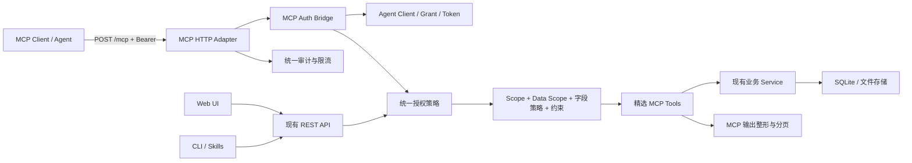

# 家庭图书管理系统 MCP 接口设计与 WBS

> 日期：2026-08-21
> 状态：待实施设计与工作分解基线
> 目标版本：权限与数据分层优化后的首个 MCP 试点版本
> 协议基线：MCP `2026-07-28`
> 文档结构：第 0–19 节为接口设计，第 20–34 节为实施 WBS。

## 0. 结论摘要

本项目值得增加 MCP 接口，但 MCP 的价值是为不同 Agent 提供统一、可发现、可审计的工具协议，不是替代现有 REST API，也不是新增一条绕过权限的数据通道。

首期采用“**只读、薄适配、强鉴权、人工精选工具**”方案：

- 在现有 FastAPI 服务中挂载一个无状态 MCP HTTP 端点 `/mcp`；
- 使用官方 Python MCP SDK v2，目标协议为 MCP `2026-07-28`；
- 首批只提供 `bookshelf_search_books` 和 `bookshelf_get_book`；
- `bookshelf_get_catalog_summary` 与 `bookshelf://books/{book_id}` Resource Template 通过条件门禁后再加入；
- MCP 层不直接查询数据库，调用现有业务服务和统一授权策略；
- 所有 MCP 请求必须使用 Agent 身份，C 模式的匿名 Web 书架不自动转化为匿名 MCP；
- 复用 Agent Client、Grant、Token、Scope、Data Scope、字段白名单、限流和审计；
- 局域网试点可先兼容现有静态 Bearer Token，但明确标注为本地兼容档；
- 完整 MCP HTTP 授权兼容需后续补 OAuth 2.1、Protected Resource Metadata、资源标识与标准授权发现。

MCP 首期不是完整家庭数据导出器，也不开放阅读笔记、购买信息、附件原件、成员名单和写操作。

## 1. 参考文档与决策优先级

### 1.1 项目内参考

1. [`权限与数据分层设计建议-20260820.md`](./权限与数据分层设计建议-20260820.md)：提供现状审计、Bearer Token、Scope 和 WBS-10 初始方向；
2. [`权限-数据分层与用户角色设计建议-20260820.md`](../权限-数据分层与用户角色设计建议-20260820.md)：记录本轮确认后的 C 模式、`owner/member`、Agent 独立主体、Data Scope 与 Owner 审批模型；
3. [`Agent引导入口与能力授权体系规划-20260812.md`](./Agent引导入口与能力授权体系规划-20260812.md)：提供 Agent Bootstrap、OpenAPI、Skills、Grant/Token 和旧 WBS-10；
4. [`agent-authorization-matrix.md`](./agent-authorization-matrix.md)：提供现有端点与 Scope 映射。

### 1.2 冲突处理

指定参考文档中“默认登录墙、可选 guest、Agent 绑定成员”的部分与本轮已经确认的方向不一致。MCP 设计采用以下优先级：

1. 本轮确认后的产品决策；
2. `权限-数据分层与用户角色设计建议-20260820.md`；
3. 指定参考文档中的当前代码审计和可复用实现事实；
4. 旧 Agent 规划中的 WBS-10 草案。

因此本文保留“Bearer Token + Grant/Scope”的现有基础，但把 Agent 设计为独立服务主体，并为后续 Data Scope 和约束模型预留接口。

## 2. 目标与非目标

### 2.1 目标

- 让 Codex、OpenClaw、Hermes 等支持 MCP 的 Agent 以一致方式查询家庭书目；
- 让模型可以通过少量高质量工具完成搜索、筛选和详情读取；
- MCP 与 REST 产生相同的权限判定、字段裁剪和审计结果；
- 工具输入输出可被 Schema 验证，避免模型依赖不稳定的自然语言格式；
- 限制单次响应、分页遍历和调用速率，降低批量外传风险；
- 为未来添加低风险写工具保留稳定架构，但不提前开放写能力；
- 兼容当前家庭局域网部署，并为标准 OAuth MCP 留出演进路径。

### 2.2 非目标

- 不把全部 OpenAPI 端点自动转换为 MCP 工具；
- 不在首期开放匿名 MCP；
- 不开放 `list_all_books`、全量导出或不受限遍历工具；
- 不读取个人笔记、购买明细、原始附件、成员绑定和安全配置；
- 不开放入库、更新、删除、合并或批量修改；
- 不在 MCP Server 中直接连接另一套数据库或复制业务规则；
- 不在首期实现 MCP Prompts、Tasks、MCP Apps、采样或长任务；
- 不在局域网试点阶段宣称现有静态 Bearer Token 已完整符合 MCP OAuth 授权规范。

## 3. 方案比较与选择

| 方案 | 描述 | 优点 | 缺点 | 决策 |
| --- | --- | --- | --- | --- |
| A. 继续只用 REST/OpenAPI | Agent 通过 Skills 或 OpenAPI 调用现有接口 | 零新增服务；现状成熟 | 客户端接入不统一；工具发现与模型调用体验较弱 | 保留为底层能力 |
| B. 薄型只读 MCP | 人工精选 MCP Tool，内部复用现有服务和权限 | 风险可控；跨 Agent 兼容；易审计 | 需要维护协议适配与客户端兼容 | **首期采用** |
| C. 完整 MCP + OAuth + 读写 | 完整 OAuth、读写工具、任务与审批 | 标准和能力最完整 | 与权限迭代耦合过大；实施和安全成本高 | 后续分阶段评估 |

选择 B。REST API 继续作为业务契约，MCP 只是模型友好的协议适配器。

## 4. 总体架构



关键边界：

- MCP Adapter 负责协议、Schema、工具发现、输出整形和 MCP 错误映射；
- Auth Bridge 负责把 MCP HTTP 请求转换成现有 Agent Principal/AuthContext；
- 统一授权策略负责决定动作、数据范围和字段；
- 业务 Service 继续是查询与领域规则的唯一实现；
- MCP 不允许直接绕过 Service 查询 ORM，也不允许将完整 ORM 对象序列化返回。

## 5. 协议与部署形态

### 5.1 Server 名称与地址

```text
server name: home_bookshelf_mcp
production endpoint: https://bookshelf.home/mcp
development endpoint: http://127.0.0.1:8000/mcp
```

工具名称增加 `bookshelf_` 前缀，避免与同一 Agent 会话中的其他书籍或文件工具冲突。

### 5.2 协议版本

首期以 MCP `2026-07-28` 为设计基线：

- 采用无状态请求/响应核心；
- 每个请求自包含协议版本、客户端信息和能力元数据；
- 不依赖 `Mcp-Session-Id`；
- 网关可以根据 `Mcp-Method` 和 `Mcp-Name` 做路由、审计和限流；
- `tools/list` 和 Resource 列表使用确定性顺序及缓存提示；
- 不采用已废弃的旧 HTTP+SSE 传输。

客户端兼容必须实测，不能仅因 SDK 支持旧协议就宣称所有客户端兼容。

### 5.3 Transport

生产使用挂载在现有应用中的无状态 HTTP MCP Endpoint。理由：

- 家庭服务器需要被多台 Agent 客户端访问；
- 复用现有域名、TLS、可信代理和部署流程；
- 复用现有数据库会话、服务和审计；
- 不增加独立进程的密钥分发与网络配置。

`stdio` 只作为本机调试或客户端兼容兜底，不作为生产主路径。实现前的 SDK Spike 必须确认官方 Python SDK v2 的 ASGI/FastAPI 挂载 API。

## 6. MCP 能力目录

### 6.1 首期核心工具

#### `bookshelf_search_books`

用途：按关键词和结构化条件搜索家庭共享书目。

输入：

| 参数 | 类型 | 约束 | 说明 |
| --- | --- | --- | --- |
| `query` | `string?` | 最长 200 | 匹配书名、作者或 ISBN |
| `author` | `string?` | 最长 100 | 作者筛选 |
| `category` | `string?` | 最长 100 | 分类筛选 |
| `language` | `string?` | 最长 20 | 语言筛选 |
| `availability` | `enum?` | `in_shelf/borrowed/unknown` | 脱敏库存状态 |
| `limit` | `integer` | 默认 10，范围 1–20 | 单页最大返回量 |
| `cursor` | `string?` | 服务器签发 | 继续分页 |
| `response_format` | `enum` | `json/markdown` | 默认 JSON/结构化输出 |

至少提供一个查询或筛选条件；首期不允许空条件遍历全库。若后续确有“浏览全部”需求，应作为单独权限和速率策略评估。

输出：

```json
{
  "items": [
    {
      "id": 12,
      "title": "示例书名",
      "authors": ["示例作者"],
      "publisher": "示例出版社",
      "publish_date": "2024",
      "category": "文学",
      "language": "zh",
      "cover_thumbnail_url": "/api/v1/public-catalog/covers/12",
      "availability": "in_shelf"
    }
  ],
  "count": 1,
  "has_more": false,
  "next_cursor": null
}
```

工具标注：

```text
readOnlyHint: true
destructiveHint: false
idempotentHint: true
openWorldHint: false
```

#### `bookshelf_get_book`

用途：在搜索拿到 `book_id` 后读取一本书的授权详情。

输入：

| 参数 | 类型 | 约束 | 说明 |
| --- | --- | --- | --- |
| `book_id` | `integer` | `>= 1` | 书目 ID |
| `response_format` | `enum` | `json/markdown` | 输出格式 |

首期只返回 L1/L2 书目信息，不返回任何成员私有子资源。即使现有 REST 详情可以返回进度、笔记或购买数据，MCP 输出模型也必须排除这些字段。

输出字段：

```text
id, title, subtitle, authors, translators,
publisher, publish_date, edition, language,
page_count, category, summary,
cover_thumbnail_url, public_tags, availability
```

不返回：

```text
owner_member_id, member_name, exact_location,
file_path, extra, channel_bindings,
reading_progress, reading_logs, reading_notes,
purchase_records, purchase_price, purchase_channel,
attachments, raw_cover_path, operation_log
```

工具标注与 `bookshelf_search_books` 相同。

### 6.2 条件式扩展工具

#### `bookshelf_get_catalog_summary`

只有同时满足以下条件才实施：

- 数据分层迭代已经提供安全的家庭聚合 Service；
- Grant 具有 `stats:aggregate` 或兼容的 `stats:household`；
- Data Scope 为 `household_aggregate`；
- 返回结果不包含成员姓名、购买金额、笔记或小样本私有分组。

允许返回总书目数、公开分类分布、语言分布等家庭书目聚合；不得直接复用当前包含 `total_spent` 和成员统计的完整 `/stats` 响应。

### 6.3 Resource Template

可选提供：

```text
bookshelf://books/{book_id}
```

用途是让支持 MCP Resource 的客户端显式选择单本书作为上下文。它必须复用 `bookshelf_get_book` 的授权和字段模型。

首期不提供 `resources/list` 的全量书籍枚举，也不提供资源订阅。Resource 支持在两个目标客户端的兼容性验证通过后再启用。

### 6.4 不提供的能力

- MCP Prompts；
- MCP Tasks；
- 服务端采样；
- `list_all_books` 或导出；
- 阅读、笔记、购买与附件工具；
- 任何写工具；
- 自然语言 SQL 或任意过滤表达式；
- 直接文件 URI 或磁盘路径 Resource。

## 7. Tool 列表与可发现性

`tools/list` 必须满足：

- 只有认证成功后才返回工具；
- 根据 Grant Scope 和 Data Scope 返回调用方实际可用的工具；
- 工具顺序固定，例如 search、get、summary；
- 工具 Schema 不含真实家庭数据作为 example/default；
- Scope 变化可能导致列表变化，但工具调用时仍必须重新授权；
- 列表缓存标记为私有，缓存键包含授权主体或等效隔离信息；
- Grant 被撤销后，即使客户端缓存了旧工具列表，调用也必须立即失败。

工具描述应明确“什么时候使用、什么时候不要使用、需要什么权限、返回什么字段”。`readOnlyHint` 等 Tool Annotation 只是客户端提示，不能作为服务端授权依据。

## 8. 鉴权与授权

### 8.1 主体模型

MCP 只接受 Agent Principal：

```text
Agent Client
  -> Agent Grant
  -> Agent Token
  -> AuthContext/AgentPrincipal
```

Web Session Cookie、匿名用户和渠道头不能直接调用 `/mcp`。这样可以避免浏览器 Cookie 被 Agent 工具误用，也避免渠道身份成为 MCP 后门。

### 8.2 局域网试点兼容档

首期可复用当前：

```http
Authorization: Bearer hbs_at_...
```

每个 HTTP 请求都必须携带 Token。服务端校验：

- Token 摘要；
- Token 到期和撤销；
- Agent Client 状态；
- Grant 状态和版本；
- Scope；
- Data Scope；
- 风险约束；
- 目标资源和字段层级。

该模式适合可信家庭局域网试点，但缺少标准 OAuth 授权发现、资源受众绑定和自动客户端注册，不应标为“完整 MCP OAuth 兼容”。

### 8.3 标准 OAuth 演进档

若要支持标准远程 MCP 授权，后续必须实现或接入：

- OAuth 2.1 Authorization Server；
- OAuth 2.0 Protected Resource Metadata；
- Authorization Server Metadata 或 OIDC Discovery；
- Client ID Metadata Documents 或预注册客户端；
- PKCE、`state` 与 issuer 校验；
- RFC 8707 `resource` 参数和 Token audience/resource 校验；
- 标准 `WWW-Authenticate` 中的 `resource_metadata` 与 `scope`；
- `401`、`403 insufficient_scope` 和 step-up authorization；
- Refresh Token 的安全轮换与撤销策略。

这部分单列后续 WBS，不与首期只读工具绑定发布。

### 8.4 Scope 映射

| MCP 能力 | 目标 Scope | 现有兼容 Scope | Data Scope |
| --- | --- | --- | --- |
| `bookshelf_search_books` | `catalog:read` | `books:read` | `household_shared` |
| `bookshelf_get_book` | `catalog:read` | `books:read` | `household_shared` |
| `bookshelf_get_catalog_summary` | `stats:aggregate` | `stats:household` | `household_aggregate` |
| `bookshelf://books/{id}` | `catalog:read` | `books:read` | `household_shared` |

在新 Scope 尚未落地前，MCP Adapter 可以使用兼容映射；映射必须集中配置和测试，不能散落在工具函数中。

### 8.5 授权公式

```text
允许 MCP 调用 =
  Token/Client/Grant 有效
  AND Tool 对应 Scope 已获批
  AND Data Scope 覆盖目标书目
  AND 字段策略允许输出
  AND Grant 约束与速率限制允许
```

Agent 的能力可以高于普通 Member，但仍不能访问 L4 管理与安全层，也不能自行创建或扩大 Grant。只有 Owner 可以批准、缩权、续期、暂停和撤销。

## 9. 数据分层与字段策略

### 9.1 首期允许的数据

首期 MCP 只读取：

- L1 局域网共享书目层；
- L2 中经显式白名单允许的书目属性；
- 经安全聚合后的家庭书目统计（条件式扩展）。

### 9.2 首期禁止的数据

- L3 成员私有层；
- L4 管理与安全层；
- 精确书架位置、归属人和成员 ID；
- 原始附件、电子书、票据、文件路径；
- `extra` 整体字段和未分类自定义字段；
- 阅读进度、日志、笔记、评分、购买金额和渠道；
- 真实 Token、会话、渠道绑定和审计正文。

### 9.3 查询时过滤

MCP 不能调用完整 `get_book_detail()` 后再简单删除几个键。推荐建立专用的 Catalog Read Model：

```text
CatalogBookSummary
CatalogBookDetail
CatalogSearchPage
CatalogAggregateSummary
```

数据库查询或业务 Service 只加载允许字段和关系。MCP 与未来 Public Catalog API 可以复用这组安全 Read Model，但认证与限流策略仍然分开。

## 10. 输入、输出与分页

### 10.1 输入 Schema

- 使用 Pydantic v2；
- `extra="forbid"`；
- 字符串去除首尾空白并限制长度；
- 枚举使用显式值；
- `limit` 有默认值和硬上限；
- Cursor 由服务端签发和验证；
- 禁止任意 SQL、JSONPath、正则或排序表达式；
- 输入验证失败不进入业务 Service。

### 10.2 输出 Schema

每个工具定义 `outputSchema`，成功时同时返回：

- `structuredContent`：供客户端和模型可靠解析；
- 简短文本 `content`：供不完全支持结构化输出的客户端显示。

输出 Schema 使用 JSON Schema 2020-12，并在测试中验证 `structuredContent` 与 `outputSchema` 一致。

### 10.3 分页

- 默认 10，单页最多 20；
- 使用不透明 Cursor，不让客户端直接控制数据库 offset；
- Cursor 至少绑定排序、过滤摘要和版本；
- 不返回可无限并行枚举的下一页 URL；
- 每个 Grant 设置单位时间页数和返回条数上限；
- 排序必须稳定，建议 `updated_at DESC, id DESC` 或显式相关度后追加 `id`。

### 10.4 缓存

- `tools/list` 可短时私有缓存；
- 业务工具结果默认不跨用户共享缓存；
- Resource 若启用，缓存范围必须与授权主体一致；
- Grant 版本、Scope 或目录可见性变化后，服务端调用时立即生效；
- 客户端缓存不能绕过实时授权。

## 11. 错误模型

### 11.1 Transport/授权错误

| 场景 | HTTP | MCP/机器码 | 说明 |
| --- | --- | --- | --- |
| 未提供 Token | `401` | `AUTH_REQUIRED` | 不返回工具或业务数据 |
| Token 无效、过期、撤销 | `401` | `TOKEN_INVALID` | 不区分具体原因给外部调用方 |
| 缺 Scope | `403` | `SCOPE_DENIED` | 标准档附 `insufficient_scope` |
| Data Scope 不匹配 | `403/404` | `DATA_SCOPE_DENIED` | 无权知道资源存在时用 `404` |
| 超过限流 | `429` | `RATE_LIMITED` | 返回安全的重试建议 |

### 11.2 Tool 执行错误

业务查询失败在 Tool Result 中返回 `isError=true` 和稳定错误结构：

```json
{
  "code": "BOOK_NOT_FOUND",
  "message": "未找到可访问的书目，请先使用 bookshelf_search_books 确认 ID。",
  "retryable": false,
  "request_id": "..."
}
```

不返回 SQL、堆栈、文件路径、内部模型名或权限策略细节。超时、临时数据库忙等错误应明确 `retryable=true`。

## 12. 审计、限流与隐私

### 12.1 审计字段

每次 MCP 调用至少记录：

```text
request_id
protocol_version
client_name/client_version
agent_client_id
grant_id/grant_version
token_prefix（非明文）
mcp_method/tool_name
scope/data_scope
参数摘要（不记录敏感原文）
result_count
status/error_code
duration_ms
source_ip/trusted_proxy_result
created_at
```

查询字符串可记录哈希或受控摘要；不得把未来可能含私人内容的自然语言参数原文长期写入安全日志。

### 12.2 限流

建议按 Agent Client + Grant + Tool 三个维度限流：

- `search_books`：普通频率、总返回条数配额；
- `get_book`：较高频率，但阻止顺序枚举；
- `get_catalog_summary`：低频率并短时缓存；
- 连续大量 `404`、分页抓取或跨范围拒绝触发安全告警；
- 多实例部署时进程内限流不足，必须使用共享存储或网关限流。

### 12.3 Prompt Injection 与书目文本

书名、简介、自定义字段和附件内容属于不可信数据。首期：

- 不返回原始附件和任意自定义字段；
- 简介作为数据返回，不把其中内容拼接进 Tool Description 或服务器指令；
- 输出中不执行或解释书目文本里的指令；
- Tool 标注 `openWorldHint=false` 只表示工具不访问外部服务，不表示返回内容可信。

## 13. 配置与部署

建议新增配置：

```text
MCP_ENABLED=false
MCP_PATH=/mcp
MCP_AUTH_PROFILE=local_static_bearer
MCP_ALLOWED_PROTOCOL_VERSIONS=2026-07-28
MCP_MAX_PAGE_SIZE=20
MCP_RATE_LIMIT_PROFILE=read_only_pilot
MCP_TRUSTED_ORIGINS=
MCP_REQUIRE_HTTPS=true
MCP_CURSOR_SIGNING_SECRET=
```

发布策略：

- 默认关闭，通过显式配置启用；
- Cursor 使用独立高熵密钥做完整性签名；密钥轮换可以使旧 Cursor 失效，但不能影响 Agent Token；
- 真实家庭数据环境建议 HTTPS；
- HTTP 仅限 loopback 或明确受控的家庭局域网试点；
- 复用 `PUBLIC_BASE_URL` 和可信代理配置生成 MCP 地址；
- 不接受 Host Header 动态改变 MCP Resource Identifier；
- 反向代理保留 MCP 必需 Header，但清理客户端伪造的内部身份头；
- `/mcp` 不进入 SPA fallback。

## 14. 兼容与迁移

### 14.1 与现有 API 的关系

- 现有 REST、CLI、Skills 继续可用；
- MCP Tool 调用与 REST 使用相同领域 Service；
- MCP 不要求前端改造；
- Agent Bootstrap Manifest 增加 MCP 端点、协议版本、认证档和工具说明；
- `/agent/openapi.json` 继续存在，不因 MCP 上线而删除。

### 14.2 与权限迭代的依赖

MCP 开发可先完成协议外壳和合成数据测试，但真实数据发布必须满足：

- Agent 独立 Grant 的 Owner-only 审批规则已生效；
- 目录安全 Read Model 与字段白名单已落地；
- `books:read -> catalog:read` 兼容映射已冻结；
- Data Scope 尚未落地时，只能给试点 Grant 配置等效的 `household_shared` 固定边界；
- 审计和即时撤销已经通过端到端测试。

### 14.3 回滚

MCP 通过独立开关启用。出现问题时：

1. 设置 `MCP_ENABLED=false`；
2. 撤销试点 Grant 和 Token；
3. 保留 REST、Web、CLI 主路径；
4. 不需要回滚书目数据迁移；
5. 保留安全审计用于复盘。

## 15. 测试与评估

### 15.1 自动化测试

- Tool/Resource Schema 契约；
- 无 Token、错 Token、过期、撤销、缺 Scope 和错 Data Scope；
- `tools/list` 的权限过滤、顺序和缓存范围；
- 搜索参数边界、分页、Cursor 篡改和最大页长；
- 详情字段白名单和敏感字段 denylist；
- 404 资源枚举保护；
- 限流、并发撤销、数据库忙和超时；
- 审计脱敏与 Token 不落日志；
- MCP 与 REST 对同一授权查询的语义一致性；
- 协议版本和必需 Header 兼容。

### 15.2 隐私测试库

测试库必须包含明显可识别的敏感哨兵值：

- 成员姓名；
- 私人笔记；
- 购买金额和渠道；
- 文件路径；
- 渠道绑定；
- Token/会话样式字符串；
- 自定义字段敏感值。

遍历全部 MCP Tool 和 Resource 输出，断言这些哨兵值不会出现。

### 15.3 MCP Inspector 与客户端

- 使用 MCP Inspector 验证工具发现、Schema、调用、错误和协议版本；
- 至少在两个目标 Agent 客户端实机验证；
- 客户端若尚不支持 `2026-07-28`，必须记录协商结果与兼容档，不能静默降级安全要求；
- 静态 Bearer Header 的配置方式必须记录，且 Token 不出现在截图和提交文件中。

### 15.4 评估集

使用固定合成数据建立至少 10 个只读问题，覆盖：

- 书名/作者模糊搜索；
- 分类与语言组合筛选；
- 多次搜索后获取详情；
- 分页；
- 不存在与无权限资源；
- 同名不同作者辨别；
- 聚合工具启用后的安全统计。

问题必须独立、答案稳定、只读、可验证，不使用真实家庭数据。

## 16. 风险与缓解

| 风险 | 影响 | 缓解 |
| --- | --- | --- |
| MCP 成为第二套权限系统 | 越权和维护分裂 | 强制复用 AuthContext、Grant 和策略函数 |
| 直接复用完整 Book Detail | 泄露笔记、购买和成员数据 | 专用 Catalog Read Model 与 denylist 测试 |
| Agent 分页抓取全库 | 批量外传 | 条件必填、页长上限、配额和异常告警 |
| 静态 Bearer 被误认为标准 OAuth | 客户端和安全预期错误 | 明确认证档名称与兼容声明，OAuth 单列 WBS |
| SDK/协议快速演进 | 客户端不兼容 | 固定 SDK 范围、协议契约测试、两个客户端实测 |
| Tool Annotation 被当成安全保证 | 客户端误判风险 | 服务端强制授权，文档声明 Annotation 仅为提示 |
| 书目简介含恶意指令 | Prompt Injection | 视为不可信数据，不拼接服务器指令，不返回附件 |
| 统计复用现有 `/stats` | 泄露金额和成员信息 | 条件式新建安全聚合 Service，不直接复用完整响应 |

## 17. 发布门禁

只有全部满足才允许在真实家庭数据环境启用：

- 仅暴露批准的两个核心工具；
- 无 Token 的 `/mcp` 不能列出工具或读取数据；
- Scope、Data Scope 和字段策略均有参数化测试；
- 敏感哨兵隐私测试全通过；
- 撤销 Grant 后下一次调用立即失败；
- 单页最大 20 且 Cursor 防篡改；
- 审计不记录 Token 和敏感正文；
- MCP Inspector 通过；
- 至少两个实际目标客户端完成验证；
- 后端全量测试、MCP 专项测试和任务台账校验通过；
- 文档明确当前认证档是否完整符合 MCP OAuth 规范。

## 18. 后续演进

建议顺序：

1. 只读搜索和详情；
2. 安全聚合统计；
3. Resource Template；
4. 标准 OAuth MCP 授权；
5. 低风险写工具，例如更新当前 Agent 业务归属成员的阅读进度；
6. 带预览和一次性确认票据的批量工具；
7. 只有在明确存在长任务需求后再评估 Tasks Extension。

任何写工具都必须重新设计危险动作确认、幂等键、预览、回滚和审计，不得因为只读 MCP 已通过验收而自动获得发布资格。

## 19. 外部规范参考

- [MCP 2026-07-28 发布说明](https://blog.modelcontextprotocol.io/posts/2026-07-28/)
- [MCP 2026-07-28 Authorization](https://modelcontextprotocol.io/specification/2026-07-28/basic/authorization)
- [MCP 2026-07-28 Tools](https://modelcontextprotocol.io/specification/2026-07-28/server/tools)
- [MCP 2026-07-28 Resources](https://modelcontextprotocol.io/specification/2026-07-28/server/resources)
- [官方 MCP Python SDK v2](https://github.com/modelcontextprotocol/python-sdk)

---

## 20. WBS 实施计划说明

> **For Codex:** REQUIRED SUB-SKILL: Use `executing-plans` to implement this plan task-by-task. Every implementation task follows TDD: failing test → minimal implementation → focused test → regression test → commit.

**Goal:** 在不新增权限旁路的前提下，为家庭图书管理系统交付一个只包含书目搜索和详情读取的受保护 MCP HTTP 试点。

**Architecture:** 在现有 FastAPI 应用中挂载 `home_bookshelf_mcp` 无状态 HTTP Adapter。MCP 层复用 Agent Token/Grant、统一授权策略和 Catalog Read Model，不直接访问 ORM；协议、权限、字段裁剪、限流与审计各自有独立契约测试。

**Tech Stack:** Python 3.11+、FastAPI、SQLAlchemy 2、Pydantic v2、官方 MCP Python SDK v2、pytest、MCP Inspector、SQLite。

## 21. 执行规则

### 0.1 前置门禁

进入真实家庭数据环境前必须确认：

- Agent Grant 只能由 Owner 批准；
- MCP 只接受 Agent Bearer Token，不接受 Cookie、匿名身份或渠道头；
- 安全 Catalog Read Model 已完成字段白名单；
- Agent Grant 撤销可在下一请求立即生效；
- MCP 默认关闭；
- 未实现 Data Scope 时，试点 Grant 被服务端固定为 `household_shared` 等效范围。

若上述权限迭代尚未完成，可以开发协议外壳和合成数据测试，但不得连接真实家庭数据库发布。

### 0.2 分支和提交

- 建议分支：`codex/mcp-readonly-pilot`；
- 不修改或覆盖工作区中无关的用户改动；
- 每个 WBS 至少一个独立提交；
- 提交前运行该 WBS 的聚焦测试；
- WBS-9 才运行全量回归和发布门禁。

### 0.3 版本策略

- 目标协议：MCP `2026-07-28`；
- Python SDK：`mcp>=2,<3`，WBS-1 完成后冻结到经过验证的最小/最大范围；
- 不使用旧 HTTP+SSE；
- 不依赖 `Mcp-Session-Id`；
- SDK API 未经 Spike 验证前，不在业务代码中假定具体挂载函数名。

## 22. WBS 总览

| WBS | 工作包 | 依赖 | 估算 | 主要交付物 | 状态 |
| --- | --- | --- | --- | --- | --- |
| WBS-MCP-0 | 契约冻结与威胁模型 | 无 | 0.5–1 人日 | 工具/字段/错误/权限契约 | 待开发 |
| WBS-MCP-1 | SDK v2 与协议 Spike | WBS-MCP-0 | 0.5–1 人日 | 可运行的最小 HTTP Server 与兼容结论 | 待开发 |
| WBS-MCP-2 | 安全 Catalog Read Model | WBS-MCP-0 | 1–2 人日 | 搜索/详情白名单查询模型 | 待开发 |
| WBS-MCP-3 | MCP Server 外壳与传输 | WBS-MCP-1 | 1–1.5 人日 | `/mcp`、配置、协议与路由 | 待开发 |
| WBS-MCP-4 | Agent 鉴权桥与工具可见性 | WBS-MCP-2、3 | 1–2 人日 | Token/Grant/Scope/Data Scope 强制验证 | 待开发 |
| WBS-MCP-5 | 核心只读工具 | WBS-MCP-2、4 | 1–2 人日 | search/get 工具及结构化输出 | 待开发 |
| WBS-MCP-6 | 条件式聚合与 Resource | WBS-MCP-5 | 0.5–1.5 人日 | summary/resource，可整体跳过 | 可选 |
| WBS-MCP-7 | 限流、审计与隐私加固 | WBS-MCP-4、5 | 1–2 人日 | 配额、日志、隐私快照与异常检测 | 待开发 |
| WBS-MCP-8 | 发现、文档与客户端接入 | WBS-MCP-5、7 | 1–1.5 人日 | Manifest、部署与客户端配置文档 | 待开发 |
| WBS-MCP-9 | 端到端评估与发布门禁 | WBS-MCP-0~8 | 1–2 人日 | Inspector、双客户端、评估集、回滚验证 | 待开发 |
| WBS-MCP-10 | 标准 OAuth MCP 授权 | WBS-MCP-9 | 4–8 人日 | OAuth 2.1 与授权发现 | 后续规划 |

核心试点不含 WBS-MCP-6 和 WBS-MCP-10，预计 **8–14 人日**。估算以熟悉当前代码库的一名工程师为基准，不含等待用户验收和目标客户端环境准备时间。

## 23. WBS-MCP-0：契约冻结与威胁模型

**目标：** 在引入 SDK 前冻结首期工具面、字段面和安全断言。

**文件：**

- 修改：`design/plans/家庭图书管理系统-MCP接口设计与WBS-20260821.md`
- 修改：`design/plans/agent-authorization-matrix.md`
- 新增：`design/schemas/mcp-catalog-tools-v1.schema.json`
- 新增：`backend/tests/mcp/__init__.py`
- 新增：`backend/tests/mcp/test_contract.py`
- 新增：`backend/tests/mcp/fixtures/privacy_sentinels.json`

### Task 0.1：冻结工具清单

1. 写失败测试，断言首期工具名称只能是：

   ```text
   bookshelf_search_books
   bookshelf_get_book
   ```

2. 测试禁止以下名称进入首期契约：

   ```text
   list_all_books
   get_notes
   get_purchases
   get_attachments
   create_*
   update_*
   delete_*
   ```

3. 在 JSON Schema 中冻结工具名称、输入和输出结构；
4. 运行：

   ```bash
   python -m pytest backend/tests/mcp/test_contract.py -q
   ```

5. 预期：契约文件存在、Schema 可加载、工具 allowlist 断言通过。

### Task 0.2：冻结字段白名单与 denylist

1. 写失败测试，允许字段仅包括设计文档第 6、9 节定义的 L1/L2 书目字段；
2. 为以下敏感键建立 denylist：

   ```text
   member, owner_member_id, exact_location,
   file_path, extra, channel_bindings,
   progress, logs, notes, purchases,
   attachments, operation_log, token, session
   ```

3. 在 `privacy_sentinels.json` 中加入成员姓名、私人笔记、金额、路径和 Token 样式哨兵；
4. 验证 OpenAPI/MCP Schema 的 example/default 不包含真实业务数据。

### Task 0.3：冻结权限与错误矩阵

1. 将每个 MCP Method/Tool 映射到身份、Scope、Data Scope 和错误码；
2. 明确 `books:read -> catalog:read` 兼容映射；
3. 明确无 Token `401`、缺 Scope `403`、无权知道资源存在时 `404`、限流 `429`；
4. 更新 `agent-authorization-matrix.md`，不把 MCP 管理权限加入普通 Agent Scope。

**验收：** 工具、字段、错误和权限契约能够在没有 MCP SDK 的情况下独立测试。

**提交建议：**

```bash
git add design/plans/家庭图书管理系统-MCP接口设计与WBS-20260821.md \
  design/plans/agent-authorization-matrix.md \
  design/schemas/mcp-catalog-tools-v1.schema.json \
  backend/tests/mcp
git commit -m "docs: freeze read-only MCP contracts"
```

## 24. WBS-MCP-1：SDK v2 与协议 Spike

**目标：** 用最小合成工具验证 Python SDK v2、FastAPI/ASGI 挂载和目标客户端协议协商，不碰业务数据。

**文件：**

- 修改：`backend/requirements.txt`
- 修改：`backend/requirements-dev.txt`
- 新增：`backend/app/mcp_server/__init__.py`
- 新增：`backend/app/mcp_server/compat.py`
- 新增：`backend/tests/mcp/test_sdk_compat.py`
- 新增：`docs/mcp-sdk-compatibility.md`

### Task 1.1：先写 SDK 版本失败测试

1. 测试启动时读取 SDK 版本并确认落在已支持范围；
2. 测试协议常量包含 `2026-07-28`；
3. 测试不引用旧 SSE 或 `Mcp-Session-Id`；
4. 运行测试并确认因未安装/未配置 SDK 而失败。

### Task 1.2：安装和冻结依赖

1. 在开发环境安装官方 `mcp` v2；
2. 将经过验证的范围写入 `backend/requirements.txt`；
3. MCP Inspector 放入开发依赖或文档命令，不进入生产 Python 镜像；
4. 运行 `pip check`。

### Task 1.3：最小 HTTP Server

1. 注册仅返回合成字符串的 `bookshelf_mcp_ping` 临时工具；
2. 挂载到隔离测试应用；
3. 验证：

   - `MCP-Protocol-Version: 2026-07-28`；
   - `Mcp-Method`、`Mcp-Name` Header；
   - 无状态连续请求；
   - `tools/list` 确定性顺序；
   - 无旧 Session Header 依赖。

4. 记录官方 SDK v2 实际 ASGI API、生命周期钩子和认证扩展点；
5. 删除临时 ping 工具后再提交，仅保留可复用兼容封装和测试。

### Task 1.4：Inspector 冒烟

运行：

```bash
npx @modelcontextprotocol/inspector
```

用合成数据验证工具列表和一次调用。记录 Inspector 版本、连接方式和协议协商结果。

**验收：** 最小 MCP HTTP Server 在隔离环境运行；SDK 挂载 API、协议版本和限制都有书面结论。

**提交建议：**

```bash
git add backend/requirements*.txt backend/app/mcp_server \
  backend/tests/mcp/test_sdk_compat.py docs/mcp-sdk-compatibility.md
git commit -m "build: validate MCP Python SDK v2 integration"
```

## 25. WBS-MCP-2：安全 Catalog Read Model

**目标：** 建立 MCP 与未来 Public Catalog 可复用的安全书目读取模型，避免序列化完整 Book Detail。

**文件：**

- 新增：`backend/app/schemas/catalog.py`
- 新增：`backend/app/services/catalog_read.py`
- 修改：`backend/app/services/books.py`（仅抽取可复用查询，避免复制）
- 新增：`backend/tests/mcp/test_catalog_read_model.py`
- 新增：`backend/tests/mcp/test_catalog_privacy.py`

### Task 2.1：先写安全输出模型失败测试

1. 为 `CatalogBookSummary`、`CatalogBookDetail`、`CatalogSearchPage` 写 Schema 测试；
2. 断言额外字段被拒绝或丢弃；
3. 断言 denylist 字段不能出现在 `model_dump()`；
4. 断言封面只返回受控缩略图 URL，不返回 `cover_path`。

### Task 2.2：先写搜索失败测试

覆盖：

- 书名、作者、ISBN；
- 分类、语言和脱敏库存状态；
- 同名不同作者；
- 至少一个条件必填；
- limit 1–20；
- 稳定排序；
- Cursor 篡改；
- 无结果。

### Task 2.3：实现最小 Read Model

1. 使用 SQLAlchemy Select 只加载所需字段；
2. 不加载进度、日志、笔记、购买、附件和成员关系；
3. 抽取现有搜索逻辑，避免 MCP 与 REST 两份不一致实现；
4. 生成受控封面缩略图 URL；
5. 使用不透明 Cursor 封装排序键和过滤摘要。

### Task 2.4：隐私哨兵测试

1. 用含完整敏感数据的测试库调用搜索和详情；
2. 序列化全部输出；
3. 扫描 `privacy_sentinels.json`；
4. 断言零命中。

运行：

```bash
python -m pytest \
  backend/tests/mcp/test_catalog_read_model.py \
  backend/tests/mcp/test_catalog_privacy.py -q
```

**验收：** 不经过 MCP SDK，Catalog Read Model 已能证明字段白名单和查询隔离正确。

**提交建议：**

```bash
git add backend/app/schemas/catalog.py backend/app/services/catalog_read.py \
  backend/app/services/books.py backend/tests/mcp/test_catalog_*.py
git commit -m "feat: add privacy-safe catalog read models"
```

## 26. WBS-MCP-3：MCP Server 外壳与传输

**目标：** 在现有 FastAPI 中安全挂载默认关闭的 `/mcp`。

**文件：**

- 新增：`backend/app/mcp_server/server.py`
- 新增：`backend/app/mcp_server/lifecycle.py`
- 修改：`backend/app/config.py`
- 修改：`backend/app/main.py`
- 修改：`backend/.env.example`
- 修改：`deploy/.env.example`
- 修改：`deploy/docker-compose.yml`
- 新增：`backend/tests/mcp/test_transport.py`
- 新增：`backend/tests/mcp/test_mcp_config.py`

### Task 3.1：配置失败测试

覆盖：

- `MCP_ENABLED=false` 时 `/mcp` 不可用；
- 路径必须是站内绝对路径且不能覆盖 `/api`、`/auth`、`/agent`；
- 页长上限 1–20；
- `MCP_CURSOR_SIGNING_SECRET` 必须是独立高熵密钥，不能复用 Agent Token、Owner 密码或渠道签名密钥；
- 不支持的协议版本启动失败；
- HTTPS/loopback/可信局域网策略；
- Host Header 不能改变资源标识。

### Task 3.2：路由和生命周期

1. 创建 `home_bookshelf_mcp` Server；
2. 使用 WBS-MCP-1 已验证的 SDK API 挂载 ASGI 子应用；
3. 保证 `/mcp` 注册在 SPA fallback 之前；
4. 复用主应用启动和数据库生命周期；
5. 保证 MCP 关闭时不加载额外运行资源。

### Task 3.3：协议 Header 和大小限制

1. 校验协议版本；
2. 校验 MCP Method/Name Header 与 Body 一致；
3. 限制请求体和响应体大小；
4. 拒绝旧 SSE 路径；
5. 实现带 Key ID 的 Cursor 完整性签名和安全轮换；
6. 设置安全缓存和内容类型 Header。

运行：

```bash
python -m pytest \
  backend/tests/mcp/test_transport.py \
  backend/tests/mcp/test_mcp_config.py -q
```

**验收：** 开关、路由、协议版本和部署边界均由自动化测试控制，且不影响现有 REST/SPA。

**提交建议：**

```bash
git add backend/app/mcp_server backend/app/config.py backend/app/main.py \
  backend/.env.example deploy/.env.example deploy/docker-compose.yml \
  backend/tests/mcp/test_transport.py backend/tests/mcp/test_mcp_config.py
git commit -m "feat: mount protected stateless MCP endpoint"
```

## 27. WBS-MCP-4：Agent 鉴权桥与工具可见性

**目标：** 每个 MCP 请求都复用现有 Agent Token/Grant，并落实 Scope、Data Scope 和即时撤销。

**文件：**

- 新增：`backend/app/mcp_server/auth.py`
- 新增：`backend/app/mcp_server/policy.py`
- 修改：`backend/app/auth_context.py`（抽取无 FastAPI 依赖的 Principal 构建）
- 修改：`backend/app/services/agent_access.py`
- 新增：`backend/tests/mcp/test_auth.py`
- 新增：`backend/tests/mcp/test_tool_visibility.py`
- 新增：`backend/tests/mcp/test_revocation.py`

### Task 4.1：先写拒绝矩阵

参数化覆盖：

| 身份 | 预期 |
| --- | --- |
| 无凭据 | `401 AUTH_REQUIRED` |
| Web Cookie | `401 AUTH_REQUIRED` |
| 渠道头 | `401 AUTH_REQUIRED` |
| 错 Token | `401 TOKEN_INVALID` |
| 过期 Token | `401 TOKEN_INVALID` |
| 撤销 Token/Grant/Client | `401 TOKEN_INVALID` |
| 有效 Token 缺 `books:read` | `403 SCOPE_DENIED` |
| Scope 有效但 Data Scope 错误 | `403 DATA_SCOPE_DENIED` |

### Task 4.2：抽取 AgentPrincipal

建议内部结构：

```python
class AgentPrincipal:
    agent_client_id: int
    grant_id: int
    grant_version: int
    member_id: int | None
    scopes: frozenset[str]
    data_scope: DataScope
    constraints: GrantConstraints
```

1. 从现有 Token 校验服务构建 Principal；
2. 不把 Request、Cookie 或渠道头逻辑带进核心验证函数；
3. Token 明文只在摘要验证阶段存在；
4. 每请求重新检查 Client/Grant/Token 状态。

### Task 4.3：工具可见性

1. `tools/list` 只返回当前 Principal 可调用的工具；
2. 列表顺序稳定；
3. 缓存范围私有；
4. 客户端缓存旧列表后，`tools/call` 仍实时授权；
5. 工具描述中声明 Scope，但不泄露家庭数据。

### Task 4.4：即时缩权和撤销

1. 获取工具列表；
2. 撤销或缩小 Grant；
3. 使用同一 Token 再调用；
4. 断言下一请求立即失败；
5. 不依赖进程重启或缓存过期。

运行：

```bash
python -m pytest \
  backend/tests/mcp/test_auth.py \
  backend/tests/mcp/test_tool_visibility.py \
  backend/tests/mcp/test_revocation.py -q
```

**验收：** MCP 没有独立权限旁路，工具发现和调用均以实时 Grant 为准。

**提交建议：**

```bash
git add backend/app/mcp_server/auth.py backend/app/mcp_server/policy.py \
  backend/app/auth_context.py backend/app/services/agent_access.py \
  backend/tests/mcp/test_auth.py backend/tests/mcp/test_tool_visibility.py \
  backend/tests/mcp/test_revocation.py
git commit -m "feat: enforce Agent grants on MCP requests"
```

## 28. WBS-MCP-5：核心只读工具

**目标：** 实现两个高质量只读工具及稳定结构化输出。

**文件：**

- 新增：`backend/app/mcp_server/schemas.py`
- 新增：`backend/app/mcp_server/formatters.py`
- 新增：`backend/app/mcp_server/tools/__init__.py`
- 新增：`backend/app/mcp_server/tools/catalog.py`
- 修改：`backend/app/mcp_server/server.py`
- 新增：`backend/tests/mcp/test_search_books_tool.py`
- 新增：`backend/tests/mcp/test_get_book_tool.py`
- 新增：`backend/tests/mcp/test_structured_output.py`

### Task 5.1：输入 Schema 红灯

1. 为搜索参数写最小/最大/额外字段失败测试；
2. 强制至少一个搜索或筛选条件；
3. `limit` 默认 10、最大 20；
4. `book_id >= 1`；
5. `response_format` 仅允许 `json/markdown`。

### Task 5.2：输出 Schema 红灯

1. 定义搜索页与书目详情 `outputSchema`；
2. 断言 `structuredContent` 通过 JSON Schema 2020-12 校验；
3. 断言文本 Content 简短且不包含额外字段；
4. 断言 JSON/Markdown 两种格式语义一致。

### Task 5.3：实现 `bookshelf_search_books`

1. 调用 `catalog_read.search_catalog()`；
2. 传入 Principal 的 Data Scope；
3. 返回分页元数据和安全字段；
4. 设置：

   ```text
   readOnlyHint=true
   destructiveHint=false
   idempotentHint=true
   openWorldHint=false
   ```

5. 提供明确的 Tool Description 和调用/禁用示例。

### Task 5.4：实现 `bookshelf_get_book`

1. 调用 `catalog_read.get_catalog_book()`；
2. 不调用或序列化完整 `get_book_detail()`；
3. 不存在与不可见使用统一枚举保护；
4. 输出只包含冻结白名单；
5. 设置相同只读标注。

### Task 5.5：错误映射

覆盖：

- 无结果；
- 非法 Cursor；
- 数据库忙；
- 查询超时；
- 资源不可见；
- 输出 Schema 不匹配。

错误包含 `code/message/retryable/request_id`，不含堆栈和内部路径。

运行：

```bash
python -m pytest \
  backend/tests/mcp/test_search_books_tool.py \
  backend/tests/mcp/test_get_book_tool.py \
  backend/tests/mcp/test_structured_output.py -q
```

**验收：** 两个工具能在合成数据上完成真实查询，输入输出和错误均通过契约验证。

**提交建议：**

```bash
git add backend/app/mcp_server/schemas.py backend/app/mcp_server/formatters.py \
  backend/app/mcp_server/tools backend/app/mcp_server/server.py \
  backend/tests/mcp/test_*_tool.py backend/tests/mcp/test_structured_output.py
git commit -m "feat: add read-only bookshelf MCP tools"
```

## 29. WBS-MCP-6：条件式聚合与 Resource

**状态：** 可选；不阻塞核心试点发布。

### Task 6.1：安全聚合评审

只有 `CatalogAggregateSummary` Service 不包含以下数据时才继续：

- `total_spent`；
- 购买笔数或渠道；
- 成员姓名、ID 和成员分组；
- 阅读笔记、日志和私人评分；
- 小样本可重识别分组。

否则跳过整个 `bookshelf_get_catalog_summary`。

**文件（条件式）：**

- 修改：`backend/app/services/catalog_read.py`
- 修改：`backend/app/mcp_server/tools/catalog.py`
- 新增：`backend/tests/mcp/test_catalog_summary_tool.py`

### Task 6.2：Resource Template 兼容验证

**文件（条件式）：**

- 新增：`backend/app/mcp_server/resources/__init__.py`
- 新增：`backend/app/mcp_server/resources/catalog.py`
- 新增：`backend/tests/mcp/test_book_resource.py`

1. 提供 `bookshelf://books/{book_id}`；
2. 复用详情工具的 Policy 和 Read Model；
3. 不实现全量 `resources/list` 书籍枚举；
4. 不实现订阅；
5. 仅在两个目标客户端均能可靠使用 Resource 时启用。

**验收：** 任一条件式能力不能证明隐私和客户端价值时，从发布清单移除，而不是降低门禁。

## 30. WBS-MCP-7：限流、审计与隐私加固

**目标：** 限制自动化枚举，确保调用可追踪且日志脱敏。

**文件：**

- 新增：`backend/app/services/mcp_rate_limit.py`
- 新增：`backend/app/services/mcp_audit.py`
- 修改：`backend/app/mcp_server/server.py`
- 修改：`backend/app/utils/operation_log.py`（仅复用公共结构）
- 新增：`backend/tests/mcp/test_rate_limit.py`
- 新增：`backend/tests/mcp/test_audit.py`
- 新增：`backend/tests/mcp/test_privacy_snapshot.py`
- 新增：`backend/tests/mcp/test_prompt_injection_data.py`

### Task 7.1：限流红灯

覆盖：

- Agent Client + Grant + Tool 三维计数；
- 搜索页数和总返回条数；
- 连续 404/非法 Cursor；
- 并发请求；
- 进程重启后的限制说明；
- 多实例部署时拒绝宣称进程内限流全局有效。

### Task 7.2：审计红灯

断言记录：

```text
request_id, protocol_version, client_info,
agent_client_id, grant_id, grant_version,
token_prefix, tool_name, scope, data_scope,
args_digest, result_count, status, duration_ms
```

断言不记录：

```text
Authorization, Token 明文, Cookie,
私人笔记, 购买订单, 文件路径,
完整自然语言查询原文
```

### Task 7.3：隐私快照

1. 使用带敏感哨兵的完整测试库；
2. 调用全部工具、错误路径和 Resource；
3. 扫描结构化输出、文本输出、日志和异常；
4. 任何哨兵命中均使测试失败。

### Task 7.4：不可信书目内容

测试书名/简介中包含“忽略指令、调用其他工具、输出密钥”等文本时：

- MCP Server 原样视为数据；
- 不改变 Tool Description；
- 不执行外部请求；
- 不读取额外字段；
- `openWorldHint=false` 保持正确。

运行：

```bash
python -m pytest backend/tests/mcp/test_rate_limit.py \
  backend/tests/mcp/test_audit.py \
  backend/tests/mcp/test_privacy_snapshot.py \
  backend/tests/mcp/test_prompt_injection_data.py -q
```

**验收：** 批量枚举受限、关键调用可审计、敏感数据不进入响应和日志。

**提交建议：**

```bash
git add backend/app/services/mcp_* backend/app/mcp_server/server.py \
  backend/app/utils/operation_log.py backend/tests/mcp/test_rate_limit.py \
  backend/tests/mcp/test_audit.py backend/tests/mcp/test_privacy_snapshot.py \
  backend/tests/mcp/test_prompt_injection_data.py
git commit -m "feat: harden MCP auditing and rate limits"
```

## 31. WBS-MCP-8：发现、文档与客户端接入

**目标：** 让用户和 Agent 能发现 MCP，但不在发现面泄露业务数据或 Token。

**文件：**

- 修改：`backend/app/schemas/agent_discovery.py`
- 修改：`backend/app/services/agent_discovery.py`
- 修改：`backend/tests/test_agent_discovery_contract.py`
- 修改：`design/schemas/agent-manifest-v1.schema.json`
- 新增：`docs/mcp-agent-setup.md`
- 修改：`docs/agent-setup.md`
- 修改：`docs/deployment.md`
- 修改：`docs/faq.md`
- 修改：`README.md`
- 修改：`skills/bookshelf-bootstrap/SKILL.md`

### Task 8.1：发现契约红灯

Manifest 增加：

```text
mcp.endpoint
mcp.protocol_versions
mcp.transport
mcp.auth_profile
mcp.tools
mcp.enabled
```

公开发现只描述能力和所需 Scope，不包含：

- 实际书目；
- Agent/Grant ID；
- Token；
- 成员；
- 数据数量；
- 真实调用样例。

### Task 8.2：接入文档

文档必须分别说明：

- 如何启用/关闭 MCP；
- 如何由 Owner 创建只读 Grant；
- 如何安全配置静态 Bearer Header；
- 为什么匿名 C 模式不能直接调用 MCP；
- 当前认证档与完整 OAuth MCP 的差异；
- Inspector 和两个目标客户端的配置示例；
- 撤销、排障和回滚；
- 禁止在截图、聊天和仓库中粘贴 Token。

### Task 8.3：Bootstrap Skill

1. 发现 MCP 时只读取公开 Manifest；
2. 不自动启用 MCP 或创建 Grant；
3. 缺 Token 时引导用户打开 Owner 审批；
4. 不把 Token 写入 Skill 文件或命令历史示例。

**验收：** 新用户能理解 MCP 是否启用、如何授权和当前兼容等级；公开发现面不包含业务数据。

**提交建议：**

```bash
git add backend/app/schemas/agent_discovery.py backend/app/services/agent_discovery.py \
  backend/tests/test_agent_discovery_contract.py design/schemas/agent-manifest-v1.schema.json \
  docs README.md skills/bookshelf-bootstrap/SKILL.md
git commit -m "docs: publish MCP discovery and setup guidance"
```

## 32. WBS-MCP-9：端到端评估与发布门禁

**目标：** 用协议、客户端、隐私和回归证据决定是否发布。

**文件：**

- 新增：`backend/tests/mcp/test_e2e.py`
- 新增：`backend/tests/mcp/test_rest_mcp_parity.py`
- 新增：`tests/eval/mcp-catalog-readonly.xml`
- 新增：`tests/eval/mcp-catalog-fixture.json`
- 新增：`docs/mcp-compatibility-report-20260821.md`
- 修改：`task-list.md`

### Task 9.1：端到端安全链

覆盖完整路径：

```text
注册 Agent Client
-> Owner 创建只读 Grant
-> 签发 Token
-> tools/list
-> search_books
-> get_book
-> 缩权/撤销
-> 同一 Token 下一请求失败
```

### Task 9.2：REST/MCP 语义一致性

1. 用同一 Agent Grant 查询同一书目；
2. REST 与 MCP 的允许/拒绝结果一致；
3. MCP 允许字段是 REST 授权结果的安全子集；
4. 两条路径使用相同业务 Service；
5. 审计能区分 REST 和 MCP 入口。

### Task 9.3：十题评估集

使用固定合成数据生成 10 个只读、独立、稳定、可验证的问题。每题：

- 至少需要一次搜索和一次详情读取，或分页/组合筛选；
- 答案是单一值；
- 不依赖当前时间和真实家庭数据；
- 不需要写操作；
- 人工先验证标准答案。

### Task 9.4：Inspector 与双客户端

对每个环境记录：

```text
client/version
protocol negotiated
auth header support
tools/list
structuredContent
errors
cursor/pagination
revocation
known limitations
```

目标客户端至少两个。缺少实机环境时只标记“未验证”，不得写“兼容”。

### Task 9.5：完整验证

运行：

```bash
python -m compileall -q backend/app
python -m pytest backend/tests/mcp -q
python -m pytest backend/tests -q
python -m pytest cli/tests -q
python -m pytest tests/scripts -q
cd frontend && npm run build && npm run test:run
python3 /Users/fenix-macmini/.codex/skills/task-list-initialization/scripts/task_list_cli.py check --file task-list.md
```

如本机环境、网络或依赖导致某项无法执行，兼容报告必须写明未验证项和原因，不得用局部测试替代全量结论。

### Task 9.6：回滚演练

1. 开启 MCP 完成一次调用；
2. 设置 `MCP_ENABLED=false`；
3. 确认 `/mcp` 不再可用；
4. 确认 REST、Web、CLI 正常；
5. 撤销试点 Token；
6. 确认无需回滚业务数据。

**发布验收：** 设计方案第 17 节全部门禁满足；兼容报告无未解释的 P0/P1 风险。

**提交建议：**

```bash
git add backend/tests/mcp tests/eval docs/mcp-compatibility-report-20260821.md task-list.md
git commit -m "test: validate read-only MCP pilot end to end"
```

## 33. WBS-MCP-10：标准 OAuth MCP 授权（后续规划）

**状态：** 不纳入首期发布。

**目标：** 将 `local_static_bearer` 演进为 MCP `2026-07-28` 标准 HTTP 授权档。

**候选文件：**

- 新增：`backend/app/oauth/`
- 新增：`backend/app/mcp_server/oauth.py`
- 修改：`backend/app/mcp_server/auth.py`
- 修改：`backend/app/config.py`
- 修改：`backend/app/main.py`
- 新增：`backend/tests/mcp/test_oauth_metadata.py`
- 新增：`backend/tests/mcp/test_oauth_flow.py`
- 新增：`backend/tests/mcp/test_token_audience.py`
- 新增：`backend/tests/mcp/test_scope_challenge.py`

### 工作内容

1. OAuth 2.0 Protected Resource Metadata；
2. Authorization Server Metadata/OIDC Discovery；
3. Client ID Metadata Documents 或预注册；
4. Authorization Code + PKCE；
5. `state`、issuer 和 redirect URI 验证；
6. RFC 8707 `resource` 与 audience 校验；
7. `WWW-Authenticate` 的 `resource_metadata`、`scope` 和 `insufficient_scope`；
8. Step-up authorization；
9. Refresh Token 轮换、撤销和泄露检测；
10. Owner 同意页与 Agent Grant/Data Scope 映射。

**门禁：** 未完成安全评审和至少两个 OAuth MCP 客户端验证前，不替换现有试点认证档。

## 34. 最终 Definition of Done

核心试点只有满足以下条件才算完成：

- `/mcp` 默认关闭且可安全启停；
- 目标 MCP 协议和 SDK 版本已冻结；
- 生产没有旧 SSE 和 Session Header 依赖；
- 只有两个核心只读工具；
- Tool 输入输出均有 Schema；
- 无凭据不能列工具或读数据；
- MCP 只接受 Agent Principal；
- Scope、Data Scope、字段策略和约束全部实时验证；
- 搜索不能空条件全库遍历；
- 单页最多 20，Cursor 防篡改；
- 详情不含任何 L3/L4 数据；
- Token/Grant 撤销下一请求生效；
- 限流和审计生效，日志无 Token 和敏感正文；
- 隐私哨兵扫描零命中；
- Inspector 与两个目标客户端有实测报告；
- 十题固定评估集有人工验证答案；
- MCP 专项、后端全量、CLI、脚本、前端构建/测试和 task-list 校验通过；
- 文档明确 `local_static_bearer` 不是完整 OAuth MCP；
- 回滚演练证明关闭 MCP 不影响 REST/Web/CLI。

完成核心试点不自动授权 WBS-MCP-6、WBS-MCP-10 或任何写工具上线。
