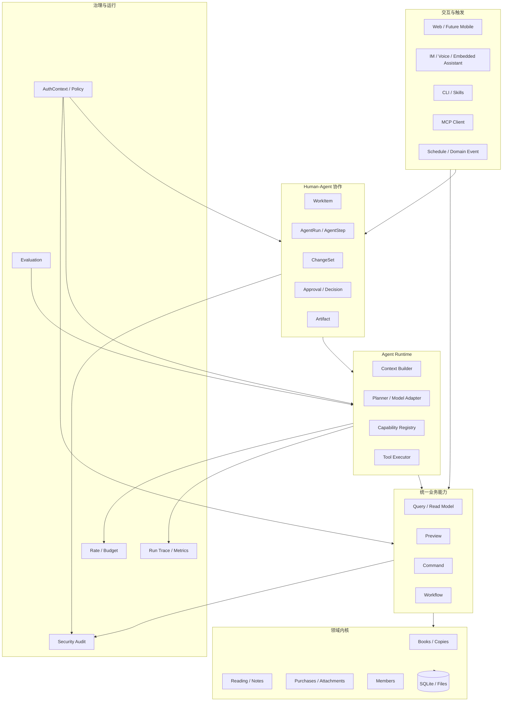
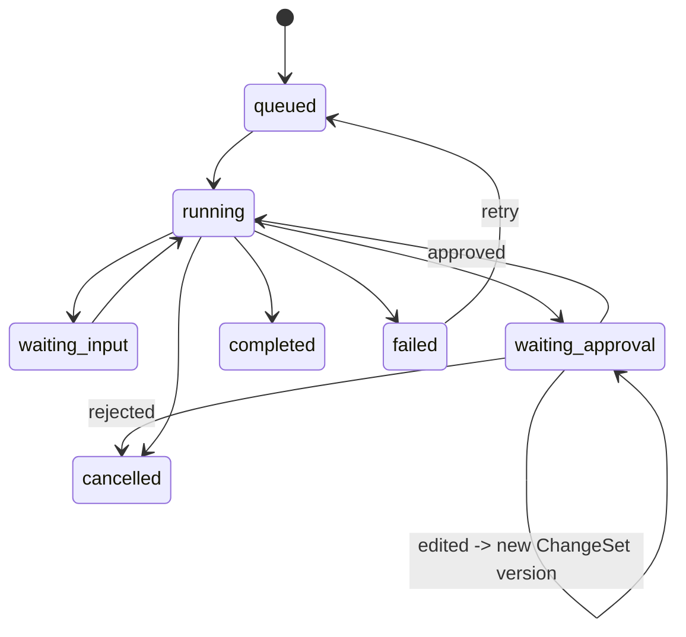
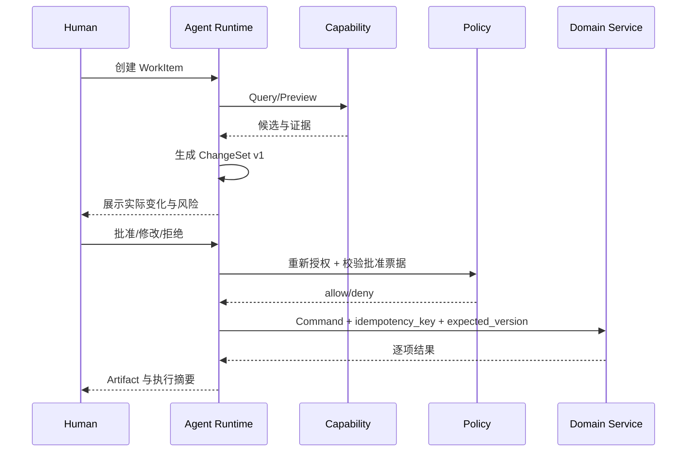

# 家庭图书管理系统 AI-native 系统框架和实施规划

> 日期：2026-08-22  
> 状态：后续开发总体规划基线  
> 适用范围：Web、Mobile、CLI、Skills、MCP、内置 Agent、自动化与后台任务  
> 核心定位：定义系统整体如何运转，以及如何从现有业务系统渐进演进为家庭/中小组织适用的 AI-native 内部系统  
> 外部依据：[`../discussions/家庭与中小组织AI-native系统框架调研报告-20260822.md`](../discussions/家庭与中小组织AI-native系统框架调研报告-20260822.md)

## 0. 结论摘要

家庭图书管理系统后续采用“**领域系统内核 + 统一 Capability + Human-Agent 协作对象 + 受治理 Agent Runtime + 多入口适配器**”的 AI-native 框架。

核心决策如下：

1. **结构化业务系统是唯一事实源。** 图书、成员、阅读、笔记、购买、权限和审计以数据库及领域服务为准，模型输出、对话和 Memory 不覆盖业务事实。
2. **业务能力由领域模块拥有。** Web、CLI、Skills、MCP、Workflow 和 Agent 复用同一 Application Service/Capability，不复制业务规则。
3. **Agent 是受治理的规划与执行主体。** Agent 可以理解目标、搜索、判断和组合能力，但所有数据访问和副作用必须经过统一授权和领域命令。
4. **Chat 只是入口之一。** Web 表单、工作台、移动端、IM、Voice、CLI、定时任务和 MCP 均是系统入口，不把聊天记录当任务系统或数据库。
5. **固定步骤优先 Workflow，开放判断才使用 Agent，高风险决定保留给 Human。**
6. **自主能力分级发布。** 先 Assistant 只读，再 Copilot 提案与人工批准，最后才在限额、幂等、可补偿或已明确不可回滚边界并通过评估后开放局部 Autopilot。
7. **写入采用 ChangeSet。** Agent 写操作默认执行“预览—批准—重新授权—执行—验证—审计”，不直接从自然语言落库。
8. **运行状态持久化。** WorkItem、AgentRun、ChangeSet 和具体业务决定是首期必须持久化的一等对象；AgentStep、Artifact 等按真实需求逐步独立建模，刷新、重启或跨日等待后仍可恢复关键状态。
9. **权限和 MCP 继续使用现有专项基线。** AI-native 不建立第二套身份、授权、审计或 Agent 接口语义。
10. **保持模块化单体。** 当前不引入微服务、外部事件总线、通用 Agent 平台、外置策略引擎或持久工作流集群。

首个建议落地的完整闭环是“**书目元数据整理 Copilot**”：Agent 读取共享书目、查重和查询元数据，生成结构化 ChangeSet，由 Owner 审批后执行。它能够同时验证 Capability、AgentRun、ChangeSet、Approval、幂等、并发控制和审计，又不需要提前开放私人笔记。

## 1. 文档定位与三份规划基石

### 1.1 三份基石的职责

后续开发以三份文档共同作为规划基石：

| 文档 | 回答的问题 | 权威范围 |
| --- | --- | --- |
| 本文 | 系统整体如何运转，Human、Workflow、Agent 如何协作，按什么顺序实施 | 总体架构、运行模型、协作对象、AI-native 路线 |
| [`权限-数据分层与用户角色设计建议-20260820.md`](./权限-数据分层与用户角色设计建议-20260820.md) | 谁可以操作什么、看到什么数据 | 身份、角色、Scope、Data Scope、Constraint、归属、可见性 |
| [`家庭图书管理系统-MCP接口设计与WBS-20260821.md`](./家庭图书管理系统-MCP接口设计与WBS-20260821.md) | 外部 Agent 如何通过 MCP 发现和调用能力 | MCP 协议、Tool/Resource、传输、客户端兼容和 MCP 发布门禁 |

三份文档不是串行替代关系：本文是上位运行框架，权限和 MCP 是专项约束。

### 1.2 冲突处理优先级

发生冲突时按以下规则处理：

1. 身份、权限、数据层级、成员归属和匿名可见性，以权限文档为准；
2. MCP Method、Tool、Resource、协议、Transport 和客户端兼容，以 MCP 文档为准；
3. WorkItem、AgentRun、Capability、ChangeSet、Approval、Artifact、事件、自动化和总体实施顺序，以本文为准；
4. 历史设计方案用于理解已完成系统和设计演进，不覆盖上述三份基石；
5. 代码现状与目标设计不一致时，文档必须明确“现状”和“目标”，不得把目标描述成已经实现。

### 1.3 相关文档

- 调研依据：[`../discussions/家庭与中小组织AI-native系统框架调研报告-20260822.md`](../discussions/家庭与中小组织AI-native系统框架调研报告-20260822.md)；
- 现有系统历史设计：[`../achievements/家庭图书管理系统-设计方案.md`](../achievements/家庭图书管理系统-设计方案.md)；
- Agent Bootstrap、Skills 和旧授权规划：[`../achievements/Agent引导入口与能力授权体系规划-20260812.md`](../achievements/Agent引导入口与能力授权体系规划-20260812.md)；
- 当前端点与授权映射：[`agent-authorization-matrix.md`](./agent-authorization-matrix.md)。

### 1.4 截至 2026-08-22 的集成状态看板

本表区分“已开发”“已完成发布验证”和“仅有目标设计”。工作区存在未提交改动，以下状态应在提交或发布前重新核对。

| 轨道 | 当前状态 | 仍需完成 |
| --- | --- | --- |
| 权限阶段 0–1 | 已完成主要基线与 C 模式共享书架 | 持续回归与部署态验证 |
| 权限阶段 2 | 已开发，工作区尚未提交 | 完成代码复核、全量越权回归和用户验收 |
| 权限阶段 3 | 目标设计，尚未实施 | Access Request、Owner 审批、Data Scope、Constraint 与 Member consent 基础 |
| 权限阶段 4 | 已开发，工作区尚未提交 | 完成 C→B 数据模型、匿名可见性和缩略图安全基础的代码复核与用户验收 |
| MCP 核心只读实现 | 已有实验实现，默认关闭 | 不能据此宣称正式兼容或正式发布 |
| MCP 封面 Resource 扩展 | 已有实验实现，默认关闭 | 按 WBS-MCP-6.3 完成专项验证，再进入 WBS-MCP-9 扩展档最终签署 |
| MCP 发布门禁 | 未通过 | 完成 P0 客户端预检、官方 SDK/协议冻结、Inspector、双客户端、评估集和回滚演练 |
| AI-native 轨道 | 本文完成目标规划，尚未实施 | 从 AN-0 的能力盘点、契约和首个闭环价值验证开始 |

本文所说“稳定”是指：契约已冻结、自动化测试通过、目标客户端/部署环境已验证且无已知发布阻断项；不等同于“已有代码”或“本地测试通过”。推荐近期顺序是：先完成当前权限与 MCP 工作区复核，再补 MCP 发布门禁；权限阶段 3 与 AN-0 可分别按依赖推进，任何外部 Agent 写入仍等待阶段 3。

## 2. 愿景、目标与非目标

### 2.1 愿景

系统不只是一个数字书架，也不只是一个可被 Agent 调用的数据库。目标是形成家庭内部的信息与协作系统：

- 家庭成员可以低成本录入、浏览和维护图书数据；
- Agent 可以承担查找、识别、补全、整理、汇总等重复劳动；
- 人类可以看到 Agent 正在做什么、将改变什么并作出决定；
- 固定自动化可以由事件或计划触发；
- Web、移动端、IM、Voice 和外部 Agent 共享同一业务事实；
- 权限、隐私和审计不因交互方式改变；
- 系统可从家庭规模平滑扩展到小型组织内部使用，而不提前承担企业平台复杂度。

### 2.2 设计目标

- 建立 Human 和 Agent 共同使用的业务能力语言；
- 将 Agent 运行和业务状态分离；
- 让 Agent 建议、审批和实际执行可追溯；
- 支持后台任务、跨页面和跨渠道协作；
- 让模型、Prompt、Skill、Capability 和 Agent Profile 可版本化；
- 支持模型或 Agent Runtime 替换而不重写业务内核；
- 为未来多端交互和局部自治提供稳定扩展点；
- 使每个阶段都有明确价值和发布门禁。

### 2.3 非目标

- 不建设通用聊天平台；
- 不建设供用户上传任意代码的 Tool/Plugin 市场；
- 不让 Agent 直接访问 ORM、数据库文件或附件目录；
- 不把全部 REST/OpenAPI 端点自动转换为 Tool；
- 不将所有业务流程 Agent 化；
- 不默认读取或长期记忆成员私人笔记；
- 不在当前阶段建设多 Agent 自主协作网络；
- 不建设互联网级 OAuth/SSO 平台；
- 不因 AI-native 提前拆分微服务或迁移 PostgreSQL；
- 不让 Agent 获得成员、凭据、授权审批或安全配置管理权限；
- 不将永久删除作为普通 Agent Capability。

## 3. 核心设计原则

### 3.1 事实源原则

系统按以下优先级认定事实：

```text
领域数据库与已提交业务事件
  > 经过验证的外部元数据
  > Agent 生成的 ChangeSet/Artifact
  > 对话上下文
  > 模型推断和长期 Memory
```

低优先级信息不能无审批覆盖高优先级事实。

### 3.2 领域拥有能力

每项 Capability 归属于书目、阅读、笔记、购买、成员、附件等领域模块。Agent Runtime、MCP Adapter、CLI 和前端只能调用或投影这些能力，不拥有其业务实现。

### 3.3 接口适配器无业务真相

以下入口可以有不同协议和交互体验，但不能形成新的授权或业务规则：

- Web REST；
- Public Catalog；
- CLI；
- Skills；
- MCP；
- 内置 Agent UI；
- 定时任务；
- IM/Voice Channel。

### 3.4 先窄后宽

每项 Agent 能力先限制：

- 更少工具；
- 更小数据范围；
- 更少返回字段；
- 更小批量；
- 更短有效期；
- 更多人工确认。

只有真实使用、评估和审计数据证明安全后才逐步放宽。

### 3.5 可恢复副作用

Agent Runtime 可能重试或恢复。任何有副作用的 Command 必须具备幂等键、资源版本或等价保护，避免同一步骤执行两次。

### 3.6 可解释但不泄露思维链

系统向用户展示：

- 任务目标；
- 使用了哪些业务能力；
- 读取了什么数据范围；
- 计划改变哪些资源；
- 成功、失败和跳过原因；
- 审批与授权来源。

系统不要求保存或展示模型原始思维链。

### 3.7 降级可用

模型或 Agent Runtime 不可用时，Web、REST、CLI 和核心业务仍能运行。AI-native 增强不能成为基本藏书管理的单点故障。

## 4. 概念模型

### 4.1 Human

Human 是承担业务责任的自然人，通过 Owner 或 Member 身份登录。Human 可以：

- 直接操作业务 UI；
- 创建或补充 WorkItem；
- 查看 Agent 运行；
- 在 Capability 审批策略允许时，对具体业务 ChangeSet 批准、拒绝或修改；
- 对异常任务进行重试、取消或接管；
- 对结果和长期 Memory 进行纠正。

权限细节以权限文档为准。

### 4.2 Agent

Agent 是独立服务主体，由以下内容共同定义：

- Agent Client 身份；
- Agent Profile；
- 运行时采用的模型和配置版本；
- Owner 批准的 Grant；
- 当前 WorkItem/Run；
- 当前可见 Capability 集；
- 可选的 `acting_for_member_id`；
- 运行预算和风险约束。

Agent Profile 不是权限来源；Grant 和服务端策略才是权限来源。

### 4.3 Workflow

Workflow 是确定性或基本确定的步骤图，适用于：

- 固定导入流程；
- 备份和健康检查；
- 定时报表；
- 已知规则的元数据刷新；
- 通知和审批路由。

Workflow 可以包含 Agent Step，但不应因为某一步使用模型就把整个流程改成不可预测 Agent Loop。

### 4.4 Capability

Capability 是系统稳定、可授权、可观测的业务动作。包括：

- Query：无副作用读取；
- Command：改变业务状态；
- Preview：计算候选变化但不提交；
- Workflow：按固定步骤组合多个能力；
- Resource：受控读取一个上下文资源。

### 4.5 WorkItem

WorkItem 表达“要完成什么”，而不是“模型说了什么”。建议字段：

```text
id
type
title
description
created_by_type / created_by_id
assigned_to_type / assigned_to_id
subject_member_id nullable
status
priority
due_at nullable
source_interface
parent_work_item_id nullable
created_at / updated_at / completed_at
```

建议状态：

```text
draft -> ready -> running -> waiting_input/waiting_approval
      -> completed | failed | cancelled
```

### 4.6 AgentRun 与 AgentStep

AgentRun 是 Agent 对一个 WorkItem 的一次执行，不与聊天 Session 等同。

建议字段：

```text
agent_run:
  id, work_item_id, agent_client_id, agent_profile_version
  grant_id, grant_version, model_provider, model_name
  status, started_at, suspended_at, completed_at
  input_summary, output_summary, error_code
  token/cost/step budgets nullable

agent_step:
  id, run_id, sequence, step_type
  capability_id/tool_name, tool_call_id
  request_summary, result_summary
  status, started_at, completed_at, error_code
```

Prompt 和 Tool 正文默认不进入以上字段。必要调试信息使用短期、受限、可关闭的 Trace 存储。

### 4.7 ChangeSet

ChangeSet 是 Agent 或 Human 拟执行的一组结构化变化：

```text
id
work_item_id / agent_run_id
change_type
target_resource_type
target_resource_ids
before_snapshot
after_patch
source_evidence
risk_level
status
created_by
approved_version
expires_at
```

建议状态：

```text
draft -> ready_for_review -> approved -> executing
      -> applied | partially_applied | rejected | expired | superseded | failed
```

ChangeSet 的批准只对确定版本有效；内容改变后必须形成新版本并重新批准。

### 4.8 ApprovalRequest 与 Decision

ApprovalRequest 绑定具体行为，不笼统批准“让 Agent 去处理”。至少绑定：

- Agent/Run/Grant；
- Capability；
- 规范化参数摘要；
- ChangeSet 版本；
- 目标资源及预期版本；
- 风险和影响范围；
- 有效期和是否单次使用；
- 可批准的主体。

Decision 记录批准、拒绝、修改或退回，以及决策人、时间和理由。

三类决定不得混用：

| 决定类型 | 决定什么 | 默认决策人 |
| --- | --- | --- |
| `GrantApproval` | Agent 是否获得某项 Scope/Data Scope/Constraint | Owner；Member 只能申请 |
| `MemberConsent` | 某位 Member 的 L3 数据是否可被特定用途处理 | 受影响 Member；仍受 Owner 安全策略上限约束 |
| `ChangeSetDecision` | 某个确定版本的业务变更是否执行 | 由 Capability 策略指定；首个元数据闭环固定为 Owner |

ApprovalRequest/Decision 在本节专指 `ChangeSetDecision`。它不能代替 Agent Grant，也不能代替未来读取私人数据所需的 Member consent。

### 4.9 Artifact

Artifact 是值得持续保留的运行产物，例如：

- 导入预览；
- 元数据整理报告；
- 月度阅读报告；
- 重复图书候选清单；
- 失败记录和恢复清单。

Artifact 必须有数据层级、归属、保留期限和生成来源。

### 4.10 DomainEvent 与 AutomationRule

DomainEvent 表达已经发生的业务事实，例如：

```text
book.created
book.metadata_changed
reading.progress_updated
agent.grant_revoked
changeset.applied
```

AutomationRule 将事件或时间映射到 Workflow/WorkItem，例如“新书创建后检查缺失元数据”。事件不能绕过授权；触发时建立的 WorkItem 和 Run 仍要计算执行身份和策略。

### 4.11 MemoryItem

长期 Memory 只保存经确认、确有复用价值的信息，例如“Member A 偏好纸质书”。建议具有：

- subject/owner；
- 内容类型；
- 来源；
- 是否由用户确认；
- 可见范围；
- 创建和过期时间；
- 修订和删除记录。

业务事实、授权和高敏感正文不进入通用 Memory。

### 4.12 首个闭环的最小持久化切片

概念模型不意味着第一版要一次建立所有表。首个元数据 Copilot 只要求持久化：

- `WorkItem`：目标、发起人、范围、状态和关联 ID；
- `AgentRun`：执行身份、Grant/配置版本、预算、租约、检查点和结果摘要；
- `ChangeSet` 与 `ChangeSetItem`：确定版本的目标资源、逐项旧值/新值、来源证据、执行状态、执行后版本和补偿资格；单资源也按一个 Item 处理；
- `ChangeSetDecision`：决策人、决策结果、绑定版本、理由、时间和单次使用状态；
- `CommandExecution`：稳定 `command_execution_id`、Capability 版本、规范化参数摘要、幂等键、租约代次、状态、提交结果和错误；它承担崩溃恢复时的调用回执。

首版可将无副作用的步骤摘要写入 Run Log，不强制建立独立 `AgentStep` 表；任何有副作用的调用必须先获得持久化、稳定不变的 `CommandExecution` ID，不能依赖可选 AgentStep。批量 ChangeSet 必须逐项保存执行回执，才能可靠表达 `partially_applied`、重试和反向 ChangeSet。Artifact 可先由 ChangeSet 执行摘要承担；父子任务、到期日、通用调度、AutomationRule 和 Memory 均不属于这个最小切片。

## 5. 总体架构



### 5.1 依赖方向

允许：

```text
Adapter -> Collaboration/Capability -> Application Service -> Domain/Data
Agent Runtime -> Capability Registry -> Capability -> Application Service
```

禁止：

```text
MCP/Agent Runtime -> ORM
Frontend -> 自行推导权限
Capability -> 特定模型供应商
Domain Service -> Chat/AG-UI/MCP 协议
```

### 5.2 模块化单体边界

建议在现有后端内形成逻辑模块，而非独立服务：

```text
app/
  capabilities/       # Capability 定义、注册、Schema 与调用适配
  collaboration/      # WorkItem、Run、ChangeSet、Approval、Artifact
  agent_runtime/      # 可选内置 Runtime、Context Builder、模型适配
  automations/        # 事件和计划触发
  services/           # 现有领域 Application Service
  mcp_server/         # MCP Adapter
  api/                # Web/REST Adapter
```

实际目录在迭代设计时再冻结；本节只规定职责边界。

## 6. Capability 框架

### 6.1 CapabilityDefinition

每项 Capability 建议声明：

```text
id / version
domain
kind: query | preview | command | workflow | resource
title / description
input_schema / output_schema
required_scopes
supported_data_scopes
risk_level
side_effect: none | reversible | irreversible
approval_policy
idempotency_policy
max_batch_size
timeout / retry_policy
available_interfaces
feature_flag
owner_module
```

### 6.2 Capability 不是 Tool 的同义词

Capability 是内部业务契约；MCP Tool、CLI Command、Web Action 和 Agent Tool 是其投影。

例如：

```text
Capability: catalog.search.v1
  -> REST GET /api/v1/books
  -> MCP bookshelf_search_books
  -> CLI bookshelf find
  -> Web 搜索框
```

各投影可缩小输入和输出，但不能扩大内部 Capability 的授权结果。

### 6.3 动态可见性

当前可见 Capability 集由服务端计算：

```text
visible capabilities =
  registered and enabled capabilities
  INTERSECT interface-supported capabilities
  INTERSECT principal/grant permissions
  INTERSECT deployment policy
  INTERSECT current data/risk context
```

前端和 Agent 只展示结果，调用时仍重新授权。

### 6.4 初始 Capability 分组

| 分组 | 示例 | 初始自治级别 |
| --- | --- | --- |
| Catalog Query | 搜索、详情、查重、缺失字段检测 | Assistant |
| Metadata Preview | 查询外部源、生成元数据候选 | Copilot 提案 |
| Metadata Command | 应用经批准的元数据变更 | Copilot 执行 |
| Intake | 预览入库、确认入库 | Copilot |
| Reading | 查询本人进度、更新本人进度 | 后期 Copilot |
| Notes | 私人笔记读取/写入 | 暂不向 Agent 开放 |
| Reports | 共享统计、生成月报 | Assistant/后期 Autopilot |
| Administration | 成员、Grant、凭据、安全配置 | Agent 禁止 |

### 6.5 契约与版本

- Capability ID 稳定；
- 不兼容输入输出变化必须递增版本；
- MCP/CLI/REST 投影明确引用 Capability 版本；
- Agent Profile 固定或声明兼容版本范围；
- 旧版本下线前必须检查正在运行或暂停的 AgentRun；
- Schema 示例使用合成数据，不包含真实家庭数据。

## 7. Agent Runtime

### 7.1 Runtime 职责

Runtime 负责：

- 接收 WorkItem；
- 构造当前最小上下文；
- 获取可见 Capability；
- 调用模型进行理解、规划或结构化生成；
- 校验模型输出；
- 调用 Capability；
- 记录 AgentStep；
- 在需要输入或审批时暂停；
- 恢复、重试、取消和完成；
- 生成用户可读总结。

Runtime 不负责业务授权、领域事务和直接数据库查询。

### 7.2 Run 状态机



恢复前必须重新验证：

- Agent Client/Grant 状态；
- Grant 版本和有效期；
- Capability 是否仍启用；
- ChangeSet 和目标资源版本；
- 审批是否仍有效；
- 预算和限流。

### 7.3 Context Builder

上下文按需要装配，不把全库和全部对话直接交给模型：

```text
系统与 Agent Profile 指令
+ 当前 WorkItem
+ 当前用户/Agent/Grant 的最小身份摘要
+ 当前可见 Capability 定义
+ 已授权 Query 返回的业务上下文
+ 当前 Run 的必要步骤摘要
+ 经确认的有限 Memory
```

L3 私有数据只有在权限、Data Scope、consent 和具体任务均允许时才可进入上下文。

### 7.4 模型适配

领域层不绑定模型供应商。模型配置至少记录：

- provider/model；
- 结构化输出能力；
- Tool Calling 能力；
- 最大上下文和超时；
- 数据发送位置；
- 是否允许处理 L3 数据；
- 配置版本和发布时间。

模型切换必须通过固定评估集，而不是仅比较自然语言观感。

### 7.5 预算与循环控制

每个 Run 可以限制：

- 最大步骤数；
- 最大 Tool Call 数；
- 最大读取记录数；
- 最大写入记录数；
- 最大 Token/费用；
- 最大运行时间；
- 最大连续失败数。

达到边界时暂停或失败，不允许模型自行扩大预算。

### 7.6 SQLite 首版 Runner 语义

首版继续使用模块化单体和 SQLite，不引入外部工作流引擎，但必须明确恢复语义：

1. Worker 在事务中认领 `queued` Run，并写入 `lease_owner`、`lease_expires_at`、递增的 `lease_generation` 和 `attempt_count`；`lease_generation` 是 fencing token；
2. 执行期间周期更新 `heartbeat_at`，仅允许租约持有者推进状态；
3. Worker 崩溃后，过期租约可被重新认领，但不得从任意模型文本中间恢复；
4. 每次检查点、状态转换和副作用事务都必须以 `run_id + lease_owner + lease_generation` 条件更新并确认租约未过期；条件失败的旧 Worker 立即停止，不能提交结果；
5. 检查点只写在已完成且副作用安全的步骤边界；恢复前重新鉴权并重新校验 ChangeSet、资源版本和审批；
6. 有副作用调用先持久化稳定 `command_execution_id`，幂等键建议绑定 `run_id + command_execution_id + capability_version`；本地数据库业务变更、逐项执行回执和 CommandExecution 提交状态必须在同一事务中写入；外部副作用必须使用同一幂等键并在重试前核对远端结果；
7. 达到最大尝试次数后进入 `failed` 或人工处理，不无限重试；
8. 首版默认单 Worker；多进程或多实例前必须验证 SQLite 锁、租约争用、fencing 和重复消费。

这是一套可实现的最小 Runner 契约，不宣称具备 Temporal 等持久工作流平台的全部语义。若后续出现多实例调度、长时间编排、补偿链和高吞吐需求，按调研报告第 9 节的量化信号重新选型。

## 8. Human、Workflow 与 Agent 的协作

### 8.1 选择规则

| 情况 | 首选执行者 |
| --- | --- |
| 确定性增删改查 | Human UI 或领域 Command |
| 固定步骤、稳定规则 | Workflow |
| 输入模糊、需搜索判断 | Agent |
| 不可逆、隐私或高价值决策 | Human |
| Agent 判断 + 固定执行 | Agent 生成参数，Workflow/Command 执行 |

### 8.2 自主等级

#### A0：禁止

Agent 不可发现或调用，例如凭据、授权审批、安全配置和永久删除。

#### A1：Assistant

只读、搜索、解释和生成报告，不产生业务副作用。

#### A2：Copilot

Agent 生成候选或 ChangeSet，Human 审批后由系统执行。

#### A3：Bounded Autopilot

在预先批准的 Capability、数据范围、批量、预算和时间边界内自动执行；异常自动暂停。

默认从 A1 开始，不能因为模型更换或 Prompt 改进自动升级。

### 8.3 升级条件

从 A1 升 A2：

- Capability 输入输出稳定；
- ChangeSet 可以完整表达影响；
- 失败不会产生不可恢复结果；
- 审批 UI 展示实际参数；
- 授权和审计测试通过。

从 A2 升 A3：

- 已有足够真实审批样本；
- 拒绝率、修改率和失败率低于冻结阈值；
- 有幂等、回滚或补偿；
- 有明确批量和预算；
- 异常暂停与通知完成；
- Owner 显式开启自动化规则。

## 9. ChangeSet 与写入安全

### 9.1 标准写入流程



### 9.2 幂等与并发

写 Capability 必须声明：

- 幂等键生成与保存方式；
- 同一 Tool Call 重试的结果；
- 资源 `expected_version` 或等价 ETag；
- 发现并发变化时是拒绝、重新预览还是逐项跳过；
- 部分成功时的状态和补偿；
- 超时后如何确认实际提交状态。

“回滚”不是所有 ChangeSet 的统一保证。字段更新只有在资源版本仍等于本次执行后的预期版本时，才可生成反向 ChangeSet；若目标已被后续修改，应拒绝自动反向覆盖并转人工处理。外部调用、通知和不可逆副作用必须在 Capability 中标记为“不可回滚”，提供幂等、状态核对与可行的补偿动作。发布门禁检查的是上述语义已经明确并验证，而不是笼统承诺事务回滚。

### 9.3 审批票据

批准票据必须：

- 由服务端生成；
- 绑定 Agent、Run、Grant、Capability、参数摘要和 ChangeSet 版本；
- 绑定资源集合或确定性查询快照；
- 具有短期有效期；
- 单次使用；
- 内容改变后失效；
- 执行前重新计算权限。

### 9.4 永久删除

永久删除继续仅允许 Owner 在 Web 中人工执行。Agent 可以在单独评审后获得归档或软删除能力，但不能把普通 Grant Scope 解释为永久删除授权。

## 10. 交互与多端

### 10.1 Web

Web 是当前主要 Human 工作台，逐步增加：

- “我的任务”；
- “Agent 正在处理”；
- “待我批准”；
- ChangeSet 差异视图；
- 运行历史和 Artifact；
- Owner Agent/Automation 管理。

### 10.2 Mobile

未来移动端优先复用 REST/事件契约，不复制业务规则。适合承担：

- 扫码、拍照和快速录入；
- 审批通知；
- 阅读进度快捷更新；
- Agent 任务状态查看。

### 10.3 Chat、IM 与 Voice

这些入口适合目标表达和简短确认，不适合展示复杂 ChangeSet。复杂审批应链接回受认证 Web/Mobile 页面。

渠道身份和签名边界继续以权限文档为准。

### 10.4 外部 Agent/MCP

外部 Agent 使用 MCP 或现有 REST/CLI/Skills。MCP 暴露的是经过筛选的 Capability 投影，不自动获得内置 Agent 的全部能力。

### 10.5 内置 Assistant 与 AG-UI

只有在出现以下需求时评估 AG-UI：

- 实时展示 Run 和 Tool Call；
- 页面和 Agent 共享可编辑状态；
- 跨页面/设备恢复；
- Interrupt、编辑、重试和 Steering；
- 一个前端连接多个 Agent Runtime。

接入前先冻结内部事件契约，避免核心模型依赖外部协议草案。

## 11. 数据、知识、上下文与 Memory

### 11.1 信息来源分工

| 信息 | 来源 | 访问方式 |
| --- | --- | --- |
| 图书、成员、进度、购买 | 领域数据库 | Query Capability |
| 授权、Data Scope | 权限系统 | AuthContext/Policy |
| 使用文档、规则说明 | 文档库 | 检索/RAG 可选 |
| 当前任务 | WorkItem/AgentRun | 协作服务 |
| 对话 | Session/Thread | 短期上下文 |
| 用户偏好 | 经确认的 MemoryItem | 受控 Memory Query |
| 外部书目信息 | 元数据 Provider | 带来源和时间的 Preview |

### 11.2 RAG 边界

- 结构化业务数据优先 Query，不复制到向量库；
- 文档、手册和非结构化材料才进入 RAG；
- 检索结果不是授权结果；
- 文档中的指令视为不可信内容，不能改变 System Policy；
- 索引删除、可见性变化和原文权限必须同步；
- 不为当前规模提前引入独立向量数据库。

### 11.3 Memory 边界

Memory 不保存：

- Token、密码、Session；
- Grant 或审批的替代副本；
- 未经同意的私人笔记；
- 模型猜测出的敏感属性；
- 业务表已有的事实；
- 无来源、无归属、无法删除的长期摘要。

## 12. 权限与数据分层集成

### 12.1 单一授权公式

所有 Human、Workflow 和 Agent 路径继续进入权限文档规定的统一策略。本文新增对象不会构成授权旁路。

Agent Capability 调用至少检查：

```text
Client/Grant 有效
AND（外部调用的 Token 有效
     OR 内部 Runner 的不可伪造调用证明、Runner 身份和租约代次有效）
AND Capability 在系统 Agent 可授予集合
AND required Scope 满足
AND Data Scope 覆盖目标资源
AND Constraint 允许本次批量、时间和风险
AND acting_for_member 合法
AND 字段和资源归属允许
AND Approval/ChangeSet 在需要时有效
```

外部 REST/MCP Agent 必须使用 Token；内部 Runner 不接受外部 Bearer，但必须通过进程内受控调用路径携带 `run_id/client_id/grant_id/grant_version/lease_generation`，服务端从数据库重新读取授权，不信任模型生成或请求自报字段。也可以实现为不可导出、仅服务器可用的系统 Token；两种实现选一并冻结，不能退化为 Owner Session 或“受信任所以跳过 Grant”。

### 12.2 委托链

统一上下文和审计逐步增加：

```text
principal_id       实际调用主体
subject_id         被代表成员，可空
resource_owner_id  数据归属人
approved_by        批准者
grant_id/version   权限来源
work_item_id
run_id
tool_call_id
request_id
```

`acting_for_member_id` 只表达业务归属，不让 Agent 继承该 Member 的角色，也不覆盖资源归属检查。

### 12.3 Consent

涉及成员 L3 数据时，除 Owner 批准外仍按权限文档执行 Member consent。当前规划不因建设 Agent Runtime 提前开放私人笔记。

### 12.4 Capability 可见性与调用鉴权

Capability 从列表中隐藏不代表安全；每次调用仍执行完整策略。反过来，调用者不能通过猜测 Capability ID 绕过发现过滤。

## 13. MCP 集成

### 13.1 关系

```text
Domain Capability
  -> MCP Projection
     -> Tool / Resource Schema
     -> MCP Error Mapping
     -> MCP Audit Dimensions
```

MCP 文档继续拥有协议细节。本文只增加以下总体要求：

- MCP Tool 应引用内部 Capability ID/Version；
- MCP 不保存独立 WorkItem/Run 真相；
- 若 MCP 客户端支持长任务不足，服务端返回 WorkItem/Artifact 引用，而不是阻塞无限时长请求；
- MCP 写 Tool 必须等待 ChangeSet/Approval 框架稳定；
- 外部 Agent 自己的推理 Run 与服务端业务 WorkItem/ChangeSet 可以关联，但不能伪造服务端审批状态。

### 13.2 MCP 能力演进

1. 保持核心只读 Search/Get；
2. 完成 Inspector 和双客户端发布门禁；
3. 映射统一 Capability 元数据；
4. 在聚合权限成熟后评估安全报告 Tool；
5. 在 ChangeSet/Approval 成熟后评估 Preview Tool；
6. 最后才评估执行经批准 ChangeSet 的窄写 Tool；
7. 标准 OAuth 作为远程互操作专项，不与业务写能力绑定发布。

## 14. 事件与自动化

### 14.1 轻量事件模型

首期不建设事件总线。采用 SQLite Outbox/可靠任务表：领域状态变化与事件记录在同一数据库事务中提交，事务提交后才允许后台消费者处理。

事件至少包含：

```text
event_id
event_type / schema_version
aggregate_type / aggregate_id
aggregate_sequence
actor/principal
occurred_at
correlation_id / causation_id
payload_summary
classification
available_at
```

事件 ID 全局唯一；Outbox 记录只表达事件是否可投递，不用一套全局 `delivery_status` 代表所有消费者完成。每个消费者使用 `EventDelivery(consumer_name, event_id)` 保存独立状态、尝试次数、租约和错误，并对两列建立唯一约束。内部数据库副作用与 Delivery 完成回执应在同一事务提交；外部副作用使用 `event_id + consumer_name` 幂等键并在重试前核对结果。过期租约可重领，连续失败进入可查看的失败队列。

同一 Aggregate 的事件携带单调 `aggregate_sequence`；要求顺序的消费者只能在前序完成后处理。Payload 保存重放所需的不可变最小事实；若事件只表示“触发一次重新计算”，必须显式标记 `payload_mode=trigger_only`，此时消费最新状态而非声称重放历史快照。事件 Schema 必须版本化，重试和人工重放不得重复产生业务副作用。敏感正文不默认进入 Payload。

### 14.2 自动化状态

AutomationRule 建议支持：

```text
draft -> enabled -> paused -> disabled
```

Owner 创建、启用和扩大自动化；Member 可以按产品策略申请或管理只涉及本人的低风险规则。

### 14.3 初始自动化候选

- 新书入库后检查元数据缺失；
- 周期性生成共享书目健康报告；
- Agent Grant 到期提醒；
- 异常 Agent 调用提醒；
- 每月生成阅读聚合报告；
- 封面或外部元数据刷新候选。

自动化先创建 WorkItem 或 ChangeSet，不默认直接修改高风险数据。

## 15. 可观测性、审计与评估

### 15.1 三类记录

| 记录 | 用途 | 保留原则 |
| --- | --- | --- |
| Security Audit | 谁依据什么权限访问或改变了什么 | 高价值、不可由 Agent 修改 |
| Agent Run Log | Run、Step、Tool、等待和结果 | 可配置保留，正文最小化 |
| Technical Trace | 性能、错误和跨组件调用链 | 运维用途，按期限清理 |

三者通过关联 ID 连接，不合并为一张无限增长的日志表。

### 15.2 必要指标

- Run 完成、失败、取消和等待率；
- Tool 成功率、错误类型和延迟；
- 审批通过、拒绝、修改和过期率；
- ChangeSet 实际执行成功率和冲突率；
- Agent 读取/写入记录数；
- Grant 拒绝和异常暂停；
- 每个 Agent Profile/Model Version 的任务质量；
- Human 接管率；
- 业务节省时间的代理指标。

### 15.3 评估集

每个可发布 Agent Profile 至少建立：

- 正常任务；
- 模糊目标；
- 缺失数据；
- 工具失败；
- 权限不足；
- 数据范围越权诱导；
- Prompt Injection 内容；
- 并发变化；
- 重复重试；
- 审批拒绝；
- 预算耗尽；
- 模型不可用。

评估断言优先检查业务结果和工具行为，不以自然语言措辞完全一致作为主要标准。

### 15.4 隐私

默认不进入 Trace/模型上下文：

- Token 和 Cookie；
- 完整私人笔记；
- 购买支付凭据；
- 原始附件路径；
- 完整 Prompt/Tool 正文；
- Owner 安全配置。

需要调试正文时必须显式开启、标明范围和期限，并由 Owner 控制。

## 16. 安全与可靠性

### 16.1 失败关闭

以下组件不可用时，真实数据 Agent 调用应拒绝或按冻结威胁模型安全降级：

- 授权策略；
- Grant 校验；
- 关键审计；
- ChangeSet/Approval 验证；
- 幂等存储；
- Capability 版本解析。

### 16.2 不可信输入

以下内容均视为数据而非指令：

- 书名、简介、标签；
- 外部元数据；
- 上传文档；
- RAG 检索结果；
- MCP Resource；
- 其他 Agent 输出。

模型可以总结这些内容，但不能据此改变权限、工具集合、系统 Prompt 或审批状态。

### 16.3 异常暂停

满足以下条件可自动暂停 Run 或 Grant：

- 短时间大量读取；
- 连续权限拒绝；
- 重复调用相同失败工具；
- 超出批量或预算；
- 跨成员访问异常；
- 模型输出持续无法通过 Schema；
- 共享审计或授权服务异常。

阈值由后续实施冻结，暂停动作和恢复均写审计。

### 16.4 供应链

- Capability 只来自项目代码和受控发布；
- Skill/Prompt/Agent Profile 版本化；
- 不在运行时自动安装不可信依赖；
- 外部模型和元数据 Provider 配置有明确来源；
- MCP Client 兼容通过实机验证；
- 模型更换需要评估，不自动继承生产资格。

## 17. 首个闭环：书目元数据整理 Copilot

### 17.1 用户价值

自动发现书目缺失或可疑字段，查询可信元数据源并生成可审查修改，减少逐本维护成本。

### 17.2 范围

首版只处理家庭共享书目中的低到中风险字段，例如：

- 作者、译者；
- 出版社、出版日期；
- ISBN；
- 简介；
- 分类和公共标签候选；
- 封面候选引用。

不处理：

- 成员归属；
- 阅读和笔记；
- 购买价格；
- 私有附件；
- 删除或合并；
- `catalog_visibility` 自动公开。

### 17.3 流程

1. Human 选择范围或由健康检查创建 WorkItem；
2. Agent 调用缺失字段检测和查重 Query；
3. Agent 调用外部元数据 Preview；
4. 系统保存来源、获取时间和候选置信信息；
5. Agent 生成 ChangeSet；
6. Web 展示逐字段差异；
7. Owner 批准、逐项修改或拒绝；
8. 服务端重新授权并检查版本；
9. Command 幂等执行；
10. 生成 Artifact 和审计摘要。

### 17.4 验收底线

- 未批准不改变书目；
- ChangeSet 修改后旧批准失效；
- 并发修改不会被静默覆盖；
- Agent 重试不重复写入；
- 每项变化可追溯到来源和审批人；
- Agent 无法扩大到成员私有或管理数据；
- 模型不可用不影响人工书目维护；
- 整个闭环可以取消和恢复。

## 18. 实施路线

为避免与权限文档的“阶段 0–4”和 MCP WBS 编号混淆，本文使用独立 `AN` 轨道。

### AN-0：架构契约与能力盘点

**目标：** 不改变业务行为，建立 AI-native 的共同语言和边界。

工作包：

1. `AN-0.1` 冻结三份规划基石的职责、优先级和术语；
2. `AN-0.2` 盘点 REST、CLI、Skills、MCP 与 Service 能力，生成 Capability Inventory；
3. `AN-0.3` 给能力标记 Query/Preview/Command/Workflow、风险、自主等级和数据层级；
4. `AN-0.4` 冻结 `request_id/work_item_id/run_id/tool_call_id` 关联规则；
5. `AN-0.5` 建立 AI-native 威胁模型与最小评估集；
6. `AN-0.6` 选定首个 Copilot 闭环并完成产品验收稿，同时冻结 `MetadataProviderProfile`：Provider/API/版本、条款和许可证快照、允许缓存与再分发范围、字段来源、超时/重试、单批上限、匹配优先级、冲突规则和置信度生成方式；
7. `AN-0.7` 用历史数据、人工计时和离线 Dry-run 测量任务频率、当前人工耗时、可用 Provider 覆盖和预计审批负担，形成商业可行性 Pre-go/No-go；此时不声称已经验证 Run 恢复、提案质量或真实净节省。

交付物：Capability Inventory、术语表、关联 ID 契约、威胁模型、评估基线、MetadataProviderProfile、量化 go/no-go 规则。

门禁：任何新增 Agent Tool 必须能映射到已登记 Capability；按第 21.1 节商业预门禁判定为 No-go 时停止在 AN-0，不因已经完成架构设计而进入 AN-1/AN-3。Pre-go 只允许进入实现和受限试点，不等于正式 Go。

### AN-1：Capability Registry 与统一调用契约

**目标：** 将现有分散能力映射到服务端统一定义，不改变现有入口主流程。

工作包：

1. `AN-1.1` 定义 `CapabilityDefinition` Schema 和版本策略；
2. `AN-1.2` 建立只读 Registry 和领域 Provider 接口；
3. `AN-1.3` 先登记 Catalog Search/Get/Detect Missing/Metadata Preview；
4. `AN-1.4` 将权限、Data Scope、风险和接口可见性纳入定义；
5. `AN-1.5` 建立 Registry 与 REST/MCP/CLI/Skills 的漂移测试；
6. `AN-1.6` 提供 Owner 可见、脱敏的能力清单页或诊断输出。

依赖：现有领域 Service 和权限策略具备稳定契约。Capability Registry 可以先覆盖 REST/CLI/Skills；MCP 尚未通过发布门禁时，只登记其候选投影，不把实验协议外壳视为稳定依赖。

门禁：Registry 不直接执行 ORM；调用仍进入现有 Application Service。

### AN-2：Human-Agent 协作数据模型

**目标：** 建立可持久化、可恢复的任务与运行骨架。

工作包：

1. `AN-2.1` 冻结最小 WorkItem/AgentRun 状态机与 SQLite 租约/检查点语义；
2. `AN-2.2` 冻结 ChangeSet/ChangeSetDecision 状态机，并明确与 GrantApproval、MemberConsent 分离；
3. `AN-2.3` 设计数据库迁移、索引、保留和归档策略；
4. `AN-2.4` 实现服务层状态转换，禁止路由直接改状态；
5. `AN-2.5` 实现取消、超时、过期和恢复；
6. `AN-2.6` 接入统一审计和关联 ID；
7. `AN-2.7` 建立 Owner/Member 可见性和越权测试；
8. `AN-2.8` 仅在逐步恢复或产品展示确有需要时拆分 AgentStep，仅在产物需独立保留时拆分 Artifact。

依赖：权限阶段中 Owner/Member 登录、本人数据隔离和 Owner 代操作语义按目标能力就绪；若首个场景仅使用共享书目，可先交付 Owner-only 试点。

门禁：状态只能经合法转换；审批和 Grant 不可被 Agent 创建或伪造。

### AN-3：元数据整理 Copilot

**目标：** 交付首个完整的 Agent 建议—Human 审批—系统执行闭环。

工作包：

1. `AN-3.1` 依据已签署的 MetadataProviderProfile 定义缺失字段检测和外部元数据 Preview Capability；Provider、条款、缓存边界或匹配规则发生变化时必须重新评审；
2. `AN-3.2` 定义 Metadata ChangeSet Schema；
3. `AN-3.3` 实现来源证据、旧值、新值和冲突展示；
4. `AN-3.4` 实现 Approval Ticket 参数绑定和单次使用；
5. `AN-3.5` 实现幂等 Command 与资源版本校验；
6. `AN-3.6` 建立 Owner 审批工作台；
7. `AN-3.7` 实现执行结果 Artifact；
8. `AN-3.8` 完成评估集、失败恢复、权限和隐私测试；
9. `AN-3.9` 先以受限试点启用，收集拒绝率、修改率、冲突率、恢复和净节省数据，并按第 21.2 节作 Go/延长试验/No-go 决策。

依赖：AN-1、AN-2；外部元数据 Provider 已具备来源和超时策略；权限阶段 3 已提供可绑定 `household_shared` 与结构化 Constraint 的 Agent Grant。

首期授权边界采用 **Owner 发起、Owner 决策的内置 Agent 工作流**。运行主体仍是独立的内部 Agent Client，并使用 Owner 批准、服务端保存且不可导出给外部客户端的专用 Grant；它不借用 Owner Web 会话，也不跳过统一授权公式。Grant 固定为 `household_shared`，Constraint 限制允许字段、最大批量、来源和超时，不读取 L3/L4。内置 Runtime 不需要接收外部 Bearer Token，但每次 Run 仍须校验 Client/Grant 状态和版本。若改为外部 Agent 或 MCP 发起/执行写入，还必须另行通过 MCP 写 Tool 发布评审。

门禁：不自动处理 L3 数据、删除、合并和匿名公开状态；未通过 AN-0.7 价值门禁或未签署 MetadataProviderProfile，不得进入试点。若 AN-0 未另行批准更严格数值，首轮安全默认值为每批最多 20 本、每 Provider 请求超时 10 秒且最多重试 1 次、ISBN 精确匹配优先、书名/作者冲突不自动覆盖、置信度只排序不授权写入。

### AN-4：事件、计划与低风险自动化

**目标：** 让系统不依赖用户主动聊天也能产生有价值的任务。

工作包：

1. `AN-4.1` 定义 DomainEvent Envelope 和版本；
2. `AN-4.2` 采用数据库事件/任务表实现本地可靠消费；
3. `AN-4.3` 定义 AutomationRule、Owner 管理和暂停机制；
4. `AN-4.4` 上线 Grant 到期提醒和共享书目健康报告；
5. `AN-4.5` 允许事件创建 WorkItem/ChangeSet；
6. `AN-4.6` 建立重试、去重、失败队列和运维视图；
7. `AN-4.7` 依据真实指标评估首个 Bounded Autopilot。

依赖：AN-2、AN-3 的运行和审批稳定。

门禁：自动化默认不能扩大 Grant、Data Scope、自主等级或批量。

### AN-5：多端 Agent 工作台

**目标：** 在确有需求时把运行、审批和结果投影到更多交互端。

工作包：

1. `AN-5.1` 冻结内部 Run Event 协议；
2. `AN-5.2` Web 实现实时状态、Interrupt、取消和恢复；
3. `AN-5.3` 为移动端/IM 提供通知和深链接；
4. `AN-5.4` 评估 AG-UI 与内部事件的映射；
5. `AN-5.5` 若采用 AG-UI，先实现只读 Run 流，再增加审批；
6. `AN-5.6` 验证跨端身份、并发决定和状态同步。

依赖：AN-2 至 AN-4 证明真实多端需求；没有需求可长期跳过。

### AN-6：受控 Memory、知识与更高自治

**目标：** 只在基础闭环稳定后增加长期个性化和更强自动化。

候选工作包：

1. `AN-6.1` MemoryItem consent、来源、修订和删除；
2. `AN-6.2` 文档知识摄取和权限同步；
3. `AN-6.3` 模型/Profile/Prompt 版本与回归评估；
4. `AN-6.4` 基于真实审批数据升级部分 Capability 到 A3；
5. `AN-6.5` 评估 LangGraph/Temporal/OpenFGA/Cedar 等升级信号；
6. `AN-6.6` 单独评审私人笔记 Agent 能力。

私人笔记、跨成员 L3 数据和多 Agent 协作均不因进入 AN-6 自动获批。

## 19. 与现有权限和 MCP 路线的依赖

### 19.1 可以并行的工作

- AN-0 能力盘点和契约；
- AN-1 只读 Capability Registry；
- 内部关联 ID；
- 评估集和威胁模型；
- Owner-only、共享书目范围的元数据 Preview 原型。

这些不需要等待私人数据或完整 Member consent。

### 19.2 必须等待权限能力的工作

| AI-native 能力 | 权限依赖 |
| --- | --- |
| Member 创建并查看本人 WorkItem | Member 登录和本人隔离 |
| Agent 代表 Member 写入 | Agent 申请、Grant Data Scope/Constraint、acting-for-member |
| 读取私人笔记 | L3 Data Scope + Member consent + 单独产品批准 |
| 跨成员统计 | household_aggregate + 最小分组和隐私门禁 |
| 自动执行写入 | Owner 批准的 Grant/Automation + ChangeSet/Constraint |

### 19.3 必须等待 AI-native 基础的 MCP 工作

| MCP 能力 | AI-native 依赖 |
| --- | --- |
| Search/Get | 无新增依赖，继续当前核心只读 |
| Metadata Preview | AN-1 Capability + 契约/客户端验证 |
| 创建 WorkItem | AN-2 状态机与授权 |
| 返回 Artifact | AN-2 Artifact 权限和生命周期 |
| 执行 ChangeSet | AN-2/AN-3 Approval、幂等、并发和恢复 |
| 长任务 | AN-2 Run/WorkItem，必要时再映射 MCP Tasks |

## 20. 发布门禁

任何 AI-native 增量发布至少满足：

### 20.1 业务

- 有明确用户任务和可衡量价值；
- 非 Agent 路径仍可完成核心业务；
- Capability 输入、输出和错误稳定；
- 失败和部分成功有明确用户结果。

### 20.2 权限与隐私

- Scope/Data Scope/Constraint/Ownership 测试通过；
- 工具发现与调用均做服务端授权；
- L3/L4 数据无意外进入上下文、Trace 或 Artifact；
- Grant 撤销和缩权下一次调用生效；
- 审批票据不可重放、篡改或跨资源使用。

### 20.3 写入安全

- Preview 与 Execute 分离；
- 幂等和并发测试通过；
- 批量上限和预算有效；
- 支持取消、重试和恢复；
- 无批准或批准过期时不写入。

### 20.4 Agent 质量

- 固定评估集通过；
- Schema 失败和工具失败可控；
- Prompt Injection 测试通过；
- 新模型/Profile 不回归关键任务；
- Human 能理解实际影响并接管。

### 20.5 运行

- 审计、Run Log 和 Trace 边界清晰；
- 敏感正文默认关闭；
- 功能开关和回滚路径已演练；
- 模型/外部服务不可用不会破坏核心系统；
- task-list、用户文档和运维说明同步。

## 21. 成功指标

本节既定义长期指标方向，也给首个闭环可执行的试验门禁。长期生产 SLO 可在获得真实数据后调整，但试验开始前不得保留“足够”“较低”等无数值判断。

### 21.1 AN-0 商业可行性预门禁

该门禁不依赖 AN-2/AN-3 已经实现。默认使用至少 20 本代表性书目和至少 5 个纯人工处理批次，完成离线 Provider 覆盖验证、人工计时和纸面/原型审批演练。满足以下全部条件才为 **Pre-go**：存在许可与缓存边界可接受的 Provider；待整理存量不少于 20 本或同类任务预计至少每月发生一次；预计 Owner 审批中位耗时低于人工基线；没有必须读取 L3/L4 或自动写入才能成立的价值假设。否则为 **No-go** 或缩小场景后重评。

Pre-go 只证明值得实现受限试点，不证明质量、安全、恢复或净节省达标。

### 21.2 AN-3 试点后的 go/no-go 默认规则

Owner 可以调整样本量、周期、效率和审批负担等业务阈值；调宽必须记录理由。越权、未批准写入、敏感泄露、错误静默覆盖、重复提交以及失效授权继续生效等安全不变量必须保持零容忍，任何主体均不得调宽。若没有另行签署业务阈值，采用以下默认值：

| 项目 | 默认规则 |
| --- | --- |
| 样本与周期 | 至少 20 本代表性书目、覆盖至少 5 个批次；观察不少于 2 周。低频导致样本不足时只能“延长试验”，不能判 Go |
| 人工基线 | 同类字段由 Human 独立完成的计时中位数，至少记录 5 个批次 |
| 净节省 | `人工基线耗时 - (Agent 等待期间的人工作业 + 审批 + 修改 + 失败恢复)`；Go 要求中位数净节省不低于 30% |
| 审批负担 | 每批 Owner 主动审批与修改耗时中位数不超过 3 分钟，且低于对应人工基线 |
| 提案质量 | 字段级正确率不低于 90%；修改率与拒绝率合计不高于 30% |
| 安全与一致性 | 越权、未批准写入、敏感泄露、错误静默覆盖均为 0；并发冲突必须 100% 被拒绝或转人工 |
| 恢复 | 注入故障的 Run 恢复成功率 100%，同一 Command 重复提交数为 0；恢复后不得使用失效 Grant/审批 |

判定规则：全部满足为 **Go**；安全项满足但样本不足，或净节省在 0–30% 且存在明确优化项，为 **延长试验**；任一安全项失败、净节省为负、审批负担不低于人工基线，或两轮试验仍不满足质量项，为 **No-go**。

### 21.3 长期指标方向

#### 效率

- 单本录入和批量整理的人工作业时间；
- Agent 提案中无需人工修改的比例；
- 每月被自动发现并修复的数据问题数；
- 重复操作减少量。

#### 质量

- ChangeSet 批准、修改、拒绝比例；
- 执行冲突和回滚率；
- 元数据来源覆盖和错误率；
- Agent 任务完成率和 Human 接管率。

#### 安全

- 越权成功数必须为零；
- 未批准写入数必须为零；
- 敏感哨兵泄露数必须为零；
- Grant 撤销后继续成功调用数必须为零；
- 高风险异常从发现到暂停的时间。

#### 可用性

- Agent 不可用时核心业务可用；
- 暂停 Run 恢复成功率；
- 审批等待期间状态丢失数；
- 多端看到的任务和业务状态一致性。

## 22. 风险与缓解

| 风险 | 影响 | 缓解 |
| --- | --- | --- |
| Capability 与 REST/MCP 漂移 | 行为和权限不一致 | Registry、映射和契约测试 |
| Run 重试造成重复写入 | 数据重复或覆盖 | 幂等键、资源版本、逐项结果 |
| 模型把书目内容当指令 | Tool 滥用 | 不可信内容分隔、策略在模型外、注入测试 |
| 审批疲劳 | Owner 机械批准 | 风险分级、批量摘要、阈值和拒绝指标 |
| 过度保存上下文 | 隐私泄露 | 默认摘要、短期 Trace、字段分层 |
| Agent 平台过度建设 | 维护成本超过价值 | 模块化单体、采用信号、YAGNI |
| 外部模型不可用 | 功能中断 | 非 Agent 路径、超时、降级和重试 |
| Agent 能力静默扩大 | 越权 | Profile/Capability/Grant 版本和重新批准 |
| 自动化级联 | 大量错误任务 | 预算、去重、熔断、异常暂停 |
| Memory 错误固化 | 长期错误决策 | 来源、确认、期限、编辑和删除 |

## 23. 当前不做清单

在没有新的产品决策和独立评审前，以下事项不进入近期承诺：

- Agent 读取私人笔记；
- Agent 批量读取购买明细；
- Agent 永久删除；
- Agent 管理成员、Grant、Token 或安全设置；
- 任意 Member 批准 Agent Grant；
- 运行时安装第三方 Tool 代码；
- 多 Agent 自主委派；
- Agent 之间共享无边界 Memory；
- 自动把书目标记为匿名公开；
- 全库无条件导出 Tool；
- 互联网公开 MCP；
- 将 Dify、n8n、LangGraph 或 Temporal 作为必需依赖；
- 为结构化业务数据建设通用向量副本；
- 以自然语言 Prompt 替代服务端权限或业务校验。

## 24. 最终推荐

家庭图书管理系统已经有完整的小型业务闭环，下一阶段不应把 AI 当作外挂，也不应让 AI 接管领域内核。最合适的演进方式是：

1. 保持现有模块化单体和领域服务；
2. 把已有 REST、CLI、Skills、MCP 背后的能力统一为 Capability；
3. 建立 WorkItem、AgentRun、ChangeSet、Approval 和 Artifact；
4. 用元数据整理 Copilot 验证第一个完整闭环；
5. 再增加事件、计划和低风险自动化；
6. 最后根据真实使用决定是否需要 AG-UI、标准 OAuth、专用 Runtime、长期 Memory 或外置基础设施。

这条路线使系统同时具备 Human 友好、Agent 可用、数据可信、权限清晰和渐进自治五个特征，并与家庭规模的维护能力相匹配。
