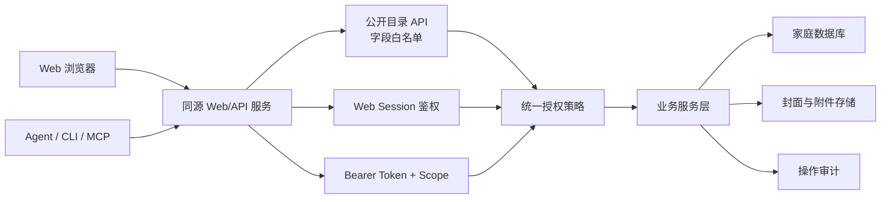

# 局域网家庭业务系统与 Agent 权限架构调研报告

> 调研日期：2026-08-12  
> 调研对象：具有局域网自托管、Web 前端、业务数据库及 Agent/API 接入能力的系统  
> 适用项目：家庭图书管理系统 V2

## 1. 摘要

本次调研聚焦一个具体问题：家庭图书管理系统主要部署在可信家庭局域网中，需要兼顾家庭成员打开即查的便利性、浏览器登录后的个性化操作，以及 Agent/CLI 通过 API 读取和修改业务数据时的安全边界。

综合 Calibre-Web、Paperless-ngx、Home Assistant、Immich、Audiobookshelf、Open WebUI 和 Model Context Protocol（MCP）的实现与安全经验，推荐采用以下总体原则：

1. **Web 人类访问与 Agent 机器访问分轨认证**：浏览器使用 Session Cookie；Agent/CLI 使用专用 Bearer Token。
2. **匿名访问映射为受限主体**：匿名用户只访问字段白名单，而不是获得完整业务 API 权限。
3. **权限以数据敏感度为边界**：不要依赖 `User-Agent`、`Origin`、`Referer` 或 `X-UI-Client` 判断请求是否来自“真正的前端”。
4. **机器凭证默认拒绝**：每个 Agent 可访问端点必须显式声明 Scope；未声明的端点不应被受限 Token 自动访问。
5. **局域网是风险降低措施，不是身份凭证**：同网段仍可能存在访客设备、受感染的 IoT 设备或错误的容器网络配置。

对本项目最合适的权限模型是四级 Web 身份加一条独立 Agent 授权链：

- 未登录：快速浏览基础书目；
- Guest：以简单 PIN 或长期设备会话获得增强只读能力；
- 普通成员：管理自己的阅读、笔记、购买和副本数据；
- Owner：管理全部家庭数据、成员、系统设置和 Agent 授权；
- Agent：始终使用 Bearer Token，并同时受 Scope、成员归属、有效期和目标服务限制。

## 2. 调研范围与方法

### 2.1 筛选条件

调研对象至少满足以下条件中的多数：

- 可在家庭服务器、NAS 或局域网环境自托管；
- 提供 Web UI；
- 存储用户或家庭业务数据；
- 具有多用户、角色或对象权限；
- 提供 API、API Key、Token 或 Agent/MCP 接入；
- GitHub 项目成熟、使用面较广，或其安全机制具有代表性。

### 2.2 重点核查项

- 匿名访问如何建模；
- Guest 与普通用户的权限差异；
- 浏览器 Session 与外部 API Token 是否分离；
- 管理员/Owner 是否绕过普通权限以及如何保护初始化；
- 机器 Token 是否支持细粒度 Scope；
- 是否采用对象级权限或数据归属；
- 局域网部署是否被当作免鉴权依据；
- Agent/MCP 是否要求 Token audience、有效期和授权发现。

## 3. 代表项目调研

### 3.1 Calibre-Web：匿名浏览应映射为受限 Guest

[Calibre-Web](https://github.com/janeczku/calibre-web) 是与本项目业务形态最接近的参考之一：自托管书库、Web 浏览、用户管理、OPDS 机器接口和电子书下载。

其关键做法是：启用匿名浏览后，未登录访问者并不是绕过权限系统，而是映射为一个特殊的 `Guest` 用户。管理员可以配置 Guest 的可见内容与能力。项目还支持：

- 细粒度用户权限；
- 仅允许登录用户下载；
- 按标签或自定义字段隐藏内容；
- Magic Link，降低电子阅读器等设备的登录成本；
- LDAP、OAuth 和反向代理认证。

Calibre-Web 的管理代码明确限制 Guest 获得管理员、密码修改和书架编辑等角色：[Guest 权限实现](https://github.com/janeczku/calibre-web/blob/master/cps/admin.py)。其配置说明也明确指出，匿名浏览对应后台可管理的 Guest 用户：[匿名浏览配置](https://github-wiki-see.page/m/janeczku/calibre-web/wiki/Configuration)。

**对本项目的启示：** 未登录浏览可以存在，但应作为受限主体参与同一权限判定，不能恢复一个可伪造请求头触发的完整旁路。

### 3.2 Paperless-ngx：Web Session 与 API Token 共享授权模型

[Paperless-ngx](https://github.com/paperless-ngx/paperless-ngx) 是自托管文档数据库，数据敏感度高于一般家庭书目。其 API 同时支持浏览器 Session、Token、Basic、Remote User 和 OIDC 等认证方式。

浏览器登录后可通过 Session 自动访问 API；外部程序则使用 Token。认证入口不同，但最终都落到用户及权限模型。Paperless-ngx 同时采用：

- 全局权限：决定用户能否访问文档、标签、设置等模块；
- 对象级权限：每个对象可设置 Owner、view 和 change 权限；
- API 只返回当前用户可操作的信息；
- Token 登录端点限速，默认 `5/min`，降低暴力破解风险。

参考：[REST API 与对象权限](https://github.com/paperless-ngx/paperless-ngx/blob/dev/docs/api.md)、[安全配置与 Token 限速](https://github.com/paperless-ngx/paperless-ngx/blob/dev/docs/configuration.md)。

**对本项目的启示：** Web Session 与 Agent Token 可以复用同一业务服务层，但认证类型、授权来源、CSRF 要求和审计身份必须明确区分。

### 3.3 Home Assistant：权限必须携带用户上下文

[Home Assistant Core](https://github.com/home-assistant/core) 是典型的家庭局域网业务平台。其权限模型区分：

- 对实体的 read、control、edit；
- 管理配置所需的 admin 权限；
- Owner 作为最高权限主体；
- 操作 Context 中记录 user ID，用于后续权限检查与归因。

官方开发文档强调，在 REST、WebSocket 或服务调用中代表用户执行操作时，必须携带正确的用户上下文：[Home Assistant 权限检查](https://developers.home-assistant.io/docs/auth_permissions/)。

Home Assistant 2026 年的一项 Critical 安全公告尤其值得注意：某些无认证容器端点原本假定只能从内部 Docker bridge 访问，但同局域网攻击者仍可通过路由访问，最终形成完整鉴权绕过。公告明确指出“内部网络接口”不能替代真正的认证和防火墙隔离：[GHSA-gh5m-4m97-c95h](https://github.com/home-assistant/core/security/advisories/GHSA-gh5m-4m97-c95h)。

**对本项目的启示：** 局域网可以降低外部攻击概率，但不能让写操作、管理接口或完整数据读取失去应用层鉴权。

### 3.4 Immich：API Key 必须细粒度且默认拒绝

[Immich](https://github.com/immich-app/immich) 是自托管照片和视频数据库，具有 Web、移动端、多用户、共享链接和 API Key。

其 API Key 机制逐步演进为细粒度权限，例如 `map.read`、`map.search`、`folder.read`。一个重要修正是：对于没有声明具体权限的路由，受限 API Key 不再默认获得访问权，而是隐式要求 `all` 权限。这体现了机器凭证的 fail-closed 原则：[API Key 权限变更](https://github.com/immich-app/immich/discussions/20133)。

Immich 还提供共享链接、密码和有效期等能力，用于在不创建完整用户账号的情况下暴露有限内容。首次管理员初始化也可以通过配置关闭，防止数据库异常重置后重新暴露 Setup 入口：[v2.5.0 发布说明](https://github.com/immich-app/immich/discussions/25577)。

**对本项目的启示：** Agent Scope 必须由端点显式声明；任何新增路由如果没有权限注解，应默认拒绝 Agent Token，而不是自动继承宽泛能力。

### 3.5 Audiobookshelf：家庭媒体系统采用多用户和自定义权限

[Audiobookshelf](https://github.com/advplyr/audiobookshelf) 是自托管有声书、播客和电子书服务，提供 Web/PWA、移动端、数据库和 API。它采用多用户及自定义权限，并将播放/阅读进度按用户隔离。

项目还支持 admin、user、guest 分组以及 OIDC 映射，说明家庭媒体类系统通常仍会保留身份与角色，只是在登录体验上提供更轻量的方式。

**对本项目的启示：** 普通家庭成员应该拥有独立身份和自己的进度、笔记数据；无需为了便利性将所有家庭成员合并成一个匿名身份。

### 3.6 Open WebUI：人类角色和机器 API Key 分轨

[Open WebUI](https://github.com/open-webui/open-webui) 同时具有 Web 用户、管理员、模型、工具以及 API 接入，适合作为 Agent 类系统参考。

其主要实践包括：

- Web 用户通过 user/admin、用户组和功能权限控制能力；
- 管理员默认通过部分权限检查；
- API 请求使用 Bearer Token 或 API Key；
- API Key 可全局禁用，并可配置允许访问的端点；
- API Key 创建本身也受用户和组权限控制。

参考：[API 鉴权说明](https://github.com/open-webui/docs/blob/main/docs/reference/api-endpoints.md)、[工具权限实现](https://github.com/open-webui/open-webui/blob/main/backend/open_webui/utils/tools.py)。

**对本项目的启示：** Agent Token 的签发和管理只能由 Owner 完成；Agent 权限不应从浏览器是否免登录推导。

### 3.7 MCP：远程 Agent 需要专用资源 Token

[Model Context Protocol](https://github.com/modelcontextprotocol/modelcontextprotocol) 的 HTTP 授权规范基于 OAuth 2.1，并强调：

- MCP Client 每次 HTTP 请求都发送 Bearer Token；
- 401 表示缺少或无效认证，403 表示 Scope 不足；
- Token 必须绑定目标 resource/audience；
- MCP Server 必须验证 Token 是否为自身签发；
- 禁止将接收到的 Token 原样透传给下游服务；
- 推荐短期 Access Token、Refresh Token 轮换；
- 授权服务端点使用 HTTPS，回调 URI 必须精确校验并采用 PKCE。

参考：[MCP HTTP 授权规范](https://github.com/modelcontextprotocol/modelcontextprotocol/blob/main/docs/specification/2025-06-18/basic/authorization.mdx) 与 [MCP 安全信任模型](https://github.com/modelcontextprotocol/modelcontextprotocol/security)。

**对本项目的启示：** 当前自定义 Agent Token 可以作为家庭部署的简化实现，但数据模型应预留 audience/resource、有效期、撤销、最后使用时间和授权主体，以便未来对接标准 MCP/OAuth 流程。

## 4. 业界共同原则

### 4.1 局域网不是身份凭证

家庭局域网仍可能包含：

- 访客 Wi-Fi 设备；
- 安全维护较差的电视、摄像头或 IoT 设备；
- 感染恶意软件的手机和电脑；
- VPN、端口转发或错误反向代理配置；
- 容器 host network 或 bridge 防火墙配置错误。

因此，局域网应作为部署层风险控制，而不是 `anonymous == trusted owner` 的应用层规则。

### 4.2 浏览器来源不可作为授权依据

后端不能可靠区分请求是否真的由官方 Web 前端发起。以下信息都可以被非浏览器客户端伪造：

- `User-Agent`；
- `Origin`；
- `Referer`；
- `X-UI-Client: web`；
- 前端公开代码中的固定密钥。

Origin/Referer 适合用于 Cookie 写请求的 CSRF 防护，但不能代替身份认证。

### 4.3 认证与授权必须分开

- 认证回答“调用者是谁”；
- 授权回答“该调用者能访问什么”；
- 数据过滤回答“本次响应能暴露哪些字段和记录”；
- 审计回答“谁在何时做了什么”。

单纯验证 Session 或 Token 并不代表可以访问全部数据。

### 4.4 机器 Token 应采用最小权限和默认拒绝

Agent 可能自动组合多个工具，也可能因提示词注入或模型误判执行非预期操作。因此机器凭证应比普通 Web Session 更严格：

- Token 绑定 Agent Client 和成员；
- Scope 精确到 read/write/delete 等能力；
- 高风险 Scope 单独授权；
- 端点未声明 Scope 时默认拒绝；
- 支持过期、撤销和轮换；
- 明文 Token 只显示一次；
- Token 不写入日志；
- 每次调用记录 Agent Client、Grant、成员和结果。

## 5. 推荐权限模型

### 5.1 Web 四级身份

| 身份层级 | 认证方式 | 默认可见内容 | 默认操作能力 |
| --- | --- | --- | --- |
| 未登录 | 无；后端映射为 Anonymous/Guest Policy | 书名、作者、封面、分类、基础阅读状态、粗粒度位置 | 搜索、筛选、查看公开详情 |
| Guest | 家庭访客 PIN、Magic Link 或长期设备 Session | 完整书目信息、副本可用状态、精确书架位置 | 只读；可保存显示偏好 |
| 普通成员 | 用户名密码、PIN 或设备登录 | Guest 内容及自己的进度、笔记、购买、副本和附件 | 修改自己的数据 |
| Owner | 强密码 Session，管理操作可要求近期重新认证 | 全部家庭数据和系统信息 | 管理全部数据、成员、配置和 Agent 授权 |

### 5.2 字段暴露建议

| 数据 | 未登录 | Guest | 普通成员 | Owner |
| --- | --- | --- | --- | --- |
| 书名、作者、封面、分类 | 可见 | 可见 | 可见 | 可见 |
| 粗粒度位置 | 可见 | 可见 | 可见 | 可见 |
| 精确书架位置 | 可配置 | 可见 | 可见 | 可见 |
| 副本是否可借 | 可配置 | 可见 | 可见 | 可见 |
| 具体拥有者 | 隐藏 | 默认隐藏 | 按家庭规则 | 可见 |
| 阅读进度 | 聚合或隐藏 | 聚合或隐藏 | 仅本人 | 全部 |
| 笔记、附件 | 隐藏 | 隐藏 | 仅本人 | 全部 |
| 购买价格与来源 | 隐藏 | 隐藏 | 仅本人 | 全部 |
| 操作日志 | 隐藏 | 隐藏 | 隐藏 | 可见 |
| Agent 授权和 Token | 隐藏 | 隐藏 | 隐藏 | 可管理 |

### 5.3 Agent 独立授权链

Agent 不属于 Web 四级角色之一。Agent 访问始终需要：

1. 注册 Agent Client；
2. Owner 选择目标成员；
3. Owner 选择 Scope 和有效期；
4. 系统签发仅显示一次的 Bearer Token；
5. 每次请求验证 Token、Client、Grant、成员、Scope、有效期和撤销状态；
6. 响应继续执行字段和记录过滤。

未授权 Agent 只能访问公共发现面和与未登录 Web 完全相同的公开数据。不能实现“浏览器匿名看到数据，但 curl/Agent 无法看到相同公共接口”的可靠安全边界。

## 6. 推荐整体架构



### 6.1 分层职责

1. **反向代理/网络层**：限制监听范围、提供 HTTPS、设置可信代理、阻止数据库和内部管理端口直接暴露。
2. **认证层**：识别 Anonymous、Guest Session、Member Session、Owner Session 和 Agent Token。
3. **授权策略层**：统一处理角色、Scope、成员归属、字段等级和目标对象。
4. **业务服务层**：只接收已经解析的 AuthContext，不自行相信客户端提交的 member ID。
5. **数据层**：数据库和文件存储只对后端开放。
6. **审计层**：记录 actor 类型、actor ID、目标资源、动作、时间和结果。

### 6.2 建议统一 AuthContext

```text
auth_type: anonymous | guest | web | agent | channel
actor_id: user/session/client identifier
member_id: 当前数据归属成员
role: guest | member | owner
scopes: Agent 或受限会话能力集合
is_owner: 是否为 Owner
request_id: 请求追踪标识
```

所有业务路由都应从 AuthContext 获取调用者身份，而不是直接信任请求体的 `member_id` 或前端专用请求头。

## 7. 对当前项目的落地建议

### 7.1 应保留的现有设计

- 保留 Owner 密码和 HttpOnly Web Session；
- 保留 Web Session 接入业务 API；
- 保留 Agent Client、Grant、Token、Scope 和撤销能力；
- 保留写端点 Scope 检查；
- 保留 Owner 专属 Agent 授权管理；
- 保留公开 Agent 发现面与业务数据面的分离。

### 7.2 应调整的产品定义

- 不恢复 `X-UI-Client: web` 匿名写入旁路；
- 新增明确的 Anonymous/Guest 读取策略；
- 为公开列表和详情建立独立响应 Schema，实行字段白名单；
- 普通成员 Session 只能写自己的进度、笔记、购买和副本；
- Owner Session 可以跨成员管理；
- Agent Token 必须同时满足 Scope 与成员归属；
- 将“Agent 必须授权才能读取”表述为“Agent 必须授权才能读取非公开业务数据或执行任何写操作”。

### 7.3 推荐分阶段实施

#### 阶段一：明确公开与私有字段

- 定义 `PublicBookSummary` 和 `PublicBookDetail`；
- 未登录只访问公开查询端点；
- 所有写操作继续要求 Web Session、Agent Token 或可信渠道身份；
- 补充匿名响应不得包含成员、价格、笔记、附件、操作记录的测试。

#### 阶段二：Guest 与普通成员登录

- 建立通用 Web 用户凭证，不再只支持 Owner；
- Guest PIN 签发只读 Session；
- Member Session 绑定成员；
- 前端增加登录状态保持、身份切换和权限提示；
- Cookie 写请求执行 CSRF/Origin 校验。

#### 阶段三：授权策略集中化

- 业务路由统一迁移至 AuthContext；
- 通过声明式依赖或路由元数据指定公开等级和 Scope；
- 增加“新增端点未声明权限即测试失败”的守卫；
- 审计日志区分 anonymous、guest、member、owner、agent。

#### 阶段四：可选标准 MCP/OAuth 接入

- 增加 OAuth Protected Resource Metadata；
- Token 增加 audience/resource；
- 支持短期 Access Token 与轮换；
- 明确 MCP Server 与内部业务 API 的凭证边界，禁止 Token 透传。

## 8. 不推荐方案

### 8.1 把局域网 IP 当作用户身份

DHCP、NAT、代理、共享设备和受感染终端都会破坏这一假设。IP 可以用于风控和日志，不适合作为唯一身份。

### 8.2 通过前端专用 Header 放行

任何客户端都能复制该 Header。它只能作为兼容或分析标记，不能具有授权含义。

### 8.3 所有数据全部匿名只读

这会让购买、笔记、成员归属、附件等隐私数据同时暴露给局域网中的所有设备。应只公开经过专用 Schema 白名单过滤的数据。

### 8.4 为每本书立即建立复杂 ACL

Paperless-ngx 的对象 ACL 功能强大，但对当前家庭书架可能过重。建议先采用 RBAC、成员归属、字段分级和 Agent Scope；只有出现“儿童不可见”“私人藏书”等明确需求后，再增加书籍级 visibility 或标签策略。

### 8.5 让 Agent 复用浏览器 Cookie

Agent 生命周期、存储环境和风险与浏览器不同。机器调用应使用可单独撤销、限权和审计的 Token，不能复制 Owner Cookie。

## 9. 推荐决策

本项目建议采用以下最终方向：

> 在可信家庭局域网中提供低摩擦的公开书目查询；未登录请求映射为受限 Anonymous/Guest 策略。浏览器登录后使用 Session Cookie 获得 Guest、Member 或 Owner 权限。Agent/CLI 始终使用独立 Bearer Token，并受 Scope、成员、有效期、撤销状态和字段过滤共同约束。

该方案兼顾：

- 家庭成员打开即查；
- 具体书架位置等高价值局域网信息可配置开放；
- 个人笔记、购买和附件保持私有；
- 普通成员拥有独立数据空间；
- Owner 可集中管理；
- Agent 能力可发现但业务数据默认不可越权；
- 未来可以平滑迁移到标准 MCP/OAuth 授权。

## 10. 参考资料

1. [Calibre-Web GitHub](https://github.com/janeczku/calibre-web)
2. [Calibre-Web Guest 权限实现](https://github.com/janeczku/calibre-web/blob/master/cps/admin.py)
3. [Calibre-Web 匿名浏览配置](https://github-wiki-see.page/m/janeczku/calibre-web/wiki/Configuration)
4. [Paperless-ngx REST API 与权限](https://github.com/paperless-ngx/paperless-ngx/blob/dev/docs/api.md)
5. [Paperless-ngx 安全配置](https://github.com/paperless-ngx/paperless-ngx/blob/dev/docs/configuration.md)
6. [Home Assistant Core](https://github.com/home-assistant/core)
7. [Home Assistant 权限开发文档](https://developers.home-assistant.io/docs/auth_permissions/)
8. [Home Assistant 局域网匿名端点安全公告](https://github.com/home-assistant/core/security/advisories/GHSA-gh5m-4m97-c95h)
9. [Immich GitHub](https://github.com/immich-app/immich)
10. [Immich API Key 权限变更](https://github.com/immich-app/immich/discussions/20133)
11. [Immich v2.5.0 细粒度权限与初始化保护](https://github.com/immich-app/immich/discussions/25577)
12. [Audiobookshelf GitHub](https://github.com/advplyr/audiobookshelf)
13. [Open WebUI API 鉴权说明](https://github.com/open-webui/docs/blob/main/docs/reference/api-endpoints.md)
14. [Open WebUI 工具权限实现](https://github.com/open-webui/open-webui/blob/main/backend/open_webui/utils/tools.py)
15. [MCP 授权规范](https://github.com/modelcontextprotocol/modelcontextprotocol/blob/main/docs/specification/2025-06-18/basic/authorization.mdx)
16. [MCP 安全与信任模型](https://github.com/modelcontextprotocol/modelcontextprotocol/security)
